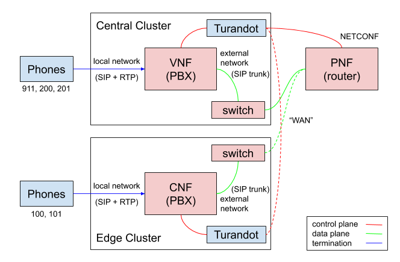

Telephony Network Service (MANO) Example
========================================

This example of a multi-cluster network service comprises a VNF (Virtualized Network Function), a
CNF (Containerized, or Cloud-native Network Function), and a PNF (Physical Network Function).

It provides an end-to-end telephony service based on [Asterisk PBX](https://www.asterisk.org/) 
between a central site and an edge site. An SIP/RTP trunk is set up on a data plane, which is
implemented as simple routing for demonstration purposes, but could be extended to a full-blown
SD-WAN. The result is that SIP phones connected to either site can all call each other.

The entire example is also available as a set of independent Kubernetes manifests and scripts,
without TOSCA and Turandot's orchestration. See
[the repository](https://github.com/tliron/telephony-network-service).
