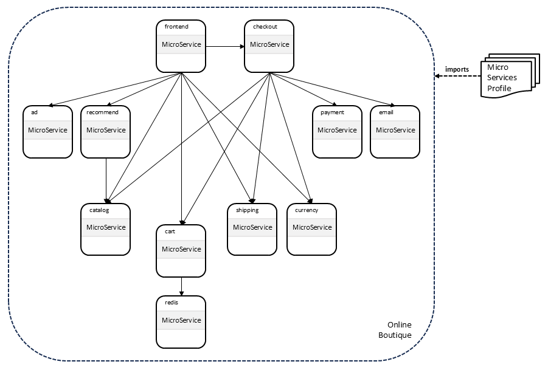

# Online Boutique

The [Online
Boutique](https://github.com/GoogleCloudPlatform/microservices-demo)
example defines a web-based e-commerce app where users can browse
items, add them to the cart, and purchase them. It consists of 11
microservices that communicate using gRPC, as shown in the following
figure:

The GoogleCloudPlatform github repository includes a single
[Kubernetes
Manifest](https://github.com/GoogleCloudPlatform/microservices-demo/blob/main/release/kubernetes-manifests.yaml)
that can be used to deploy the entire microservice.

This directory defines a TOSCA service template that models the online
boutique and that can be used to deploy the service. This service
template is shown in the following figure:

This service template imports the [microservices
profile](../../profiles/community/tosca/microservices/profile.yaml)
and defines nodes of type `MicroService` to model the topology of the
service.

> This example assumes that the `MicroService` node type can be
  *parameterized* through property values to represent the
  configurations for each of the microservices in the Online Boutique
  example. If this is not the case, then microservice-specific derived
  node types may need to be created and added to the [microservices
  profile](../../profiles/community/tosca/microservices/profile.yaml).

Each of the abstract microservice nodes in the online boutique service
template is annotated with the `substitute` directive and is intended
to be *realized* using a [substituting template for `MicroService`
nodes](../substitutions/microservice/main.yaml) that uses nodes from
the [kubernetes
profile](../../profiles/community/tosca/kubernetes/profile.yaml).

