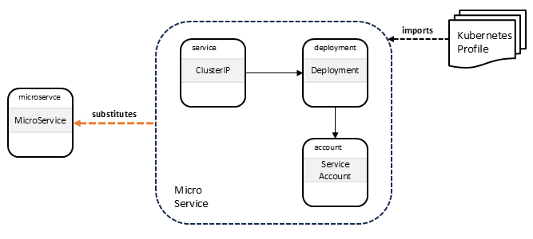

# Substituting Service Template for `MicroService` Nodes

This directory contains a TOSCA service template that defines a
*substituting service* for nodes of type `MicroService`.  This node
type is defined in the [microservices
profile](../../../profiles/community/tosca/microservices/profile.yaml).

The service template is shown in the following figure:

It shows how a node of type `MicroService` in an abstract service
template is substituted using a [substituting TOSCA
service template](main.yaml) that defines one node of type
`ClusterIP`, one node of type `Deployment`, and one node of type
`ServiceAccount`. The microservice service template imports the
[microservices
profile](../../../profiles/community/tosca/microservices/profile.yaml).
