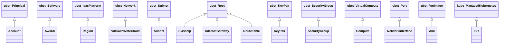
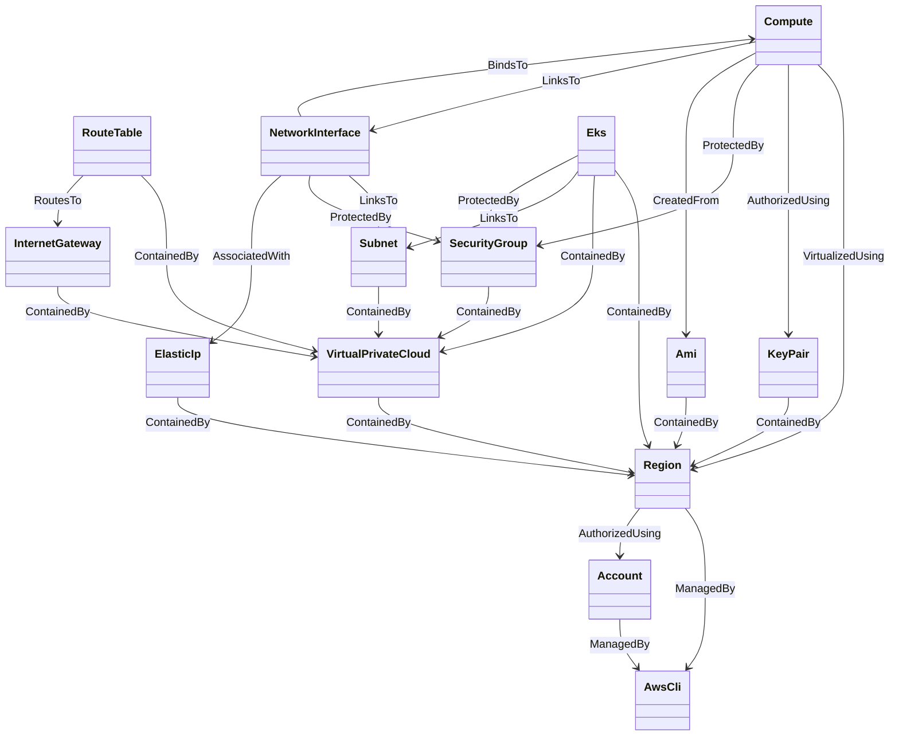

# AWS Profile Node Types

TOSCA type definitions for Amazon Web Services resources.

## Node Type Hierarchy

Note: types prefixed with `ubct_` are base types from the `com.ubicity:2.5`
profile; `kube_` types come from `com.ubicity.kubernetes:2.5`.

## Resource Relationships

