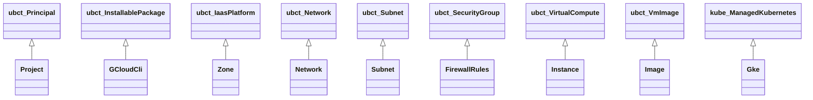
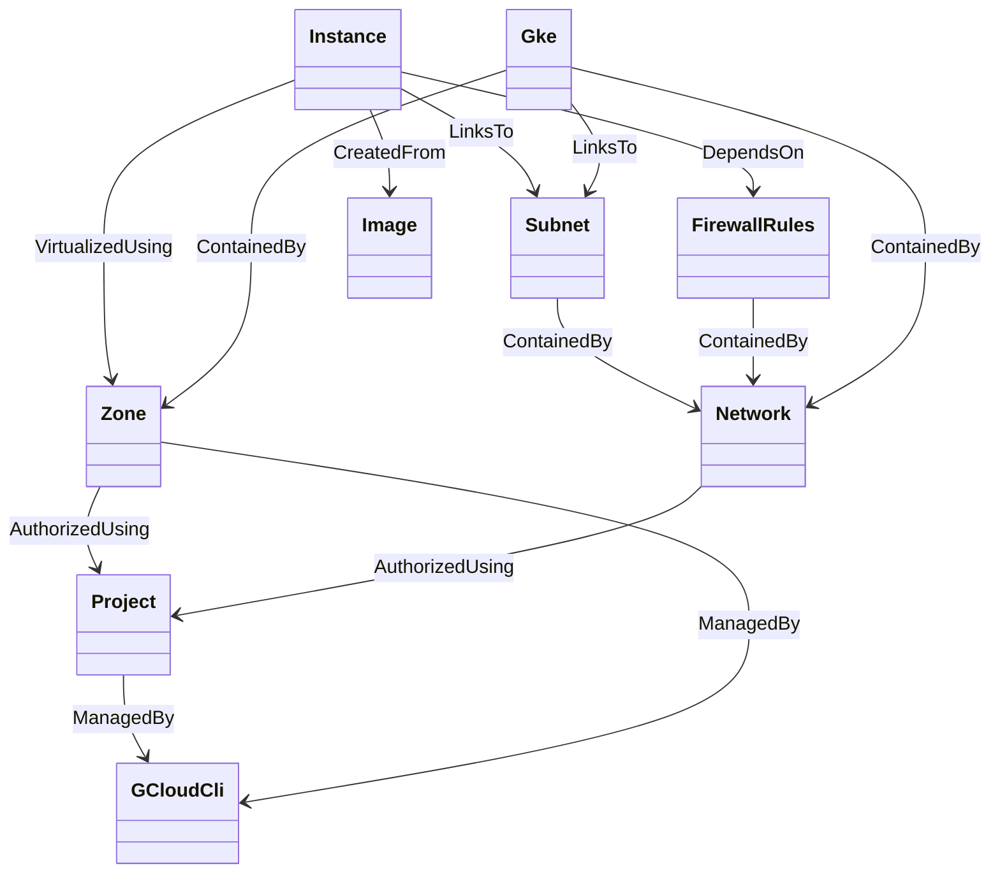

# Google Cloud Profile Node Types

TOSCA type definitions for Google Cloud Platform resources.

## Node Type Hierarchy

Note: types prefixed with `ubct_` are base types from the `com.ubicity:2.5`
profile; `kube_` types come from `com.ubicity.kubernetes:2.5`.

## Resource Relationships

GCP credentials are project-scoped: `Zone` and `Network` require the
`Project` directly via the `credential` capability.

