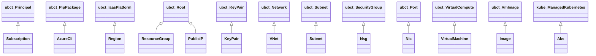
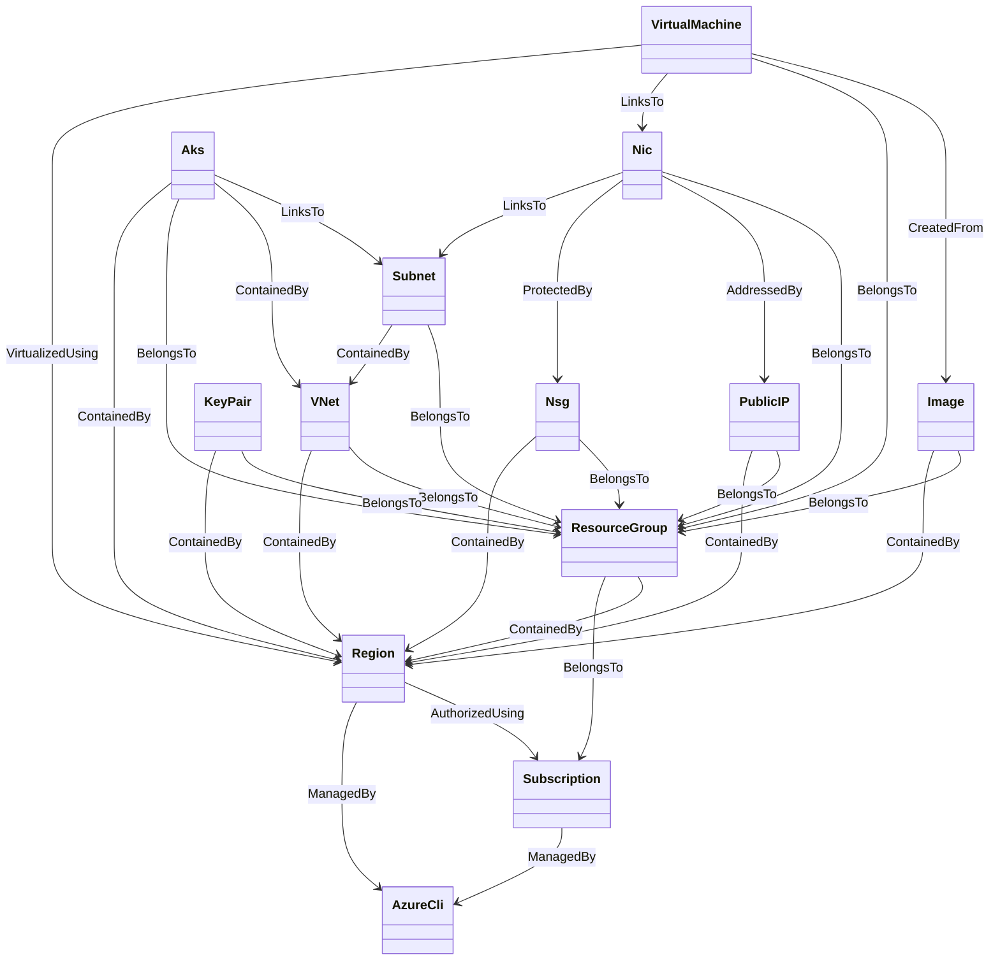

# Azure Profile Node Types

TOSCA type definitions for Microsoft Azure resources.

## Node Type Hierarchy

Note: types prefixed with `ubct_` are base types from the `com.ubicity:2.5`
profile; `kube_` types come from `com.ubicity.kubernetes:2.5`.

## Resource Relationships

Azure resources are organized in two overlapping scopes: `Region` (deployment
target, provides credentials) and `ResourceGroup` (management container, groups
related resources under an `Subscription`).

