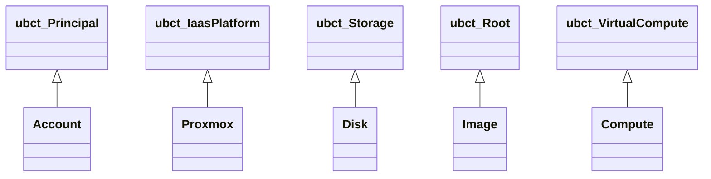
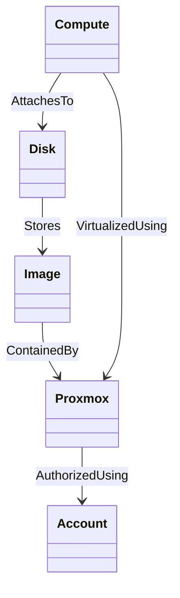

# Proxmox Virtual Environment Profile

**Thales: this is a modified version of Ubicity's Proxmox VE Profile in https://github.com/ubicity-corp/tosca-profiles/tree/master/com/proxmox/ve/1.0**


TOSCA node types for orchestrating infrastructure on a Proxmox Virtual
Environment.

## TOSCA Node Types

### Node Type Hierarchy



Note: types prefixed with `ubct_` are base types from the `com.ubicity:2.5` profile.

### Resource Relationships



## TOSCA Artifacts

The Proxmox VE Profile uses [Terraform](https://www.terraform.io/)
artifacts to provide implementations for interface operations.
Terraform artifacts in this profile use the
[bpg](https://registry.terraform.io/providers/bpg/proxmox/latest/docs)
provider. The following must be taken into account when using this
provider:

1. The `bpg` provider uses a mix of Proxmox API calls and CLI
   commands. This means that it must have access to both a Proxmox API
   token as well as an ssh key to the Proxmox server machine.
2. The API token must be in the format `USER@REALM!TOKENID=UUID`. The
   following shows an example token with token id `root-token` for the
   `root` user in the `pam` realm:
   ```
   root@pam!root-token=a0fbda11-c18e-46ac-8339-f5cc5fa29c4b
   ```
3. The API token must be stored in a file that is readable by the
   Orchestrator. That file must contain only one single line that
   contains the token. **That line must not have a newline character
   at the end**.
4. The provider makes use of the *QEMU Guest Agent* to return
   information such as allocated IP addresses. Unfortunately, this
   agent is not installed by default on most cloud images. The
   artifacts in this profile use *user data* supplied to
   [*cloud-init*](https://cloudinit.readthedocs.io/en/latest/index.html)
   to install the QEMU agent when VMs are first booted up, but the use
   of *user data* is incompatible with some of the arguments supported
   by the
   [`proxmox_virtual_environment_vm`](https://registry.terraform.io/providers/bpg/proxmox/latest/docs/resources/virtual_environment_vm)
   resource. Those arguments need to be replaced with appropriate
   *user data* as well.
3. *User data* are stored as *snippets* on the Proxmox server.
   However, snippets are not enabled by default in new Proxmox
   installations. Snippets must be enabled in the
   `Datacenter>Storage>local` section of the Proxmox Web UI before
   first using the `proxmox_virtual_environment_vm` resource.
