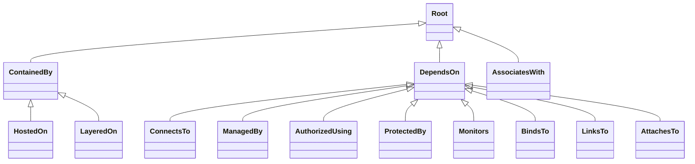
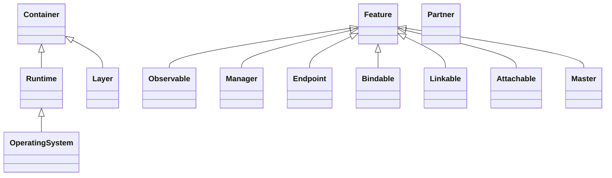
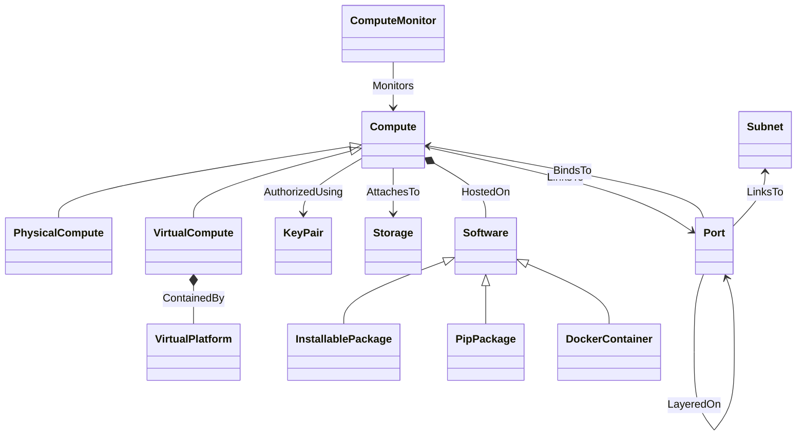

# Ubicity Profile Type Definitions

This directory contains the main Ubicity TOSCA Profile. This profile
defines *administrator view* types as defined in the [abstraction
continuum](../README.md#modeling-at-different-levels-of-abstraction)
used by Ubicity. These types assume specific technologies but don't
prescribe any specific implementations. Instead, they are intended to
be used as base types for vendor-specific types defined in *device
view* profiles.

## Relationship Types

Relationship types defined in the Ubicity TOSCA Profile are derived
from one of the three *base* relationship types defined in the
[Ubicity Core Profile](../core/1.0/README.md) as shown in the
following type hiearchy:

### Capability Types

Capability types defined in the Ubicity TOSCA Profile are derived from
one of the three base capability types in the [Ubicity Core
Profile](../core/1.0/README.md) as shown in the following type
hiearchy:

## Node Types

The Ubicity TOSCA Profile defines *base* node types from which other
*system view* types can be derived. Those base node types are shown in
the following figure:

Note that each of the top-level node types in this diagram derive from
a `Root` node type which is not shown.

> Should we distinguish between *virtual* infrastructure and *cloud*
  infrastructure?

