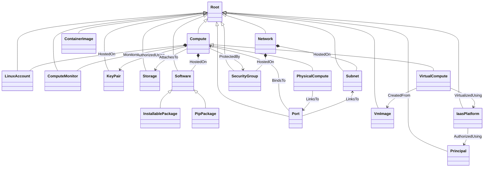
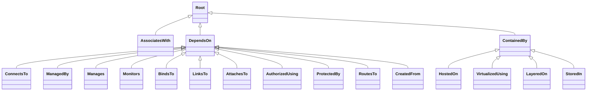
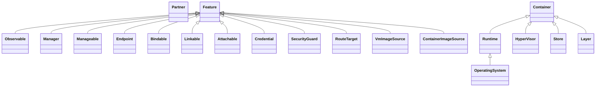

# Ubicity Profile Node Types

This directory contains the main Ubicity TOSCA Profile. This profile
primarily defines *administrator view* types that model components
that use specific technologies. Many of the node types defined in this
profile are used as base types in other profiles that define *device
view* types for vendor-specific implementations. However, the Ubicity
profile itself defines a set of device view types as well.

# Relationship Types

# Capability Types

# Implementation Status

## Image types are mostly scaffolding

`VmImage`, `ContainerImage`, the `VmImageSource` / `ContainerImageSource`
capabilities, and the `CreatedFrom` relationship are wired into the
foundation, and each cloud provider's profile defines a vendor
`VmImage` subtype (AWS `Ami`, Azure `Image`, GCP `Image`, OpenStack
`Image`). However, only the Proxmox profile (`com.proxmox.ve:2.5`)
ships a working create/delete lifecycle for its `Image` type — it
downloads or uploads a cloud image into a Proxmox datastore.

The other vendor `VmImage` subtypes are *reference-only*: they have no
create/delete artifacts, so they're meant to be used with
`directives: [select]` to point at an existing AMI / Azure image /
GCP image / Glance image. The ID is then read across the
`CreatedFrom` requirement and threaded into the `Compute` create
operation as a default for the existing image-id input. No vendor
profile yet ships artifacts that *create* a new VM image from a
template.

`ContainerImage` has no consumer side wired up at all — `DockerContainer`,
Kubernetes `Pod`, and KubeVirt's `containerDisk` still encode their
images as string properties. The type exists as the agreed shape for
when a downstream profile is ready to adopt it.
