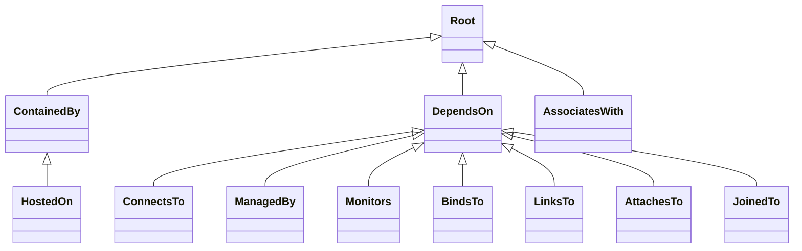
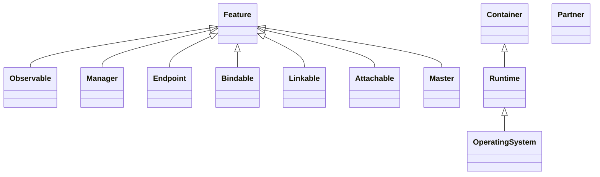

# TOSCA Profile Design Patterns

Ubicity uses a number of design patterns to aid the development of
TOSCA profiles. These patterns are described in this section.

## Modeling at Different Levels of Abstraction
To manage the complexities associated with large scale systems and
services, the Ubicity modeling approach relies heavily on
*abstraction*. Abstraction allows for the creation of models
that ignore implementation-specific details. 

Ubicity leverages the [*policy
continuum*](https://www.sciencedirect.com/science/article/abs/pii/S0140366408002302)
introduced by [John
Strassner](https://www.linkedin.com/in/john-strassner-41ba98a) to help
guide the creation of models at different levels of abstraction. While
the policy continuum was originally introduced to assist with the
definition of *policies* at various levels of abstraction, Ubicity
also uses it to assist with the creation of *models* to which these
policies can be applied.

The policy continuum recommends five different levels of abstraction
as shown in the following picture:

**Business View**: describes services in terms of business goals. It
models services as products that are available to customers.

**System View**: describes the architectural components of the service
in a technology-agnostic fashion. It the system architecture used to
meet the business objectives specified in the business view.

**Administrator View**: specifies technologies used for each of the
architectural components in the system. It introduces
technology-specific implementations for the architecture specified in
the system view.

**Device View**: lists specific devices or software components-as well
as their associated configurations-for all of the components of the
service. It introduces vendor-specific equipment for the technologies
used in the administrator view.

**Instance View**: captures the state of each instance.

For purposes of *TOSCA orchestration*, only system view, administrator
view, and device view models are important as shown in the following
figure:

Using a **top-down** modeling approach, system designers create
abstract system view models to define the architecture of their
systems. These models are then extended using administrator view
models that introduce the technologies chosen to implement the system
architecture. Finally, device view models specify specific vendor
implementations for the chosed technologies.

During the orchestration process, models at a higher level of
abstraction must be extended with information at the next lower level
of abstraction. TOSCA provides two mechanisms to accomplish this:

**Derivation**: Using the derivation approach, base node types define
abstract definitions. Derived types provide concrete implementations
for those abstract definitions. This approach is shown in the
following figure:

**Substitution**: Using the substitution approach, base node types
*define an abstract interface, a facade* if you will. Substituting
*templates provide concrete implementations for the abstract
*interface. This approach is shown in the following figure:

### Abstraction Best Practices

Ubicity recommends the following best practices for creating abstract
models:

> Note that these recommendations are still in flux. They may change
> based on additional experience. In addition, the profiles defined in
> this repository do not yet fully comply with these guidelines.

- Avoid mixing and matching types defined at different levels of
  abstraction within the same profile. Instead, define separate TOSCA
  profiles for level of abstractions. Specifically, define a profile
  for system view models, a profile for administrator view models, and
  a profile for device view models.
- Avoid mixing and matching types defined at different levels of
  abstraction within the same TOSCA service template.
- Use *substitution* to map from the system view level of abstraction
  to the administrator view level of abstraction, as shown in the
  following figure:

  
- Use *derivation* to map from the administrator view level of
  abstraction to the device view level of abstraction, as shown in the
  following figure:

  
- Since substitution mapping may require sharing of capability types
  and relationship types between different profiles, introduce a
  *common* profile that defines these relationship types and
  capability types. Only this common profile should define top-level
  relationship types or capability types. Profile-specific types
  should derive from one of the base types defined in the common
  profile.
- Maintain a shallow capability type hierarchy. Specifically, avoid
  creating subtypes to constrain which source nodes can use a certain
  capability. Instead, constrain the *generic* capability type with
  `valid_source_node_type` statements.

## Component/Port Pattern

TOSCA uses a **Component/Port** pattern where a component’s touch
points for interacting with other components are modeled separately
from that component using *port* abstractions. Using TOSCA, components
are modeled using *Node Types* and the ports of those components are
modeled using the following two different abstractions associated with
node types:
- Capabilities: for functionality exposed by a component and usable by
  other components.
- Requirements: for dependencies of one component on functionality
  exposed by other components.

The Ubicity Component/Port pattern defines *common* categories of
functionality that are typically exposed by all components. It then
attempts to define *common* capability types and *common* relationship
types to represent each of these categories of functionality. Note
that this pattern is inspired by the [ONF Core Information
Model](https://opennetworking.org/software-defined-standards/models-apis/),
the [TMF Open Digital Architecture](https://www.tmforum.org/oda/), and
other modeling efforts that use a similar approach. These standard
categories of functionality are shown in the following picture:

- **Runtime environment**: most if not all TOSCA nodes are contained
  by (*hosted on*) another node and their lifecycle is determined by
  the lifecycle of the containing node. This containment dependency is
  expressed using an *execution environment requirement* that must be
  fulfilled by a corresponding *execution environment capability* of
  the containing node. Nodes that can *host* other nodes typically
  have their own *runtime environment requirement*.
- **Core functionality**: the main function of a TOSCA node is to
  provide a specific set of features or functionality to other
  nodes. This is expressed using a *core functionality
  capability**. Other nodes will define requirements for this
  functionality.
- **Management**: many TOSCA nodes are matched with a corresponding
  management tool. This relationship is expressed as a *management
  requirement* of the managed TOSCA node rather than as a *management
  capability* to express potential deployment dependencies: if the
  management tool is used to configure the TOSCA node, the management
  tool must be deployed before the managed node can be fully deployed.
  Note that for management tools, the management functions are exposed
  as their *core functionality capability*.
- **Monitoring**: many TOSCA nodes are matched with a corresponding
  monitoring tool. This relationship is expressed as a *monitoring*
  capability of the monitored node.

  > This pattern was discussed in the TOSCA TC but never formalized.

- **Security**: access to TOSCA nodes may need to be secured.

  > This pattern needs further work

As stated earlier, Ubicity uses this pattern to define common
capability types and common relationship types for these various
categories of functionality. These types are discussed next.

### Relationship Types

Ubicity uses three different *kinds* of top-level relationships. When
using the Ubicity Orchestrator, the *kind* of the relationship is used
to determine how state changes in *target* nodes are propagated across
relationships to the *source* nodes of those relationships.
- A *containment* relationship kind that indicates that the lifecycle
  of the contained entity (the *source* of the relationship) is
  dictated by the lifecycle of the containing entity (the *target* of
  the relationship). This kind of relationship is provided using the
  `ContainedBy` relationship type that derives directly from
  `Root`. Relationships of type `ContainedBy` target capabilities of
  type `Container` as specified using the `valid_capability_types`
  keyword in the type definition.
- A *dependency* relationship kind that indicates that the state
  and/or configuration of a dependent node (the *source* of the
  relationship) depends on the state and/or configuration of the
  *target* node. This kind of relationship is provided using the
  `DependsOn` relationship type that derives directly from
  `Root`. Relationships of type `DependsOn` target capabilities of
  type `Feature` as specified using the `valid_capability_types`
  keyword in the type definition.
- An *association* relationship kind that is provided for
  informational purposes only and no state or configuration
  dependencies exist. This kind of relationship is provided using the
  `AssociatesWith` relationship type that derives directly from
  `Root`. Relationships of type `AssociatedWith` target capabilities
  of type `Partner` as specified using the `valid_capability_types`
  keyword in the type definition.

Each of these relationship types derive from a top-level `Root`
relationship type that advertizes the Ubicity `Configure` interface
that is used by all relationship types. Other relationship types are
derived from one of the three *base* relationship types as shown in
the following type hiearchy:

### Capability Types

Ubicity defines three *base* capability types that are matched with
the three different kinds of base relationshp types. Other capability
types are derived from one of these three base types.  The following
figure shows the capability type hierarchy:

### Best Practices
Best practices questions:

- Specific relationship types may need to get matched with specific
  capability types. This constraint can be specified:
  - Just in the relationship type using the `valid_capability_types`
    keyword.
  - Just in the capability type using the `valid_relationship_types`
    keyword.
  - In both places.

  Which one is the best way to go?

- How deep do we make the relationship type and capability type
  hierarchies? Or, said a different way, when is it appropriate to
  define new derived relationship and/or capability types? We should
  consider the following scenarios:

   1. Derived type names can more clearly indicate the intended
      function of the relationship or capability and improve
      *readability* of profiles and templates.
   2. Additional properties and/or attributes need to be defined for
      relationships or capabilities.
   3. Additional inputs and/or operation implementations need to be
      defined for relationship interfaces.
   4. Additional interfaces need to be defined on relationships.

- If specific capabilities are needed, and specific relationships to
  those capabilities are needed, there are two ways to define these:

   1. We can create derived capability types and associated
      relationship types and use those types in requirement and
      capability definitions.
   2. We can use the base types as-is, and *specialize* how they can
      be used in capability and requirement definitions using the
      `valid_source_node_types` and `valid_target_node_types`
      keywords.

  Which one is the best way to go?
