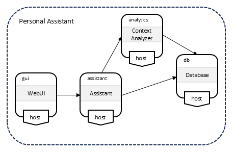
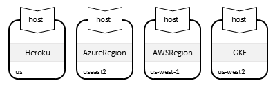
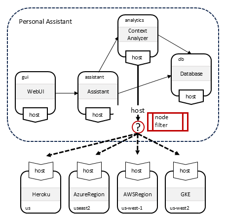
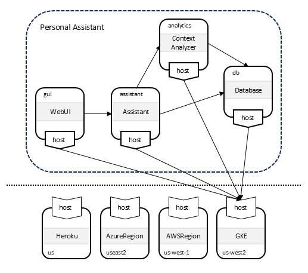
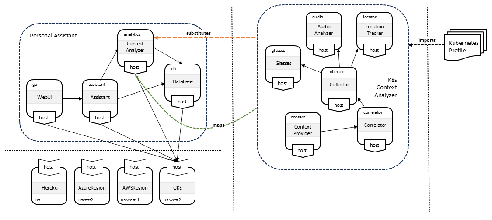
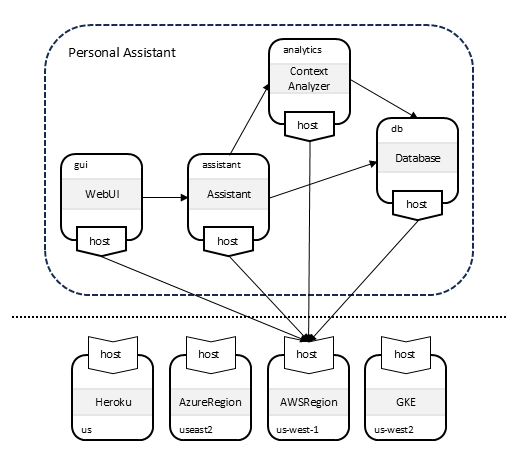
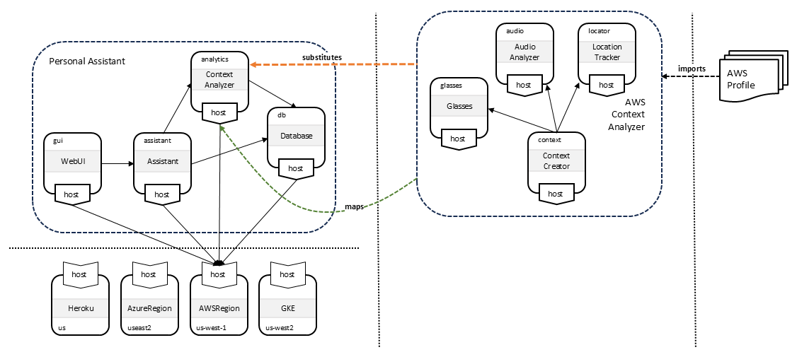

# TOSCA Profile Design Patterns

Ubicity uses a several design patterns to help guide the development
of TOSCA profiles. These patterns are described in this document.

## Abstraction
To manage the complexities associated with large scale systems and
services, the Ubicity modeling approach relies heavily on the use of
*abstraction*. Abstraction allows for the creation of models that
ignore implementation-specific details.

### The Policy Continuum
To help guide the use of abstraction in service modeling, Ubicity
leverages the [*policy
continuum*](https://www.sciencedirect.com/science/article/abs/pii/S0140366408002302)
introduced by [John
Strassner](https://www.linkedin.com/in/john-strassner-41ba98a). While
the policy continuum was originally introduced to assist with the
definition of *policies* at various levels of abstraction, Ubicity
also uses it to assist with the creation of *models* to which these
policies can be applied.

The policy continuum recommends five different levels of abstraction
as shown in the following picture:

- **Business View**: describes services in terms of business goals. It
  models services as products that are available to customers.
- **System View**: describes the architectural components of the
  service in a technology-agnostic fashion. It the system architecture
  used to meet the business objectives specified in the business view.
- **Administrator View**: specifies technologies used for each of the
  architectural components in the system. It introduces
  technology-specific implementations for the architecture specified
  in the system view.
- **Device View**: lists specific devices or software components-as
  well as their associated configurations-for all of the components of
  the service. It introduces vendor-specific equipment for the
  technologies used in the administrator view.
- **Instance View**: captures the state of each instance and specifies
  details about the interfaces for managing these instances.

### The Model Continuum

Ubicity applies the levels of abstraction proposed by the Policy
Continuum to the *TOSCA models* used for purposes of
*Orchestration*. Since the *Business View* level of abstraction does
not play a role in *TOSCA Orchestration*, only the following four
levels of abstractions are important in the resulting *Model
Continuum* as shown in the following figure:

This enables a **top-down** modeling approach, where:

1. System designers create abstract system view models to define the
   architecture of their systems.
2. These abstract system models are then refined using administrator
   view models that introduce the specific technologies chosen to
   implement the system architecture.
3. For the technologies selected in the administrator view models,
   device view models specify specific vendor products or software
   packages.
4. Finally, the instance view models add implementation artifacts that
   can be used by an Orchestrator to manage the products specifies in
   the device view models.

#### Example

> This section needs to be fleshed out.

1. The system view includes a node for a *relational database*
2. The administrator view specifies that *DBMS software* needs to be
   installed and that a *database instance* needs to be created on
   that DBMS and that a dedicated *database user* account needs to be
   created.
3. The device view specifies that *PostgreSQL* needs to be used.
4. The instance view specifies that *Ansible* playbooks will be used
   to setup and configure the PostgreSQL database.

### Translating Between Levels of Abstraction
During the orchestration process, models at a higher level of
abstraction must be extended with information at the next lower level
of abstraction. TOSCA provides two mechanisms to accomplish this:

#### Derivation

Using the derivation approach, base node types define abstract
definitions. Derived types provide concrete implementations for those
abstract definitions. This approach is shown in the following figure:

#### Substitution

Using the substitution approach, base node types define an abstract
interface, a *facade* if you will. Substituting templates provide
concrete implementations for the abstract facade. This approach is
shown in the following figure:

### Abstraction Best Practices

TOSCA Profile designers should create separate TOSCA profiles for each
level of abstraction and should be very clear about the level of
abstraction for which each profile is designed. Said a different way,
profile designers should avoid mixing and matching types defined at
different levels of abstraction within the same profile. Instead, they
should define separate profiles for system view models, for
administrator view models, for device view models, and for instance
view models, and use the techniques recommended in this document to
translate between different levels of abstractin.

#### Translating System View to Administrator View

We recommend using *substitution* to map from the system view level of
abstraction to the administrator view level of abstraction, as shown
in the following figure:

Since substitution mapping may require sharing of capability types and
relationship types between different profiles, introduce a *common*
profile that defines these relationship types and capability
types. Only this common profile should define top-level relationship
types or capability types. Profile-specific types should derive from
one of the base types defined in the common profile.

Note that this recommendation do not prohibit the use of *inheritance*
for types defined in *system view* profiles. In fact, inheritance
could be useful to define base node types that define common
functionality (e.g. interfaces) that is shared by all node types
derived from that common base type. However, inheritance should not be
used to add technology-specific or vendor-specific implementations to
system view node types.

#### Translating Administrator View to Device View
We recommend using *derivation* to map from the administrator view
level of abstraction to the device view level of abstraction, as shown
in the following figure:

When using derivation, we recommend maintaining a shallow capability
type hierarchy. Specifically, avoid creating subtypes to constrain
which source nodes can use a certain capability. Instead, constrain
the *generic* capability type with `valid_source_node_type`
statements.

#### Translating Device View to Instance View

Derivation could be used again to translate from the device view level
of abstraction to the instance view level of abstraction, as shown in
the following figure.

This figure suggests that different derived classes could add
different types of artifacts that can be used as interface operation
implementations. One derived node type could use Ansible playbooks, a
second derived node type could use Terraform configurations, and a
third could use simple Bash scripts.

However, this approach could result in a proliferation of profiles. A
better approach would be to *dynamically* attach implementations to
the types defined in device view profiles without having to introduce
new derived types. Unfortunately, the TOSCA language currently does
not have any constructs to support such dynamic behavior.

### Organization of Ubicity TOSCA Profiles

The Ubicity TOSCA Profiles have been designed with these recommended
best practices in mind. Their organization is shown in the following
figure:

- The Ubicity Cloud Profile (*to be provided*) defines abstract node
  types that are used to define system architectures. These types are
  technology and vendor-independent and are intended to be substituted
  by templates that use types defined in the vendor-specific profiles.
- The main [Ubicity Profile](1.0/) defines technology-specific node
  types. Many of these types are intended to be used as base types for
  the types defined in the vendor-specific profiles.
- The AWS, Openstack, and Proxmox profiles (*to be provided*) define
  vendor-specific node types. Where possible, these types derive from
  the vendor-independent types defined in the Ubicity Profile.
- The [Ubicity Core Profile](core/1.0/) defines types that are shared
  between profiles at different levels of abstraction. It primarily
  defines base capability types, base relationship types, common data
  types, and common artifact types.

### Mapping Relationship Types

> It is likely that the same guidelines about abstraction apply to
  defining relationship types as well. However, the TOSCA spec is
  somewhat vague about whether requirement mappings rules (and
  capability mapping rules for that matter) require that the
  relationships resulting from the mapping have types that are
  compatible with the relationship of the mapped requirement. If that
  is the case, then these relationship types (and capability types)
  must be shared between System View, Administrator View, and Device
  View profiles and may need to be organized in a *common* profile.

## Abstract Service Design

Ubicity leverages abstraction in service design using the following
process:

1. Create technology-independent service designs.
2. Create representations for available platforms.
3. Make placement decisions based on abstract representations of
   services and platforms.
4. Create substituting services based on selected platforms.

### Create Technology-Independent Service Designs
- High-level service designs should be *abstract and portable* and
  should be independent of the target platform on which the service
  will ultimately be deployed.
- Abstract service designs should show the functional architecture of
  the system: what are the system components and how do they interact?
- Abstract service designs should be modeled using an *Administrator
  View* profile that is technology-independent.
- Each component in the functional architecture should specify the
  requirements for capabilities in the target platform(s) on which the
  service can be deployed.

The following shows a hypothetical example of an abstract service that
provides a context-aware personal assistant:

### Create Technology-Independent Representations for Available Platforms

Orchestrators should maintain representations of the available
platforms on which services can be deployed.

- Platforms should be modeled using an *Administrator View* profile,
  since we are not concerned with details about the internals of the
  platforms.
- Instead, representations for the available platforms should contain
  just enough information to allow Orchestrators to make intelligent
  orchestration decisions (e.g. placement decisions). This information
  should include the following:
  - Location: where is the platform physically located?
  - Capabilities: what type of platform is it and what types of
    workloads can the platform support?
  - Capacity: how much load can be placed on the platform?
  - Access: how to access the platform?

The following shows a representation of the platforms available for a
specific customer. 

### Make Placement Decisions

When deploying an abstract service, the Orchestrator first makes
placement decision by *fulfilling* the dangling requirements of the
nodes in the abstract service representation using capabilities of the
nodes in the abstract platform representations. Node filters can be
used to narrow down the set of candidate target platforms. The
following example shows a node filter that drives placement for the
`analytics` node in the abstract service template.

the following figure:

### Substitute Based on Allocated Target Platform

Once placement decisions have been made, the Orchestrator finds
substituting templates that are suitable for the allocated target
platform. This is done by using information about that target platform
into the substitution filters for the candidate substituting
templates.

> If substitution decisions made based on the type of the allocated
  platform, do we need to define a TOSCA function that returns a node
  type?

#### Substitute for Kubernetes

The following figure shows an example where the abstract service is
deployed on a Kubernetes cluster.

This information is then used to substitute the abstract nodes with
substituting templates that implement those nodes by deploying
Kubernetes resources. TOSCA type definitions from the TOSCA Kubernetes
Profile are used for the templates in the substituting service:

#### Substitute for Amazon Web Services

The following figure shows an alternative deployment on Amazon EC2:

In this scenario, abstract nodes are substituted using templates that
implement those nodes by deploying infrastructure on AWS and
installing the necessary software components on that
infrastructure. TOSCA type definitions from the TOSCA AWS Profile are
used for the templates in the substituting service:

## Component/Port Pattern

TOSCA uses a **Component/Port** pattern where a component’s touch
points for interacting with other components are modeled separately
from that component using *port* abstractions. Using TOSCA, components
are modeled using *Node Types* and the ports of those components are
modeled using the following two different abstractions associated with
node types:
- Capabilities: for functionality exposed by a component and usable by
  other components.
- Requirements: for dependencies of one component on functionality
  exposed by other components.

The Ubicity Component/Port pattern defines *common* categories of
functionality that are typically exposed by all components. It then
attempts to define *common* capability types and *common* relationship
types to represent each of these categories of functionality. Note
that this pattern is inspired by the [ONF Core Information
Model](https://opennetworking.org/software-defined-standards/models-apis/),
the [TMF Open Digital Architecture](https://www.tmforum.org/oda/), and
other modeling efforts that use a similar approach. These standard
categories of functionality are shown in the following picture:

- **Runtime environment**: most if not all TOSCA nodes are contained
  by (*hosted on*) another node and their lifecycle is determined by
  the lifecycle of the containing node. This containment dependency is
  expressed using an *execution environment requirement* that must be
  fulfilled by a corresponding *execution environment capability* of
  the containing node. Nodes that can *host* other nodes typically
  have their own *runtime environment requirement*.
- **Core functionality**: the main function of a TOSCA node is to
  provide a specific set of features or functionality to other
  nodes. This is expressed using a *core functionality
  capability**. Other nodes will define requirements for this
  functionality.
- **Management**: many TOSCA nodes are matched with a corresponding
  management tool. This relationship is expressed as a *management
  requirement* of the managed TOSCA node rather than as a *management
  capability* to express potential deployment dependencies: if the
  management tool is used to configure the TOSCA node, the management
  tool must be deployed before the managed node can be fully deployed.
  Note that for management tools, the management functions are exposed
  as their *core functionality capability*.
- **Monitoring**: many TOSCA nodes are matched with a corresponding
  monitoring tool. This relationship is expressed as a *monitoring*
  capability of the monitored node.

  > This pattern was discussed in the TOSCA TC but never formalized.

- **Security**: access to TOSCA nodes may need to be secured.

  > This pattern needs further work

As stated earlier, Ubicity uses this pattern to define common
capability types and common relationship types for these various
categories of functionality. These types are discussed next.

### Best Practices
Best practices questions:

- Specific relationship types may need to get matched with specific
  capability types. This constraint can be specified:
  - Just in the relationship type using the `valid_capability_types`
    keyword.
  - Just in the capability type using the `valid_relationship_types`
    keyword.
  - In both places.

  Which one is the best way to go?

- How deep do we make the relationship type and capability type
  hierarchies? Or, said a different way, when is it appropriate to
  define new derived relationship and/or capability types? We should
  consider the following scenarios:

   1. Derived type names can more clearly indicate the intended
      function of the relationship or capability and improve
      *readability* of profiles and templates.
   2. Additional properties and/or attributes need to be defined for
      relationships or capabilities.
   3. Additional inputs and/or operation implementations need to be
      defined for relationship interfaces.
   4. Additional interfaces need to be defined on relationships.

- If specific capabilities are needed, and specific relationships to
  those capabilities are needed, there are two ways to define these:

   1. We can create derived capability types and associated
      relationship types and use those types in requirement and
      capability definitions.
   2. We can use the base types as-is, and *specialize* how they can
      be used in capability and requirement definitions using the
      `valid_source_node_types` and `valid_target_node_types`
      keywords.

  Which one is the best way to go?
