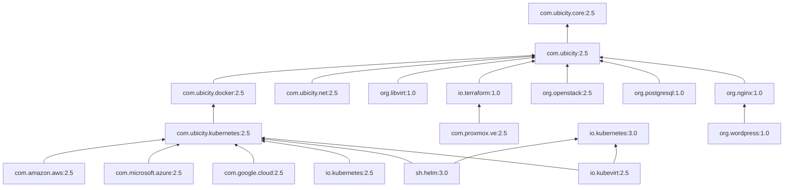

# Ubicity TOSCA Profiles

The following diagram shows how the profiles in this repository relate
to each other via TOSCA `imports`. Arrows point from a profile to the
profiles it imports. Transitive edges have been omitted to keep the
graph readable.

```mermaid
graph BT
    core["com.ubicity.core:2.5"]
    ubct["com.ubicity:2.5"]

    docker["com.ubicity.docker:2.5"]
    kube["com.ubicity.kubernetes:2.5"]
    net["com.ubicity.net:2.5"]

    aws["com.amazon.aws:2.5"]
    azure["com.microsoft.azure:2.5"]
    gcp["com.google.cloud:2.5"]
    openstack["org.openstack:2.5"]
    proxmox["com.proxmox.ve:2.5"]

    libvirt["org.libvirt:1.0"]
    kubevirt["io.kubevirt:2.5"]

    iokube25["io.kubernetes:2.5"]
    iokube30["io.kubernetes:3.0"]

    terraform["io.terraform:1.0"]
    helm["sh.helm:3.0"]

    postgres["org.postgresql:1.0"]
    nginx["org.nginx:1.0"]
    wordpress["org.wordpress:1.0"]

    ubct --> core

    docker --> ubct
    kube --> docker
    net --> ubct
    libvirt --> ubct
    terraform --> ubct
    openstack --> ubct
    postgres --> ubct
    nginx --> ubct

    aws --> kube
    azure --> kube
    gcp --> kube
    iokube25 --> kube
    helm --> kube
    kubevirt --> kube
    helm --> iokube30
    kubevirt --> iokube30

    proxmox --> terraform
    wordpress --> nginx

    classDef deprecated stroke:#c33,stroke-dasharray:5 5;
    classDef transitional stroke:#e90,stroke-dasharray:3 3;
    classDef external fill:#eee,stroke:#999,color:#555;
    class abs_platform,abs_data transitional;
    class cc_platform,cc_data external;
```

`com.ubicity.scalar:1.0`, `org.oasis-open.simple:2.5`, and
`org.oasis-open.non-normative:1.3` are not shown in the diagram: they
neither import nor are imported by any other profile in this
repository.

### Foundation

#### [com.ubicity.core:2.5](../ubicity/core/2.5)
Base relationship types, capability types, and data types shared by
every other Ubicity profile. Also defines the custom TOSCA functions
implemented in `functions/` (e.g. `unique_name`, `validate_json`,
`decode_json`).

### Administrator and Device View

These profiles model resources from the perspective of an
administrator deploying and operating them on real infrastructure.
They include lifecycle artifact scripts that the Ubicity Orchestrator
runs to install and configure software on remote hosts.

#### [com.ubicity:2.5](../ubicity/2.5)
The main Ubicity profile. Defines the core node-type taxonomy used by
service templates: `Compute`, `Software`, `InstallablePackage`,
`PipPackage`, networking primitives, storage, and the standard
lifecycle interface. Imports `com.ubicity.core:2.5`.

#### [com.ubicity.docker:2.5](../ubicity/docker/2.5)
Ubicity-specific Docker and Containerd install recipes (Docker engine,
containerd, Docker containers, Docker volumes, Mac VLAN networks).
Apt-based installation on Debian/Ubuntu hosts. Imports `com.ubicity:2.5`.

#### [com.ubicity.kubernetes:2.5](../ubicity/kubernetes/2.5)
Node types for installing and operating Kubernetes clusters. Defines
the abstract `KubernetesCluster` base type and two realizations:
self-installed clusters via `KubernetesController`/`KubernetesWorker`
(with k3s, k0s, MicroK8s, kubeadm, and minikube subtypes) and
cloud-managed clusters via `ManagedKubernetes` (EKS/AKS/GKE). Distinct
from `io.kubernetes`, which models the Kubernetes API resources
themselves. Imports `com.ubicity:2.5` and `com.ubicity.docker:2.5`.

#### [com.ubicity.net:2.5](../ubicity/net/2.5)
Network device types (switches, VLANs, links) used for managing
physical and virtual networks. Imports `com.ubicity:2.5`.

#### [com.ubicity.scalar:1.0](../ubicity/scalar/1.0)
TOSCA v2.0 equivalents of the `scalar-unit.size`, `scalar-unit.time`,
`scalar-unit.frequency`, and `scalar-unit.bitrate` data types
originally defined in TOSCA Simple Profile in YAML v1.3.

### Cloud Providers (Device View)

Vendor-specific profiles for deploying resources on public and
private clouds. Each profile defines the resources offered by the
provider and uses provider-specific CLIs (installed via TOSCA service
templates in [tosca-svcs](https:/github.com/ubicity-corp/tosca-svcs))
to provision them.

#### [com.amazon.aws:2.5](../amazon/aws/2.5)
AWS resources: VPCs, subnets, security groups, EC2 instances, EKS
clusters, etc. Artifacts use the AWS CLI.

#### [com.microsoft.azure:2.5](../microsoft/azure/2.5)
Azure resources organized around subscriptions and resource groups:
virtual networks, subnets, public IPs, network security groups, NICs,
virtual machines, AKS clusters, etc. Artifacts use the Azure CLI.

#### [com.google.cloud:2.5](../google/cloud/2.5)
Google Cloud resources: networks, firewall rules, compute instances,
GKE clusters, etc. Artifacts use the `gcloud` CLI.

#### [org.openstack:2.5](../../org/openstack/2.5)
OpenStack resources: regions, projects, key pairs, networks, subnets,
ports, and servers (../pute instances). Artifacts use the OpenStack
client.

#### [com.proxmox.ve:2.5](../proxmox/ve/2.5)
Proxmox Virtual Environment resources: the Proxmox host, VM images,
disks, and virtual machines. Built around the Terraform Proxmox
provider.

### Virtualization Platforms

#### [org.libvirt:1.0](../../org/libvirt/1.0)
KVM hypervisor and libvirt management layer that underpin Linux
virtualization platforms (KubeVirt, oVirt, OpenNebula, CloudStack,
etc.). Provides a `HyperVisor` capability that virtualization
platforms can host on.

#### [io.kubevirt:2.5](../../io/kubevirt/2.5)
The KubeVirt virtualization platform — an installation of KubeVirt on
a Kubernetes cluster — together with the resources (virtual machines,
tooling) that can be provisioned on it.

### Kubernetes Resource Models

These profiles model the Kubernetes API resources themselves
(deployments, services, pods, configmaps, etc.) — distinct from
`com.ubicity.kubernetes`, which is about installing the cluster.

#### [io.kubernetes:3.0](../../io/kubernetes/3.0)
Model of Kubernetes API resources, split into
`core`, `apps`, `storage`, `networking`, and `rbac` modules.

### Infrastructure Tooling

#### [io.terraform:1.0](../../io/terraform/1.0)
Defines a `Terraform` artifact type used to drive infrastructure-as-
code workflows, and a node type for installing the Terraform CLI on a
host.

#### [sh.helm:3.0](../../sh/helm/3.0)
Node types for installing the Helm CLI, registering Helm
repositories, and deploying Helm charts to a Kubernetes cluster.
Imports `com.ubicity.kubernetes:2.5` and `io.kubernetes:3.0`.

### Application Software

#### [org.postgresql:1.0](../../org/postgresql/1.0)
PostgreSQL DBMS, logical databases, and database user accounts.

#### [org.nginx:1.0](../../org/nginx/1.0)
nginx web server and websites hosted on it.

#### [org.wordpress:1.0](../../org/wordpress/1.0)
A WordPress website hosted on an nginx web server. Derives from the
nginx `WebSite` node type.

