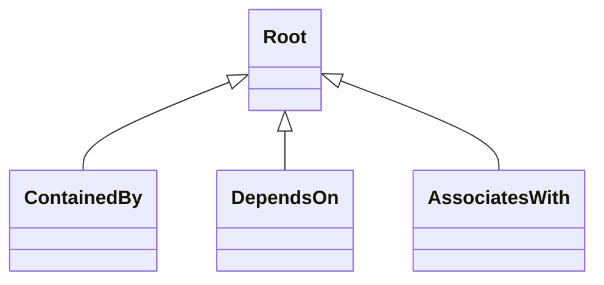
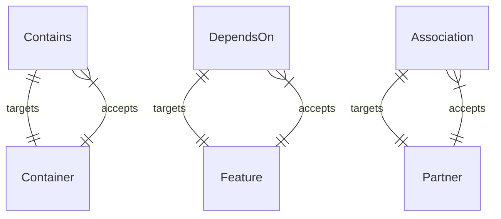

# Ubicity Core Profile
## Relationship Types

Ubicity uses three different *kinds* of top-level relationships. When
using the Ubicity Orchestrator, the *kind* of the relationship is used
to determine how changes in *target* nodes are propagated across
relationships to the *source* nodes of those relationships.
- A *containment* relationship kind that indicates that the lifecycle
  of the contained entity (the *source* of the relationship) is
  dictated by the lifecycle of the containing entity (the *target* of
  the relationship). This kind of relationship is provided using the
  `ContainedBy` relationship type that derives directly from
  `Root`. Relationships of type `ContainedBy` target capabilities of
  type `Container` as specified using the `valid_capability_types`
  keyword in the type definition.
- A *dependency* relationship kind that indicates that the state
  and/or configuration of a dependent node (the *source* of the
  relationship) depends on the state and/or configuration of the
  *target* node. This kind of relationship is provided using the
  `DependsOn` relationship type that derives directly from
  `Root`. Relationships of type `DependsOn` target capabilities of
  type `Feature` as specified using the `valid_capability_types`
  keyword in the type definition.
- An *association* relationship kind that is provided for
  informational purposes only and no state or configuration
  dependencies exist. This kind of relationship is provided using the
  `AssociatesWith` relationship type that derives directly from
  `Root`. Relationships of type `AssociatedWith` target capabilities
  of type `Partner` as specified using the `valid_capability_types`
  keyword in the type definition.

Each of these relationship types derive from a top-level `Root`
relationship type that is intended to advertize the Ubicity
`Configure` interface that is used by all relationship types. Other
relationship types can be derived from one of the three *base*
relationship types.

## Capability Types

Ubicity defines three *base* capability types that are matched with
the three different kinds of base relationship types. Other capability
types are derived from one of these three base types. The following
figure shows how the different base relationship types target
different capability types and how different capability types accept
different incoming relationship types:

