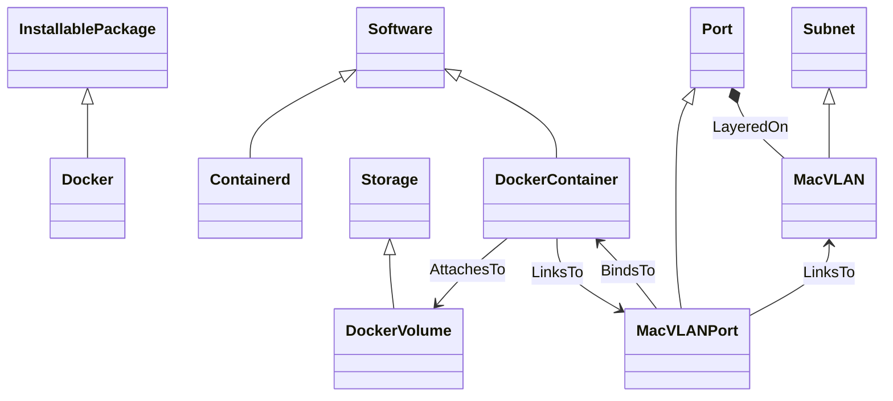

# Ubicity Docker Profile Node Types

This directory contains the Ubicity Docker TOSCA Profile. This profile
primarily defines *device view* types that model components that use
Docker.

The following node types are used for deploying docker containers:

