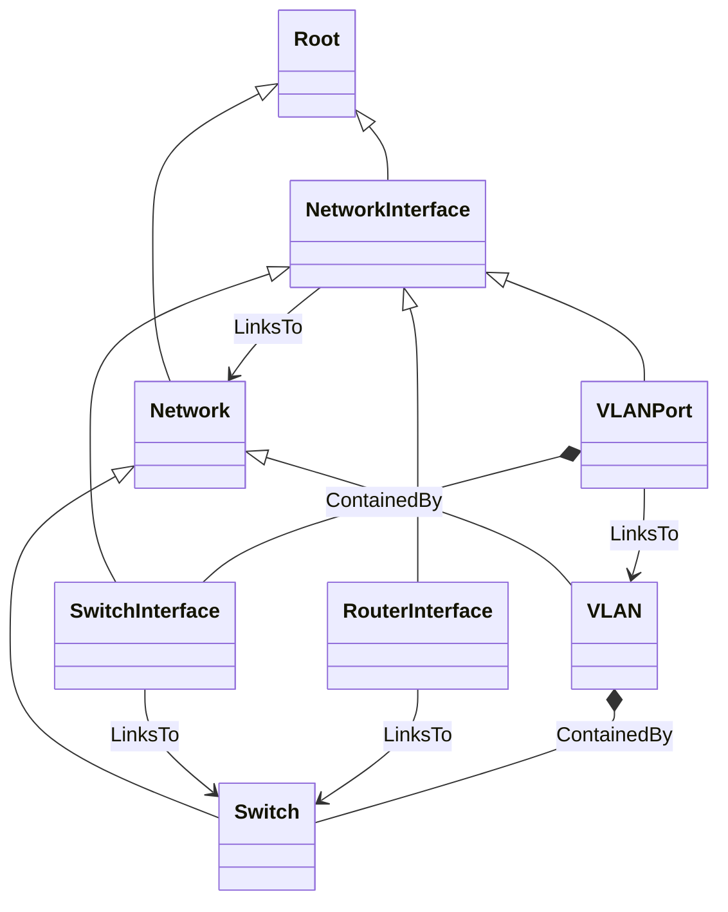

# Ubicity Network Profile
TOSCA node types for managing networks.

## TOSCA Node Types



### TOSCA Artifacts

[Netmiko Scripting](https://networkjourney.com/cisco-netmiko-scripting-with-examples-a-comprehensive-guide/)

## Development Environment

Network equipment can be simulated using [Cisco Modeling
Labs](https://www.cisco.com/site/us/en/learn/training-certifications/training/modeling-labs/index.html)
(CML) or [Graphical Network Simulator-3](https://www.gns3.com/)
(GNS3). So far, Ubicity has only used CML.

### Installing Cisco Modeling Labs

Use the following instructions to install Cisco Modeling Labs-Free
Tier as a Virtual Machine using VMWare Workstation:

1. Download the Cisco Modeling Labs Server OVA file from the Cisco
   [Software Central](https://software.cisco.com/download/home) site.
2. Download the Cisco Modeling Labs reference platform ISO file from
   the Cisco [Software
   Central](https://software.cisco.com/download/home) site. This file
   is delivered in compressed ZIP format.
3. Right-mouse-click on the downloaded OVA file in the `Downloads`
   folder and select
   ```
   Open with > VMware Workstation
   ```
   This will cause VMware Workstation to create a new virtual machine
   and import the OVA file. When prompted, assign a VM name
   (e.g. `CML`) and a directory for the VM files (e.g,
   `C:\Users\<user>\Documents\Virtual Machines\CML)`
4. Extract the zip'd reference platform ISO file into the same
   directory that contains the Modeling Labs VM files.
5. Click `Edit virtual machine settings` for the Cisco Modeling Labs
   VM and select the `CD/DVD (IDE)` panel. Enable `Connect at power
   on` and choose the `Use ISO image file:` option. Then click the
   `Browse..` button to select the extracted reference platform ISO
   file.

### Support Modeling VMs
Both tools are available as virtual machines that can be run using
VMWare Workstation. However, Hyper-V must be disabled on the Windows
host since it conflics with VMWare Workstation. To disable Hyper-V,
take the following actions. These steps are loosely based on a
[Microsoft
Document](https://learn.microsoft.com/en-us/troubleshoot/windows-client/application-management/virtualization-apps-not-work-with-hyper-v).

1. Open the *Turn Windows features on or off* window and unselect the
   following features:
   - Hyper-V
   - Virtual Machine Platform
   - Windows Hypervisor Platform

   Alternativaly, Hyper-V can also be disabled in PowerShell by
   running the following command:
   ```
   Disable-WindowsOptionalFeature -Online -FeatureName Microsoft-Hyper-V-Hypervisor
   ```
   
2. Even with these features disabled, Hyper-V continues to run since
   some of its features are used by the Windows *Device Guard* and
   *Credential Guard* security tools. These need to be disabled to
   fully disable Hyper-V. This can be done as follows:
   - Download and unzip the [Device Guard and Credential Guard
     hardware readiness
     tool](https://www.microsoft.com/en-us/download/details.aspx?id=53337)
   - Open PowerShell as administrator and run
     ```
     DG_Readiness.ps1 -Disable
     ```

The following step has also been recommended but at this point it is
unclear if it is required:

3. Open PowerShell as administrator and run
   ```
   bcdedit /set hypervisorlaunchtype off`
   ```

### Cisco Modeling Labs

Slightly out-of-date installation instructions can be found in the
following video: [Cisco CML: Full installation and
configuration](https://youtu.be/qKiLpN-M4Xc).

Documentation can be found at
https://developer.cisco.com/docs/modeling-labs/

#### Setting up a Lab with a Switch

1. Go to the Cisco Modeling Labs *Dashboard* and click the *Add*
   button to create a new lab. This opens the *Workbench*.
2. Click the *Add Nodes* button from the menu bar at the top of the
   Workbench.
   - Drag an *External Connector* onto the topology view.
   - Drag an *IOL-L2* onto the topology view.
   - *Right-mouse-click* on the IOL-L2 node and select *Add
      Link*. Terminate the link on the External Connector.
3. Click on the External Connector node to edit its settings. From the
   *Connector Selection* dropdown, select `System Bridge (bridge0)`.

#### Basic Switch Configuration

1. Start the lab by selecting the *Lab" dropdown in the Workbench menu
   bar and click *Start Lab*.
2. Right-mouse-click on the switch node and open the console. 
3. In the console window, enter basic configuration, configure a
   management IP address on VLAN 1, and making sure all necessary
   interfaces are up. These instructions are loosely based on the this
   [video](https://youtu.be/LprAFbJy8a8):

    ```
    enable
    config terminal
    hostname <hostname>
    interface vlan 1
    ip address <mgmt_ip_address> <subnet_mask>
    no shutdown
    exit
    interface Ethernet0/0
    no shutdown
    end
    wr
    ```

#### Enable SSH
1. Support SSH on virtual terminal lines:
   ```
   config terminal
   line vty 0 4
   transport input ssh
   end
   wr
   ```
2. Create an SSH key
   ```
   config terminal
   ip domain name <domain-name>
   crypto key generate rsa
   end
   wr
   ```

#### Create `admin` Credentials
1. Create an admin account using the following commands:
   ```
   config terminal
   aaa new-model
   aaa authentication login default local
   username admin password <password> 
   end
   wr
   ```
2. Create an `enable` password:
   ```
   config terminal
   enable secret <enable-password>
   exit
   wr
   ```
### Graphical Network Simulator-3

Installation instructions can be found in the following document:
[GNS3 Getting
Started](https://docs.gns3.com/docs/getting-started/setup-wizard-gns3-vm)

