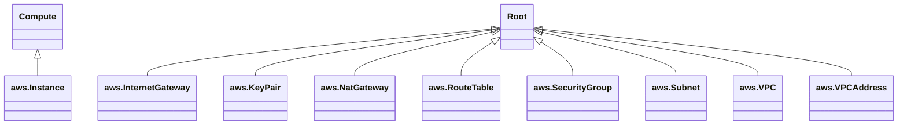
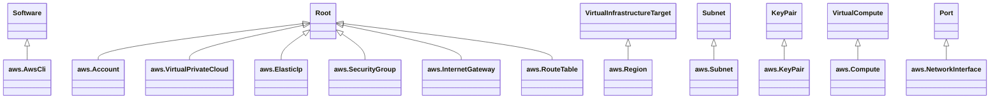
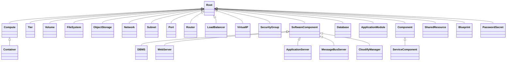

# TOSCA Community Profiles

This directory is intended to track profiles created by the TOSCA
Community.

> The community needs to decide on a naming convention for these
  profiles.

## Objectives

The goal for these community profiles is to combine *best of breed*
type definitions created by various TOSCA projects over the
years. Most of these projects have used the TOSCA Simple Profile in
YAML v1.3 type definitions as a starting point and have extended these
definitions to satisfy project-specific objectives. As a result, it is
likely that there are sufficient similarities between these profiles
that should allow them to be harmonized. However, there are likely
also significant differences, specifically:

- differences in the target platforms on which components modeled by
  node types are intended to be deployed (e.g. IaaS clouds, PaaS
  platforms, Kubernetes clusters, dedicated compute devices, etc.)
- differences in the deployment technologies used to interact with the
  physical resources (e.g., Ansible, Terraform, Bash, etc.)

The community profiles should include sufficient variability to
accommodate these differences.

## Approach

Common community profiles will be created using the following process:

1. *Document*: For each of the profiles under consideration, document
   the TOSCA node type hiearchies.
2. *Categorize*: Define common categories into which to separate the
   various node type definitions.
3. *Harmonize*: Extract common node type hierarchies for each of the
   defined categories.
4. *Integrate*: Define common capabilities and requirements that
   define the integration points between the defined node types.
5. *Configure*: Define common properties and attributes.
6. *Implement*: Define mechanisms for overlaying various
   deployment technologies for the community profiles.

## Document

Common community profiles will be based on TOSCA type definitions that
have been created in the context of various TOSCA implementation
projects. So far, the following have been identified:

- [TOSCA Simple Profile in YAML v1.3](https://github.com/oasis-open/tosca-community-contributions/tree/master/profiles/org/oasis-open/simple/1.3)
- [TOSCA Simple Profile Non-Normative](https://github.com/oasis-open/tosca-community-contributions/tree/master/profiles/org/oasis-open/non-normative/1.3)
- [EDMM](https://github.com/UST-EDMM/modeling-repository/)
- [OpenTOSCA](https://github.com/OpenTOSCA/tosca-definitions-common)
- [Vintner](https://vintner.opentosca.org/normative/)
- [DeMAF](https://github.com/UST-DeMAF/demaf-type-definitions)
- [XLAB Steampunk AWS EC2](https://github.com/oasis-open/tosca-community-contributions/tree/master/profiles/si/steampunk/aws/ec2)
- [Yorc](https://github.com/ystia/yorc/tree/develop/data/tosca)
- [Ystia](https://github.com/ystia/forge/tree/develop/org/ystia)
- [Alien4Cloud](https://github.com/alien4cloud/csar-public-library/tree/develop/org/alien4cloud)
- [Radon particles](https://github.com/radon-h2020/radon-particles)
- [Ubicity](https://github.com/lauwers/tosca-community-contributions/tree/master/profiles/com/ubicity)
- [Cloudify](https://github.com/cloudify-cosmo/cloudify-manager/blob/master/resources/rest-service/cloudify/types/types.yaml)
- other?

> Most of these type definitions will need to be converted to TOSCA v2.0

This section shows node type hierarchies for each of these profiles

### TOSCA Simple Profile in YAML v1.3

The TOSCA Simple Profile in YAML specification defines both normative
and non-normative types. Since the non-normative type definitions
derive from the normative types, normative and non-normative types are
combined in the following class diagram:

> In order the improve readability of the diagram, the leading
  `tosca.nodes.` prefixes are omitted from the node type names.

### EDMM
EDMM Provides a declarative model describing the components to be
deployed, their configurations, required artifacts, and relations
among them. The resulting EDMM model is independent of any specific
deployment technology and can be exported from an EDMM-enabled
modeling tool or created directly using a text editor according to the
respective YAML specification. This model can be fed into the EDMM
Transformation and Deployment Framework.

TOSCA v2.0 versions of the node types defined by EDMM can be found in
[edmm.yaml](edmm.yaml). They are organized in the following node type
hiearchy:

### OpenTOSCA

OpenTOSCA defines common TOSCA types for VMs, cloud providers, and
runtimes that are intended to be consumed by the OpenTOSCA Container.
TOSCA v2.0 versions of the node types defined by OpenTOSCA can be
found in [open-tosca.yaml](open-tosca.yaml). They are organized in the
following node type hiearchy:

### Vintner

OpenTOSCA Vintner is a TOSCA preprocessing and management layer that
is able to deploy applications based on TOSCA orchestrator
plugins. Preprocessing includes the modeling of different deployment
variants inside a single deployment model.

Vintner defines two TOSCA profiles: the TOSCA Vintner Core Profile and
the TOSCA Vintner Extended Profile. Since the Extended Profile types
leverage the Core Profile types, they are combined into the following
diagram:

### DeMAF

Deployment-Model Abstraction Framework (DeMAF) is a tool that enables
transforming technology-specific deployment models using Terraform,
Kubernetes, etc. into technology-agnostic deployment models using the
Essential Deployment Metamodel (EDMM). DeMAF defines the following
node types:

> In order the improve readability of the diagram, the leading
  `demaf.nodetypes.` prefixes are omitted from the node type names.

### XLAB Steampunk AWS EC2
The XLAB Steampunk AWS EC2 profile is intended to be a complete
library to interface with EC2. It defines the following types:

### Radon particles

Defines TOSCA types for application runtimes, computing resources, and
FaaS platforms in the form of abstract as well as deployable modeling
entities. The repository also comprises RADON's FaaS abstraction layer
that provides several TOSCA definitions to deploy a particular FaaS
application component to different cloud providers.

> To be provided

### Ystia/Alien4Cloud/Yorc

Ystia is an open source project (under OW2) that includes the
Alien4Cloud and Yorc technologies. Alien4Cloud is a graphical
front-end for designing and managing cloud applications. It is not an
orchestrator, but rather it requires a backend orchestrator for
deploying applications. Yorc (Ystia Orchestrator) is the default
orchestrator used by Alien4Cloud. Yorc is designed to support multiple
infrastructures (VMs, containers, Kubernetes, etc.).

> For reasons that are unclear, the Yorc and Alien4Cloud github
repositories each define their own TOSCA types In addition, there is a
separate Ystia repository that also defines TOSCA types. We need to
understand the motivation behind this separation as well as the
relationships between these different types.

#### Yorc
Yorc defines the following TOSCA types, many of which derived from the
Simple Profile types:

In addition, Yorc defines a collection of Kubernetes-related TOSCA
types that are based on Alien4Cloud type definitions.

#### Ystia

#### Alien4Cloud

```mermaid
classDiagram
    Root <|-- cloudify.patches.pub.nodes.CloudifyPatch
    cloudify.patches.pub.nodes.CloudifyPatch <|-- cloudify.patches.amqp_client.nodes.AmqpClientPatch
    cloudify.patches.pub.nodes.CloudifyPatch <|-- cloudify.patches.change_max_mgmtworker.nodes.ChangeMaxMgmtWorkerPatch
    cloudify.patches.pub.nodes.CloudifyPatch <|-- cloudify.patches.change_max_fd.nodes.ChangeMaxFd
    cloudify.patches.pub.nodes.CloudifyPatch <|-- cloudify.patches.patch_mgmtworker.nodes.PatchMgmtworkTasksPy
    apache.pub.nodes.WebApplication <|-- cloudify.config.offline_plugin.nodes.PluginConfigurator
    SoftwareComponent <|-- cloudify.ansible.nodes.Ansible4CloudifyManager
    SoftwareComponent <|-- cloudify.hostpool.pub.nodes.HostPoolService
    cloudify.hostpool.pub.nodes.HostPoolService <|-- cloudify.hostpool.service.nodes.HostPool
    SoftwareComponent <|-- cloudify.hostpool.awsfeeder.nodes.AWSHostpoolFeeder
    SoftwareComponent <|-- cloudify.manager.pub.nodes.CloudifyManagerService
    Root <|-- cloudify.manager.pub.nodes.CloudifyIaaSConfiguration
    cloudify.manager.pub.nodes.CloudifyManagerService <|-- cloudify.manager.v4.nodes.CloudifyManager
    Root <|-- cloudify.manager.v4.nodes.CloudifySSHKey
    cloudify.manager.pub.nodes.CloudifyIaaSConfiguration <|-- cloudify.manager.v4.nodes.CloudifyAwsConfiguration
    cloudify.manager.pub.nodes.CloudifyIaaSConfiguration <|-- cloudify.manager.v4.nodes.CloudifyAzureConfiguration
    cloudify.manager.pub.nodes.CloudifyIaaSConfiguration <|-- cloudify.manager.v4.nodes.CloudifyOpenstackConfiguration
    cloudify.manager.pub.nodes.CloudifyManagerService <|-- cloudify.manager.v3.nodes.Cloudify3Manager
    cloudify.manager.v4.nodes.CloudifyAwsConfiguration <|-- cloudify.manager.v3.nodes.Cloudify3AwsConfiguration
    Root <|-- cloudify.manager.pub.nodes.CloudifyAsAService
    SoftwareComponent <|-- java.jdk.linux.nodes.OracleJDK
    Root <|-- java.pub.nodes.JavaSoftware
    apache.pub.nodes.Apache <|-- apache.linux_sh.Apache
    WebServer <|-- apache.pub.nodes.Apache
    WebApplication <|-- apache.pub.nodes.WebApplication
    apache.pub.nodes.Apache <|-- apache.linux_ans.nodes.Apache
    SoftwareComponent <|-- mock.pub.nodes.AbstractMock
    mock.pub.nodes.AbstractMock <|-- mock.pub.nodes.AbstractMockHost
    mock.pub.nodes.AbstractMock <|-- mock.pub.nodes.AbstractMockComponent
    mock.pub.nodes.AbstractMockHost <|-- mock.bash.nodes.BashMockHost
    mock.pub.nodes.AbstractMockComponent <|-- mock.bash.nodes.BashMockComponent
    mock.pub.nodes.AbstractMockHost <|-- mock.ansible.nodes.AnsibleMockHost
    mock.pub.nodes.AbstractMockComponent <|-- mock.ansible.nodes.AnsibleMockComponent
    SoftwareComponent <|-- monitoring.pub.nodes.MonitoringAgent
    SoftwareComponent <|-- monitoring.pub.nodes.MetricsBackend
    SoftwareComponent <|-- consul.pub.nodes.ConsulAgent
    consul.pub.nodes.ConsulAgent <|-- consul.pub.nodes.ConsulServer
    java.pub.nodes.JavaSoftware <|-- spark.linux_sh.nodes.SparkNode
    spark.linux_sh.nodes.SparkNode <|-- spark.linux_sh.nodes.SparkMaster
    spark.linux_sh.nodes.SparkNode <|-- spark.linux_sh.nodes.SparkSlave
    nodes.Job <|-- spark.jobs-linux-sh.nodes.SparkJob
    http-proxy.pub.nodes.HttpProxy <|-- squid3.linux_sh.Squid3
    monitoring.pub.nodes.MetricsBackend <|-- graphite.pub.nodes.GraphiteService
    graphite.pub.nodes.GraphiteService <|-- graphite.linux_ans.nodes.Graphite
    diamond.pub.nodes.DiamondCollector <|-- diamond.collectors.nodes.ElasticSearchCollector
    diamond.pub.nodes.DiamondCollector <|-- diamond.collectors.nodes.JolokiaCollector
    diamond.collectors.nodes.JolokiaCollector <|-- diamond.collectors.nodes.A4CCollector
    diamond.pub.nodes.DiamondCollector <|-- diamond.collectors.nodes.RabbitmqCollector
    diamond.pub.nodes.DiamondCollector <|-- diamond.collectors.nodes.PostgresqlCollector
    diamond.pub.nodes.DiamondCollector <|-- diamond.collectors.nodes.CloudifyCollector
    diamond.pub.nodes.DiamondCollector <|-- diamond.collectors.nodes.CloudifyHostpoolCollector
    monitoring.pub.nodes.MonitoringAgent <|-- diamond.pub.nodes.DiamondAgent
    Root <|-- diamond.pub.nodes.DiamondCollector
    diamond.pub.nodes.DiamondAgent <|-- diamond.agent_linux.nodes.DiamondLinuxAgent
    SoftwareComponent <|-- php.debian_sh.nodes.PHP
    Database <|-- mysql.pub.nodes.Mysql
    mysql.pub.nodes.Mysql <|-- mysql.linux_pup.nodes.Mysql
    SoftwareComponent <|-- kubernetes.kubeadm.nodes.DockerEngine
    SoftwareComponent <|-- kubernetes.kubeadm.nodes.Kube
    kubernetes.kubeadm.nodes.Kube <|-- kubernetes.kubeadm.nodes.KubeMaster
    kubernetes.kubeadm.nodes.Kube <|-- kubernetes.kubeadm.nodes.KubeNode
    SoftwareComponent <|-- aws-cli.linux_bash.nodes.AwsCli
    SoftwareComponent <|-- http-proxy.pub.nodes.HttpProxy
    elasticsearch.pub.nodes.ElasticSearchService <|-- elasticsearch.ubuntu.nodes.ElasticSearch
    java.pub.nodes.JavaSoftware <|-- elasticsearch.pub.nodes.ElasticSearchService
    elasticsearch.pub.nodes.ElasticSearchService <|-- elasticsearch.centos.nodes.ElasticSearch
    elasticsearch.pub.nodes.ElasticSearchService <|-- elasticsearch.ansible.nodes.ElasticSearch
    terraform.openstack.nodes.AbstractTerraInstance <|-- terraform.openstack.nodes.TerraInstance
    Compute <|-- terraform.openstack.nodes.AbstractTerraInstance
    Root <|-- terraform.openstack.nodes.CustomSecurityGroup
    SoftwareComponent <|-- grafana.pub.nodes.GrafanaService
    grafana.pub.nodes.GrafanaService <|-- grafana.linux_ans.nodes.Grafana
    alien4cloud.webapp.nodes.Alien4Cloud <|-- alien4cloud.demo.nodes.Alien4CloudDemo
    alien4cloud.pub.nodes.Alien4CloudService <|-- alien4cloud.webapp.nodes.Alien4Cloud
    java.pub.nodes.JavaSoftware <|-- alien4cloud.postdeployment.nodes.Postdeployment
    java.pub.nodes.JavaSoftware <|-- alien4cloud.pub.nodes.Alien4CloudService
    Root <|-- alien4cloud.pub.nodes.AlienConfigurator
    java.pub.nodes.JavaSoftware <|-- alien4cloud.tests.loadtest.nodes.JMeterTestLauncher
    alien4cloud.pub.nodes.AlienConfigurator <|-- alien4cloud.config.pub.nodes.OrchestratorConfigurator
    Root <|-- alien4cloud.config.pub.nodes.LocationConfigurator
    alien4cloud.pub.nodes.AlienConfigurator <|-- alien4cloud.config.applications.nodes.AddApplications
    alien4cloud.pub.nodes.AlienConfigurator <|-- alien4cloud.config.repository.nodes.ArtifactRepositoriesConfigurator
    alien4cloud.pub.nodes.AlienConfigurator <|-- alien4cloud.config.plugin.nodes.UploadPlugin
    alien4cloud.pub.nodes.AlienConfigurator <|-- alien4cloud.config.csar.nodes.AddCsarFromGit
    alien4cloud.pub.nodes.AlienConfigurator <|-- alien4cloud.config.repository.nodes.ArtifactRepositoriesConfigurator
    alien4cloud.config.pub.nodes.OrchestratorConfigurator <|-- alien4cloud.config.orchestrator.cfy.nodes.CfyOrchestratorConfigurator
    alien4cloud.config.orchestrator.cfy.nodes.CfyOrchestratorConfigurator <|-- alien4cloud.config.orchestrator.cfy.nodes.CfyAzureParametersConfigurator
    alien4cloud.pub.nodes.AlienConfigurator <|-- alien4cloud.config.backupRestoreS3.nodes.BackupRestoreS3
    alien4cloud.config.location.nodes.SimpleLocationConfigurator <|-- alien4cloud.config.location_resources.cfy_byon.nodes.ByonLocationResourcesConfigurator
    alien4cloud.config.location.nodes.SimpleLocationConfigurator <|-- alien4cloud.config.location_resources.on_demand.nodes.OnDemandLocationResourcesConfigurator
    alien4cloud.config.location.nodes.SimpleLocationConfigurator <|-- alien4cloud.config.location_resources.autoconfig.nodes.ResourcesConfigurator
    alien4cloud.config.pub.nodes.LocationConfigurator <|-- alien4cloud.config.location.nodes.SimpleLocationConfigurator
```

### Ubicity

Ubicity profiles define general purpose TOSCA types that aim to
implement common design patterns to handle
[abstraction](https://github.com/oasis-open/tosca-community-contributions/blob/master/profiles/com/ubicity/README.md). The
Ubicity main profile types are organized in the following node type
hiearchy:

#### Ubicity Amazon EC2
In addition, Ubicity defines various platform-specific profiles. The
following shows the profile for AWS EC2:

#### Ubicity Openstack
The following shows the profile for Openstack:

#### Ubicity Proxmox
The following shows the profile for Proxmox:

#### Ubicity Kubernetes
The following shows the profile for Kubernetes:

### Cloudify

Cloudify allows organizations to automate their existing
infrastructure alongside cloud native and distributed edge
resources. Cloudify also allows users to manage different
orchestration and automation domains as part of one common CI/CD
pipeline.

> In order the improve readability of the diagram, the leading
  `cloudify.nodes.` prefixes are omitted from the node type names.

## Categorize

For the types defined in each of the contributed profiles:
- Distinguish between types that define service components
  vs. types that define the platforms on which these service
  components are deployed.
- Distinguish between abstract types and types that assume specific
  implementations.
- Distinguish between types that model the same component but use
  different implementation technologies (e.g., Ansible vs. Terraform)

### Platform Types

- IaaS (Infrastructure as a Service): You rent virtual machines and
  storage; you manage everything else.

- PaaS (Platform as a Service): You rent a ready-made platform to
  develop and deploy apps; provider manages the infrastructure.

  Examples of PaaS:

  - Heroku

  - Google App Engine

  - Microsoft Azure App Service

  - AWS Elastic Beanstalk

  - Red Hat OpenShift

- SaaS (Software as a Service): You rent and use a finished
  application (like Gmail or Salesforce).

Kubernetes is not itself a Platform as a Service (PaaS). It’s more
accurate to call it a container orchestration system or an
infrastructure platform that many PaaS offerings are built on top of.

What Kubernetes does:

- Manages containers (e.g., Docker) across clusters of machines.

- Handles scheduling, scaling, load balancing, networking, and
  self-healing of applications.

- Provides APIs and abstractions for infrastructure, but doesn’t give
  you developer-focused tools out of the box (like build pipelines,
  application runtimes, or managed databases).

Why it’s not PaaS:

- PaaS is developer-focused → You push your code, and the platform
  takes care of builds, dependencies, deployment, scaling, etc. (e.g.,
  Heroku).

- Kubernetes is infrastructure-focused → You deploy containers that
  you have already built; Kubernetes schedules and manages them.

- In fact, people often describe Kubernetes as sitting somewhere
  between IaaS and PaaS:

  - It’s more than IaaS (because it abstracts servers into a unified
    cluster).

  - It’s less than PaaS (because it doesn’t abstract away deployment
    complexity for developers by default).

PaaS existed long before Kubernetes was created (2014). For example:

- Heroku (2007) → classic PaaS, lets you git push code and deploy. No
  Kubernetes.

- Google App Engine (2008) → serverless-style PaaS, predates
  Kubernetes.

- Cloud Foundry (2011) → a PaaS with its own container/runtime system,
  not Kubernetes-based.

These platforms provided developer workflows, build pipelines, and
runtime environments without Kubernetes.

Many newer PaaS offerings do use Kubernetes under the hood, because
Kubernetes has become a de facto standard for container
orchestration. Examples:

- OpenShift (Red Hat)

- Google Cloud Run / Knative

- VMware Tanzu Application Service (K8s edition)

In these cases, Kubernetes provides a solid infrastructure layer,
while the PaaS adds developer-focused abstractions.

Some modern PaaS options still don’t depend on Kubernetes, especially
serverless PaaS:

- AWS Elastic Beanstalk (abstracts EC2, no Kubernetes required).

- AWS Lambda / Azure Functions (FaaS, sometimes called a “serverless
  PaaS”).

- Netlify, Vercel (serverless platforms for web apps, not
  Kubernetes-based).

## Harmonize

- Extract common class hierarchies

## Define Integration Points

- Define common requirement and capability definitions that model the
  integration points between node types.

## Configurations

- Define common properties and attributes that can be used to
  configure nodes and relationships and to track runtime state.

## Implementations

- Attach various implementations to the resulting node type
  definitions.