# TOSCA Community Profiles

This directory is intended to track profiles created by the TOSCA
Community.

> The community needs to decide on a naming convention for these
  profiles.

## Objectives

The goal for these community profiles is to combine *best of breed*
type definitions created by various TOSCA projects over the
years. Most of these projects have used the TOSCA Simple Profile in
YAML v1.3 type definitions as a starting point and have extended these
definitions to satisfy project-specific objectives. As a result, it is
likely that there are sufficient similarities between them that should
allow them to be harmonized. However, there are likely also
significant differences, specifically:

- differences in the target platforms on which components modeled by
  node types are intended to be deployed (e.g. IaaS clouds, PaaS
  platforms, Kubernetes clusters, dedicated compute devices, etc.)
- differences in the deployment technologies used to interact with the
  physical resources (e.g., Ansible, Terraform, Bash, etc.)

The community profiles should include sufficient variability to
accommodate these differences.

## Approach

### Inventory

Create an inventory of available TOSCA type definitions based on which
community profiles can be defined. So far, the following have been
identified:

- [TOSCA Simple Profile in YAML v1.3](https://github.com/oasis-open/tosca-community-contributions/tree/master/profiles/org/oasis-open/simple/1.3)
- [TOSCA Simple Profile Non-Normative](https://github.com/oasis-open/tosca-community-contributions/tree/master/profiles/org/oasis-open/non-normative/1.3)
- [EDMM](https://github.com/UST-EDMM/modeling-repository/)
- [OpenTOSCA](https://github.com/OpenTOSCA/tosca-definitions-common)
- [Vintner](https://vintner.opentosca.org/normative/)
- [DeMAF](https://github.com/UST-DeMAF/demaf-type-definitions)
- [XLAB Steampunk AWS EC2](https://github.com/oasis-open/tosca-community-contributions/tree/master/profiles/si/steampunk/aws/ec2)
- [Radon particles](https://github.com/radon-h2020/radon-particles)
- [Yorc/Ystia](https://github.com/ystia/yorc/tree/develop/data/tosca)
- [Ubicity](https://github.com/lauwers/tosca-community-contributions/tree/master/profiles/com/ubicity)
- [Cloudify](https://github.com/cloudify-cosmo/cloudify-manager/blob/master/resources/rest-service/cloudify/types/types.yaml)
- other?

> Most of these type definitions will need to be converted to TOSCA v2.0

### Document

- For each of the contributed profiles, document the node type
  hierarchies.

#### TOSCA Simple Profile in YAML v1.3

TOSCA Simple Profile in YAML includes both normative and non-normative
type definitions. Since the non-normative type definitions derive from
the normative types, they are combined in the following class diagram:

> In order the improve readability of the diagram, the leading
  `tosca.nodes.` prefixes are omitted from the node type names.

#### EDMM
EDMM Provides a declarative model describing the components to be
deployed, their configurations, required artifacts, and relations
among them. The resulting EDMM model is independent of any specific
deployment technology and can be exported from an EDMM-enabled
modeling tool or created directly using a text editor according to the
respective YAML specification. This model can be fed into the EDMM
Transformation and Deployment Framework.

TOSCA v2.0 versions of the node types defined by EDMM can be found in
[edmm.yaml](edmm.yaml). They are organized in the following node type
hiearchy:

#### OpenTOSCA

OpenTOSCA defines common TOSCA types for VMs, cloud providers, and
runtimes that are intended to be consumed by the OpenTOSCA Container.
TOSCA v2.0 versions of the node types defined by OpenTOSCA can be
found in [open-tosca.yaml](open-tosca.yaml). They are organized in the
following node type hiearchy:

#### Vintner

OpenTOSCA Vintner is a TOSCA preprocessing and management layer that
is able to deploy applications based on TOSCA orchestrator
plugins. Preprocessing includes the modeling of different deployment
variants inside a single deployment model.

Vintner defines two TOSCA profiles: the TOSCA Vintner Core Profile and
the TOSCA Vintner Extended Profile. Since the Extended Profile types
leverage the Core Profile types, they are combined into the following
diagram:

```mermaid
classDiagram
    node <|-- cloud.provider
    node <|-- cloud.service
    node <|-- software.component
    software.component <|-- service.component
    software.component <|-- software.runtime
    software.runtime <|-- container.runtime
    node <|-- machine
    machine <|-- local.machine
    machine <|-- remote.machine
    remote.machine <|-- virtual.machine
    remote.machine <|-- physical.machine
    node <|-- database
    database <|-- relational.database
    software.component <|-- dbms
    dbms <|-- relational.dbms
    software.component <|-- cache
    node <|-- storage
    storage <|-- block.storage
    storage <|-- object.storage
    storage <|-- file.storage
    node <|-- ingress
    software.runtime <|-- nodejs.runtime
    service.component <|-- nodejs.service.component
    service.component <|-- reactjs.service.component
    software.runtime <|-- python.runtime
    service.component <|-- python.service.component
    service.component <|-- go.service.component
    software.runtime <|-- java.runtime
    service.component <|-- java.service.component
    software.runtime <|-- dotnet.runtime
    service.component <|-- csharp.service.component
    service.component <|-- binary.service.component
    cloud.provider <|-- gcp.provider
    cloud.service <|-- gcp.service
    gcp.service <|-- gcp.cloudrun
    gcp.service <|-- gcp.cloudsql
    gcp.service <|-- gcp.appengine
    gcp.service <|-- gcp.appenginereporting
    gcp.service <|-- gcp.cloudbuild
    gcp.service <|-- gcp.kubernetesengine
    gcp.service <|-- gcp.cloudstorage
    gcp.service <|-- gcp.memorystore
    container.runtime <|-- docker.engine
    cloud.service <|-- kubernetes.cluster
    cloud.provider <|-- openstack.provider
    relational.dbms <|-- mysql.dbms
    relational.database <|-- mysql.database
    service.component <|-- minio.server
    cache <|-- redis.server
```

#### DeMAF

Deployment-Model Abstraction Framework (DeMAF) is a tool that enables
transforming technology-specific deployment models using Terraform,
Kubernetes, etc. into technology-agnostic deployment models using the
Essential Deployment Metamodel (EDMM). DeMAF defines the following
node types:

> In order the improve readability of the diagram, the leading
  `demaf.nodetypes.` prefixes are omitted from the node type names.

#### Radon particles

Defines TOSCA types for application runtimes, computing resources, and
FaaS platforms in the form of abstract as well as deployable modeling
entities. The repository also comprises RADON's FaaS abstraction layer
that provides several TOSCA definitions to deploy a particular FaaS
application component to different cloud providers.

#### Yorc/Ystia
Yorc is an hybrid cloud/HPC TOSCA orchestrator.

#### Ubicity

Ubicity profiles define general purpose TOSCA types that aim to
implement common design patterns to handle
[abstraction](https://github.com/oasis-open/tosca-community-contributions/blob/master/profiles/com/ubicity/README.md). The
Ubicity profile types are organized in the following node type
hiearchy:

#### Cloudify

Cloudify allows organizations to automate their existing
infrastructure alongside cloud native and distributed edge
resources. Cloudify also allows users to manage different
orchestration and automation domains as part of one common CI/CD
pipeline.

### Categorize

For the types defined in each of the contributed profiles:
- Distinguish between types that define service components
  vs. types that define the platforms on which these service
  components are deployed.
- Distinguish between abstract types and types that assume specific
  implementations.
- Distinguish between types that model the same component but use
  different implementation technologies (e.g., Ansible vs. Terraform)

### Harmonize

- Extract common class hierarchies

### Define Integration Points

- Define common requirement and capability definitions that model the
  integration points between node types.

### Configurations

- Define common properties and attributes that can be used to
  configure nodes and relationships and to track runtime state.

### Implementations

- Attach various implementations to the resulting node type
  definitions.