# TOSCA Community Profiles

This directory contains TOSCA profiles that are created by the TOSCA
Community&mdash;an informal group of TOSCA implementors and TOSCA
users that meet periodically and collaborate on TOSCA profiles and
examples that can be used by all members. TOSCA community profiles all
use `community.tosca` as their top-level domain name.

## Objectives

The goal for the TOSCA Community profiles is to combine *best of
breed* type definitions created by various [TOSCA
projects](inventory.md) over the years. Most of these projects have
used the TOSCA Simple Profile in YAML v1.3 type definitions as a
starting point and have extended these definitions to satisfy
project-specific objectives. As a result, it is likely that there are
sufficient similarities between these profiles that should allow them
to be harmonized. However, there are likely also significant
differences, specifically:

- Differences in the target platforms on which components modeled by
  node types are intended to be deployed (e.g. IaaS clouds, PaaS
  platforms, Kubernetes clusters, dedicated compute devices, etc.)
- Differences in the deployment technologies used to interact with the
  physical resources (e.g., Ansible, Terraform, Bash, etc.)

The TOSCA community profiles are intended to harmonize these various
profiles while at the same time including sufficient variability to
accommodate these differences.

## Design Patterns

The TOSCA Community has adopted a number of design patterns to help
guide the development of TOSCA profiles, specifically:

1. Support abstraction through the *Model Continuum*

2. Best practices for translating between levels of abstraction.

3. Common base node types for System View profiles

4. Placement drives substitution

### Abstraction through the Model Continuum

To manage the complexities associated with large scale systems and
services, the TOSCA Community has adopted a modeling approach that
relies heavily on the use of *abstraction*. Abstraction allows for the
creation of *high-level* models that hide *low-level* implementation
details.  To help guide the use of abstraction in service modeling, we
leverage the [*policy
continuum*](https://www.sciencedirect.com/science/article/abs/pii/S0140366408002302)
introduced by [John
Strassner](https://www.linkedin.com/in/john-strassner-41ba98a). While
the policy continuum was originally introduced to assist with the
definition of *policies* at various levels of abstraction, it can also
be used to assist with the creation of *models* to which these
policies can be applied. Therefore, this document uses the term *model
continuum* rather than *policy continuum*.

The model continuum recommends five different levels of abstraction
as shown in the following picture:

- **Business View**: describes services in terms of business goals. It
  models services as products that are available to customers.
- **System View**: describes the architectural components of the
  service in a technology-agnostic fashion. It the system architecture
  used to meet the business objectives specified in the business view.
- **Administrator View**: specifies technologies used for each of the
  architectural components in the system. It introduces
  technology-specific implementations for the architecture specified
  in the system view.
- **Device View**: lists specific devices or software components-as
  well as their associated configurations-for all of the components of
  the service. It introduces vendor-specific equipment for the
  technologies used in the administrator view.
- **Instance View**: captures the state of each instance and specifies
  details about the interfaces for managing these instances.

The model continuum enables a **top-down** modeling approach, where
high-level designs are incrementally refined into lower levels as
follows:

1. System designers create abstract *system view* models to define the
   architecture of their systems.
2. These abstract system models are then refined using *administrator
   view* models that introduce the specific technologies chosen to
   implement the system architecture.
3. For the technologies selected in the administrator view models,
   *device view* models specify specific vendor products or software
   packages.
4. Finally, the *instance view* models add interface implementations
   based on implementation artifacts that can be used by an
   Orchestrator to manage the products specifies in the device view
   models.

> Add discussion about monitoring and telemetry data moving in the
  other direction: low-level monitoring data are summarized and
  aggregated into high-level *system health* attributes.

### Best Practices for Translating Between Levels of Abstraction
During the orchestration process, models at a higher level of
abstraction must be extended with information at the next lower level
of abstraction. TOSCA provides two mechanisms to accomplish this:

#### Derivation

Using the derivation approach, base node types define abstract
definitions. Derived types provide concrete implementations for those
abstract definitions. This approach is shown in the following figure:

#### Substitution

Using the substitution approach, base node types define an abstract
interface, a *facade* if you will. Substituting templates provide
concrete implementations for the abstract facade. This approach is
shown in the following figure:

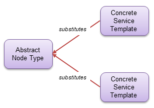

#### Abstraction Best Practices

TOSCA Profile designers should create separate TOSCA profiles for each
level of abstraction and should be very clear about the level of
abstraction for which each profile is designed. Said a different way,
profile designers should avoid mixing and matching types defined at
different levels of abstraction within the same profile. Instead, they
should define separate profiles for system view models, for
administrator view models, for device view models, and for instance
view models, and use the techniques recommended in this document to
translate between different levels of abstraction.

##### Translating System View to Administrator View

We recommend using *substitution* to map from the system view level of
abstraction to the administrator view level of abstraction, as shown
in the following figure:

Note that this recommendation do not prohibit the use of *inheritance*
for types defined in *system view* profiles. In fact, inheritance
could be useful to define base node types that define common
functionality (e.g. interfaces) that is then shared by all node types
derived from that common base type. However, inheritance should not be
used to add technology-specific or vendor-specific implementations to
system view node types.

##### Translating Administrator View to Device View
We recommend using *derivation* to map from the administrator view
level of abstraction to the device view level of abstraction, as shown
in the following figure:

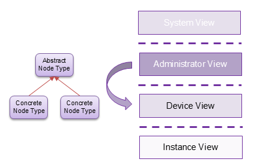

#### Translating Device View to Instance View

Derivation could be used again to translate from the device view level
of abstraction to the instance view level of abstraction, as shown in
the following figure.

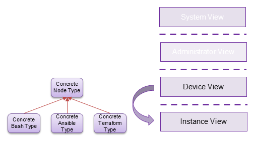

This figure suggests that different derived classes could add
different types of artifacts that can be used as interface operation
implementations. One derived node type could use Ansible playbooks, a
second derived node type could use Terraform configurations, and a
third could use simple Bash scripts.

However, this approach could result in a proliferation of profiles. A
better approach would be to *dynamically* attach implementations to
the types defined in device view profiles without having to introduce
new derived types. Unfortunately, the TOSCA language currently does
not have any constructs to support such dynamic behavior.

> This needs further discussion

#### Mapping Relationship Types and Capability Types

> It is likely that the same guidelines about abstraction apply to
  relationship types as well. However, the TOSCA spec is somewhat
  vague about whether requirement mappings rules (and capability
  mapping rules for that matter) require that the relationships
  resulting from the mapping have types that are compatible with the
  relationship of the mapped requirement. If that is the case, then
  these relationship types (and capability types) must be shared
  between System View, Administrator View, and Device View profiles
  and may need to be organized in a *shared* profile.  This shared
  profile should only define top-level relationship types or
  capability types. Profile-specific types should derive from one of
  the base types defined in the common profile.

### Common Base Node Types for System View Profiles

At the highest level of abstraction, any service or application can be
modeled using the generic service template shown in the following
figure:

This service template defines four nodes:

1. An *application* node of type `Application` that represents the
   functionality provided by the service.
2. A *data* node of type `Data` that represents the persistent data
   processed by the service. This data node can model Data Sets, Data
   Lakes, Databases or similar entities.
3. A *platform* node of type `Platform` that represents the platform
   on which the service is deployed.
4. A *network* node of type `Network` that represents connectivity
   between platforms.

The TOSCA Community profiles define base node types that represent
these *generic* abstractions as well as the relationships between
these abstractions. Derived types add more specific details as needed.

### Abstract Service Deployment: Placement Drives Substitution

Abstract service deployment uses the following process:

1. Create technology-independent service designs.
2. Create representations for available platforms.
3. Make placement decisions based on abstract representations of
   services and platforms.
4. Create substituting services based on selected platforms.

#### Create Technology-Independent Service Designs
- High-level service designs should be *abstract and portable* and
  should be independent of the target platform on which the service
  will ultimately be deployed.
- Abstract service designs should show the functional architecture of
  the system: what are the system components and how do they interact?
- Abstract service designs should be modeled using an *Administrator
  View* profile that is technology-independent.
- Each component in the functional architecture should specify the
  requirements for capabilities in the target platform(s) on which the
  service can be deployed.

The following shows a hypothetical example of an abstract service that
provides a context-aware personal assistant:

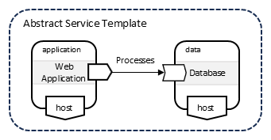

#### Create Technology-Independent Representations for Available Platforms

Orchestrators should maintain representations of the available
platforms on which services can be deployed.

- Platforms should be modeled using an *Administrator View* profile,
  since we are not concerned with details about the internals of the
  platforms.
- Instead, representations for the available platforms should contain
  just enough information to allow Orchestrators to make intelligent
  orchestration decisions (e.g. placement decisions). This information
  should include the following:
  - Location: where is the platform physically located?
  - Capabilities: what type of platform is it and what types of
    workloads can the platform support?
  - Capacity: how much load can be placed on the platform?
  - Access: how to access the platform?

The following shows a representation of the platforms available for a
specific customer. 

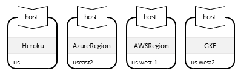

#### Make Placement Decisions

When deploying an abstract service, the Orchestrator first makes
placement decision by *fulfilling* the dangling requirements of the
nodes in the abstract service representation using capabilities of the
nodes in the abstract platform representations. Node filters can be
used to narrow down the set of candidate target platforms. The
following example shows a node filter that drives placement for the
`analytics` node in the abstract service template.

the following figure:

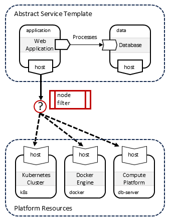

#### Substitute Based on Allocated Target Platform

Once placement decisions have been made, the Orchestrator finds
substituting templates that are suitable for the allocated target
platform. This is done by using information about that target platform
into the substitution filters for the candidate substituting
templates.

> If substitution decisions made based on the type of the allocated
  platform, do we need to define a TOSCA function that returns a node
  type?

##### Substitute for Kubernetes

The following figure shows an example where the abstract service is
deployed on a Kubernetes cluster.
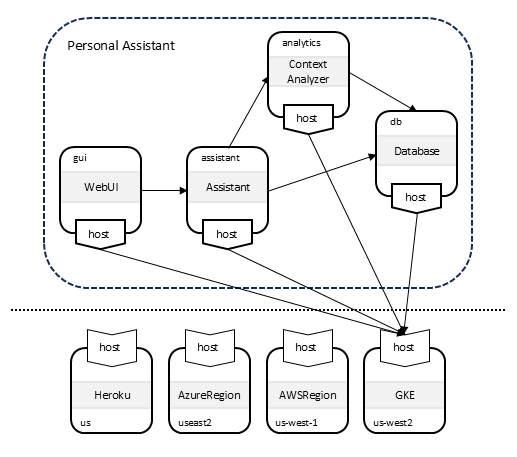

This information is then used to substitute the abstract nodes with
substituting templates that implement those nodes by deploying
Kubernetes resources. TOSCA type definitions from the TOSCA Kubernetes
Profile are used for the templates in the substituting service:

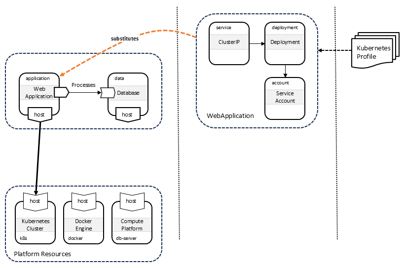

##### Substitute for Amazon Web Services

The following figure shows an alternative deployment on Amazon EC2:
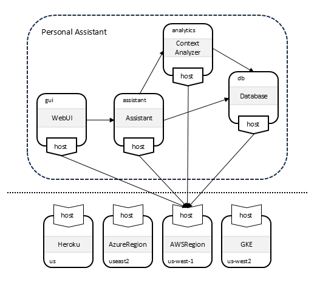

In this scenario, abstract nodes are substituted using templates that
implement those nodes by deploying infrastructure on AWS and
installing the necessary software components on that
infrastructure. TOSCA type definitions from the TOSCA AWS Profile are
used for the templates in the substituting service:

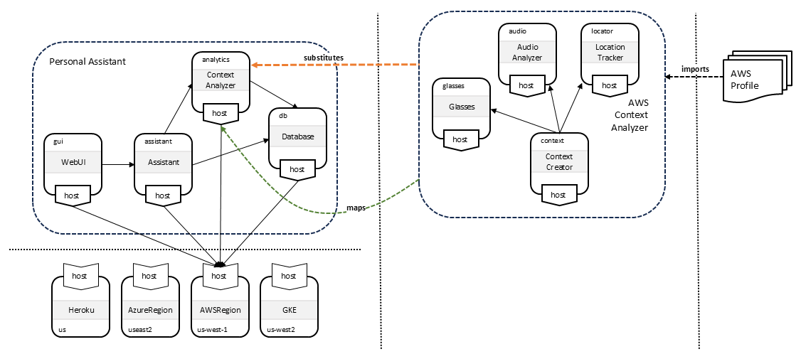

## Profile Organization

The TOSCA Community Profiles have been designed with these recommended
best practices in mind. Their organization is shown in the following
figure:

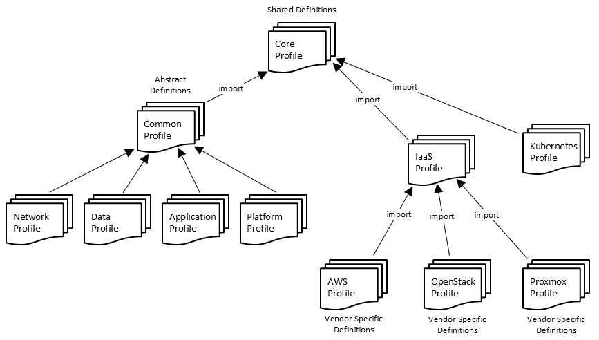

We define the following profiles:

### System View Profiles

- The Common Profile (*to be provided*) defines abstract node
  types that are used to define system architectures. These types are
  technology and vendor-independent and are intended to be substituted
  by templates that use types defined in the vendor-specific profiles.

### Administrator View Profiles

### Shared Profiles

- The Core Profile defines types that are shared
  between profiles at different levels of abstraction. It primarily
  defines base capability types, base relationship types, common data
  types, and common artifact types.

