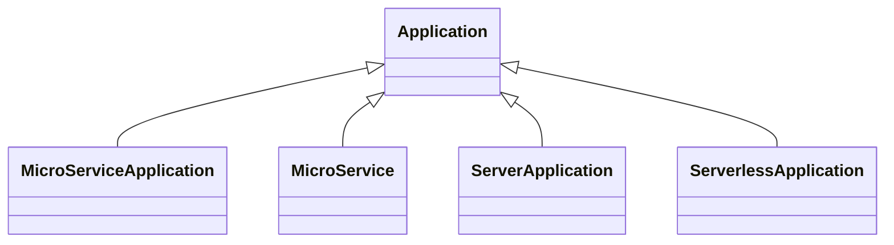

# TOSCA Community Application Profile

This profile defines the types for deploying applications, derived from the
abstract `Application` node type in the [base profile](../base/README.md). It
declares four application node types, the `Endpoint` capability that specializes the
`Service` port every application has, and a `Process` data type.

The four are distinguished along two axes: whether the node stands for a **whole
application** or for **one component of one**, and **which kind of platform** it
is deployed on.

|  | whole application | one component |
|---|---|---|
| container platform | `MicroServiceApplication` | `MicroService` |
| server platform | `ServerApplication` | — |
| serverless platform | `ServerlessApplication` | — |

A whole-application node is frequently a good candidate for replacement by a
substituting template, since the internal structure it stands for is exactly what
such a template supplies.

## Interaction between applications

Every application exposes a `service` capability of type `Service`, and reaches another
application's through an `interacts-with` requirement over `InteractsWith`; both are declared
on `Application` in the [base profile](../base/README.md). `InteractsWith` is an association,
so it asserts no deployment order. A type reached over a network refines `service` to
`Endpoint`, which carries `port`, `target-port`, `name` and `protocol`; `MicroService` and
`ServerApplication` do. Either end may be any kind of application, and a profile that wants to
restrict the sources narrows `valid_source_node_types` on the capability.

## MicroServiceApplication

A complete microservice application, not one of its microservices. Deployed on a
`ContainerPlatform`.

Choose it where the top-level template treats the application as a single node
and leaves its internal topology to a substituting template.

## MicroService

A single microservice. Deployed on a `ContainerPlatform`.

Choose it where the top-level template explodes the application into its
microservices, so that each is substituted separately and independently of the
others. Its `service` capability is an `Endpoint`, and it reaches its peers through
`interacts-with`.

## ServerApplication

An application that runs on a server platform. Deployed on a `ServerPlatform`.

Several nodes of this type combine to represent an application distributed over
distinct servers, such as an N-tier or client-server deployment. Its `service`
capability is an `Endpoint`, so that peers can reach it.

## ServerlessApplication

A complete serverless application, not one of its functions. Deployed on a
`ServerlessPlatform`.

Choose it, as with `MicroServiceApplication`, where the individual functions are
left to a substituting template.

