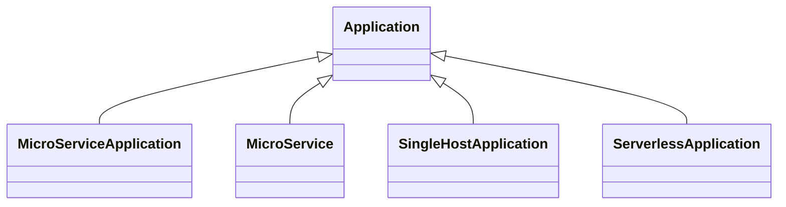

# TOSCA Community Application Profile

This profile defines the types for deploying applications, derived from the
abstract `Application` node type in the [base profile](../base/README.md). It
declares four application node types, an `Endpoint` capability and an
`InteractsWith` relationship through which applications reach one another, and a
`Process` data type.

The four are distinguished along two axes: whether the node stands for a **whole
application** or for **one component of one**, and **which kind of platform** it
is deployed on.

|  | whole application | one component |
|---|---|---|
| container platform | `MicroServiceApplication` | `MicroService` |
| server platform | `SingleHostApplication` | — |
| serverless platform | `ServerlessApplication` | — |

A whole-application node is frequently a good candidate for replacement by a
substituting template, since the internal structure it stands for is exactly what
such a template supplies.

## MicroServiceApplication

A complete microservice application, not one of its microservices. Deployed on a
`ContainerPlatform`.

Choose it where the top-level template treats the application as a single node
and leaves its internal topology to a substituting template.

## MicroService

A single microservice. Deployed on a `ContainerPlatform`.

Choose it where the top-level template explodes the application into its
microservices, so that each is substituted separately and independently of the
others. A `MicroService` exposes an `Endpoint` and reaches its peers through an
`InteractsWith` requirement to theirs.

## SingleHostApplication

An application whose processes all run on one host — a monolith, a modular
monolith, or a distributed application whose parts share a host. Deployed on a
`ServerPlatform`.

Several nodes of this type combine to represent an application distributed over
distinct hosts, such as an N-tier or client-server deployment. The `processes`
property lists the processes that compose it, and the type exposes an `Endpoint`
so that peers can reach it.

## ServerlessApplication

A complete serverless application, not one of its functions. Deployed on a
`ServerlessPlatform`.

Choose it, as with `MicroServiceApplication`, where the individual functions are
left to a substituting template.

---

> **Three agreed changes are not yet applied.** `SingleHostApplication` becomes
> `ServerApplication`, named for the platform it targets rather than for a
> cardinality, and loses its `processes` property (decision N12). `Endpoint` and
> `InteractsWith` move up: `Application` gains a property-free `Service`
> capability that derived types specialize, and the constraint that both ends of
> an interaction be nodes of the same type is dropped (decision N11). The
> `runs-on` requirement is renamed `host`, the name used for deployment layering
> at every level (decision N9). All three were agreed on 2026-09-02; Sections
> 2.3, 2.6 and 2.7 of the [abstract-profile
> proposal](../../docs/abstract-profile-proposed-changes.md) carry the detail.
