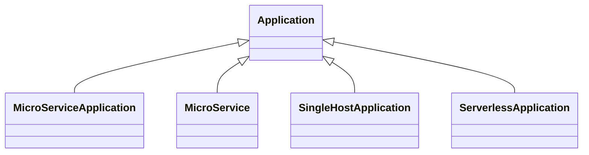

# TOSCA Community Application Profile

This profile defines the types for deploying applications, derived from the
abstract `Application` node type in the [base profile](../base/README.md). It
declares four application node types, an `Endpoint` capability and an
`InteractsWith` relationship through which applications reach one another, and a
`Process` data type.

> **Two agreed changes are not yet applied.** `SingleHostApplication` becomes
> `ServerApplication`, named for the platform it targets rather than for a
> cardinality, and loses its `processes` property (decision N12). `Endpoint` and
> `InteractsWith` move up: `Application` gains a property-free `Service`
> capability that derived types specialize, and the constraint that both ends of
> an interaction be nodes of the same type is dropped (decision N11). Both were
> agreed on 2026-09-02; Sections 2.6 and 2.7 of the [abstract-profile
> proposal](../../docs/abstract-profile-proposed-changes.md) carry the detail.

> Each of the four node types is named here but not described. What each models,
> and when to choose one over another, is the documentation this profile still
> needs — compare the [data profile](../data/README.md), which describes each of
> its six types and the distinction between them.
