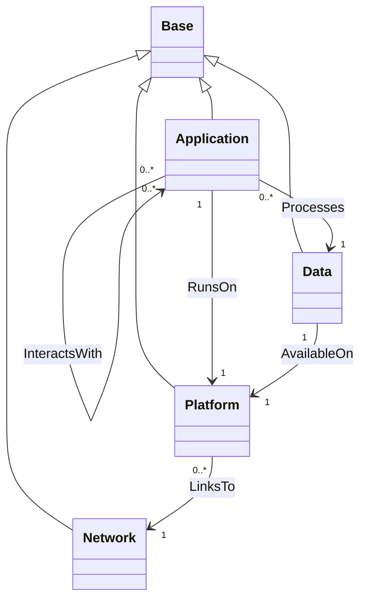
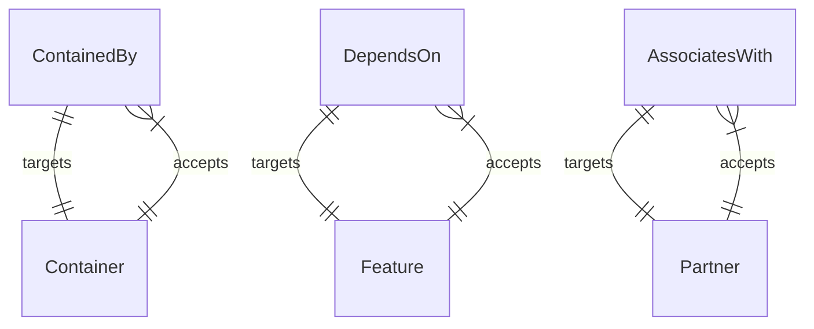

# TOSCA Community Base Profile

The Base profile defines types for modeling services and
applications at the highest level of abstraction. It also defines
types to represent the platforms on which these services and
applications are deployed. 

## Type Definitions

The `community.tosca.abstract.base` profile defines four node types as shown in
the following diagram.

The abstract nodes in the diagram above are intended to be decomposed
into concrete Service Templates using the TOSCA substitution mapping
feature. This approach can be used to orchestrate both the
infrastructure and the application. For example, a TOSCA Orchestrator
may build a service from scratch by:

- First setting up a K8s cluster, and then
- Deploying a service on the newly created K8s cluster

> Reference specific profiles that define types that derive from the
  types defined in the base profile.

These node types relate to one-another using the following
relationships:

- Application nodes define a relationship of type `RunsOn` to a
  platform node. This is a containment relationship that defines which
  platform runs the application.
- Application nodes define a relationship of type `Processes` to a
  data node. This is a dependency relationship that defines which
  entity contains the data that are processed by the application.
- Application nodes define a relationship of type `InteractsWith` to
  the `service` capability, of type `Service`, that every application
  exposes. This is an association relationship that records which
  applications use a service another provides, without implying a
  deployment order.
- Data nodes define a relationship of type `AvailableOn` to a
  platform node. This is a containment relationship that defines which
  platform stores persistent copies of the data.
- Platform nodes define a relationship of type `LinksTo` to a network
  node. This is a dependency relationship that defines the network(s)
  to which platforms connect.

Every node type in the profile derives from `Base`, and so carries four
properties:

- `name` names the node. Every node carries one, so a realization can
  name the resource it creates after the node it realizes.
- `technology` names the technology intended for the implementation, as
  `relational` does for a relational database. Substitution filters read
  it to select a realization.
- `product` names the specific product intended for the implementation,
  and is read the same way.
- `implementation-details` carries opaque values for a substituting
  template; see [Adding Implementation Details](#adding-implementation-details).

Platform nodes also carry `credentials`: references to the credential
material the orchestrator authenticates with, keyed by the kind of
credential. They are supplied for a platform the orchestrator connects to,
and each platform type narrows the kinds it accepts.

Network nodes carry two properties. `cidr_block` is the network's
address range in CIDR notation, left unset for a forwarding domain that
carries no addressing of its own or one whose range the realization
assigns. `internet_accessible` states whether traffic on the network
reaches the public internet; it is `false` unless set, and a substitution
filter reads it to choose between a reachable and an isolated
realization of the same network.

## Base Relationship Types

This profile defines three different *kinds* of top-level
relationships. The *kind* of the relationship can be used by a TOSCA
processor to determine how changes in *target* nodes are propagated
across relationships to the *source* nodes of those relationships.

- A *containment* relationship kind that indicates that the lifecycle
  of the contained entity (the *source* of the relationship) is
  dictated by the lifecycle of the containing entity (the *target* of
  the relationship). This kind of relationship is provided using the
  `ContainedBy` relationship type. Relationships of type `ContainedBy`
  target capabilities of type `Container` as specified using the
  `valid_capability_types` keyword in the type definition.
- A *dependency* relationship kind that indicates that the state
  and/or configuration of a dependent node (the *source* of the
  relationship) depends on the state and/or configuration of the
  *target* node. This kind of relationship is provided using the
  `DependsOn` relationship type. Relationships of type `DependsOn`
  target capabilities of type `Feature` as specified using the
  `valid_capability_types` keyword in the type definition.
- An *association* relationship kind that records a relationship
  between two nodes that carries **no lifecycle, state, or
  configuration dependency** — the association is informational and
  neither node's deployment depends on the other. This kind of
  relationship is provided using the `AssociatesWith` relationship
  type. Relationships of type `AssociatesWith` target capabilities of
  type `Partner` as specified using the `valid_capability_types`
  keyword in the type definition.

  > **Guard against misuse.** If a relationship *does* carry a
  > deployment or configuration dependency (for example, a cloud
  > resource that must exist before another node can be associated with
  > it), it is a *dependency*, not an *association*, and should derive
  > from `DependsOn` — even when the domain colloquially calls it an
  > "association." Reserve `AssociatesWith` for genuinely
  > dependency-free links.

Other relationship types can be derived from one of the three *base* relationship types.

### Naming derived relationship types

Derived relationship type names should express the **semantics** of the
relationship — the *intent* of the source node toward the target — and
**not** the wiring mechanism used to realize it. Prefer intent-revealing
names (`Monitors`, `ManagedBy`, `RegistersWith`, `HostedOn`) over
mechanism-flavored names (`ConnectsTo`, `BindsTo`, `LinksTo`). A reader
of a service template should be able to tell *why* two nodes are related
from the relationship type name alone, without knowing how the
connection is physically established.

## Base Capability Types

This profile defines three *base* capability types that are matched
with the three different kinds of base relationship types. Other
capability types are derived from one of these three base types. The
following figure shows how the different base relationship types
target different capability types and how different capability types
accept different incoming relationship types:

### Organizing derived capability types

Capability types derived from `Feature` and `Container` tend to fall
into a small number of recurring **functional categories** — the
runtime environment a node offers, the core functionality it exposes,
its management and monitoring touch points, its security and trust
surface, and so on. These categories, and the common capability and
relationship types recommended for each, are described by the
Component/Port pattern in the
[design patterns](../../docs/design-patterns.md#componentport-pattern). New derived
capability types should be slotted into one of those categories rather
than introduced ad hoc, so the type library stays a catalog rather than
a loose collection.

The technology column declares its own copies of these six types in
[`community.tosca.technology.base`](../../technology/base/README.md#relationship-and-capability-types).

## Adding Implementation Details

Because the abstract node types defined in this profile *hide* the details
required at lower levels, a substituting template often needs some of what was
hidden. These profiles carry those values in an opaque `implementation-details`
property, mapped to an input of the substituting template and decoded there.

This is a **recommended practice rather than a requirement of the
specification**. The pattern, the reasoning for it, and worked examples are in
the modeling methodology, which is the single place it is described:

[Modeling methodology &mdash; Passing Implementation Details Across a Substitution Boundary](../../docs/modeling-methodology.md#passing-implementation-details-across-a-substitution-boundary)
