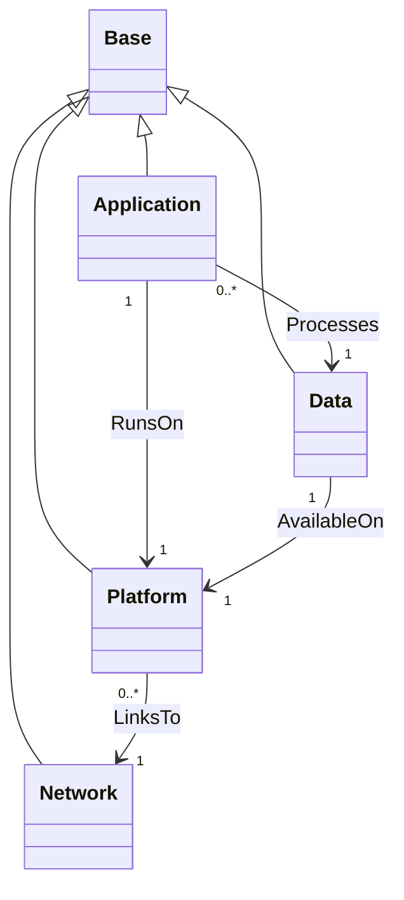

# TOSCA Community Base Profile

The Base profile defines types for modeling services and
applications at the highest level of abstraction. It also defines
types to represent the platforms on which these services and
applications are deployed. 

## Type Definitions

The `community.tosca.abstract.base` profile defines four node types as shown in
the following diagram.

The abstract nodes in the diagram above are intended to be decomposed
into concrete Service Templates using the TOSCA substitution mapping
feature. This approach can be used to orchestrate both the
infrastructure and the application. For example, a TOSCA Orchestrator
may build a service from scratch by:

- First setting up a K8s cluster, and then
- Deploying a service on the newly created K8s cluster

> Reference specific profiles that define types that derive from the
  types defined in the base profile.

These node types relate to one-another using the following
relationships:

- Application nodes define a relationship of type `RunsOn` to a
  platform node. This is a containment relationship that defines which
  platform runs the application.
- Application nodes define a relationship of type `Processes` to a
  data node. This is a dependency relationship that defines which
  entity contains the data that are processed by the application.
- Data nodes define a relationship of type `AvailableOn` to a
  platform node. This is a containment relationship that defines which
  platform stores persistent copies of the data.
- Platform nodes define a relationship of type `LinksTo` to a network
  node. This is a dependency relationship that defines the network(s)
  to which platforms connect.

## Adding Implementation Details

Because the abstract node types defined in this profile *hide* the details
required at lower levels, a substituting template often needs some of what was
hidden. These profiles carry those values in an opaque `implementation-details`
property, mapped to an input of the substituting template and decoded there.

This is a **recommended practice rather than a requirement of the
specification**. The pattern, the reasoning for it, and worked examples are in
the design guide, which is the single place it is described:

[Design guide &mdash; Passing Implementation Details Across a Substitution Boundary](../../docs/design-guide.md#passing-implementation-details-across-a-substitution-boundary)
