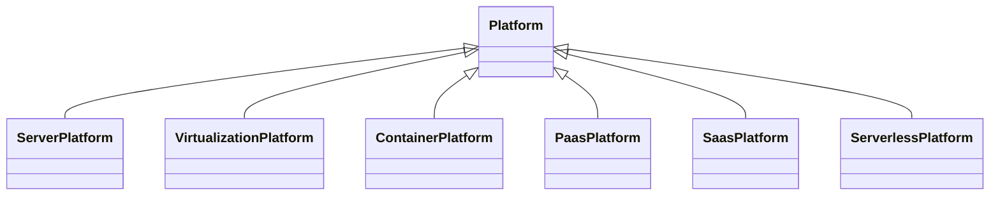
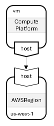
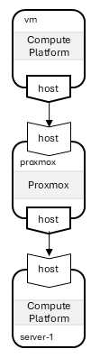
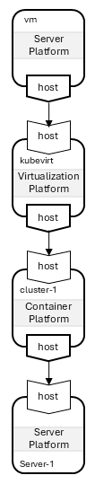
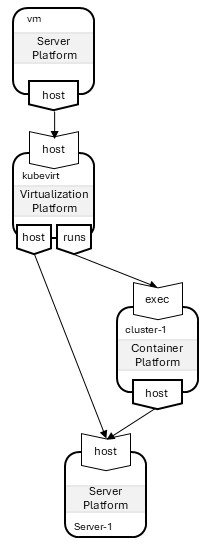
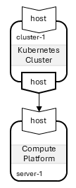
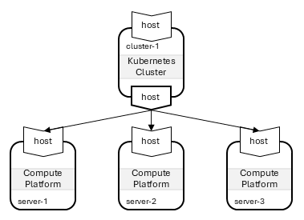

# TOSCA Community Platform Profile

This profile defines TOSCA types that support modeling of *platforms*
on which services can be *orchestrated* as well as the *providers* of
these platforms. It builds on and extends existing [TOSCA type
definitions for platforms](inventory.md).

## Platform Types

The *TOSCA Community Platform Profile* defines the platform types
shown in the following diagram:

### Server Platforms

The `ServerPlatform` node type can represent the following. Note that
this list is not meant to be exhaustive:

- *Bare Metal Machine*: A device without operating system software or
  firmware pre-installed. Instead, this device exposes an interface
  that allows it to be managed remotely (e.g. an HPE server with an
  iILO interface) and that allows for remote installation of the
  operating system or hypervisor software.
- *Physical Server*: A device with operating system software or
  firmware pre-installed.
- *Virtual Machine*: A VM instantiated on a virtualization platform.

### Virtualization Platforms

The `VirtualizationPlatform` node type represents systems or services
that support the creation of virtual machine instances. This can
include the following:

- *Hypervisor Platform*: a platform that allows for the creation of
   virtual infrastructure on a server or bare metal device.
- *IaaS (Infrastructure as a Service)*: A platform that allows
  on-demand creation of networks, virtual machines and storage in the
  cloud.

### Container Platforms

The `ContainerPlatform` node type represents systems that can host
containerized software. This can include:

- *Docker Servers*: Server platforms that have technologies such as
   Docker or Docker Compose installed and that can be used to deploy
   and run containerized applications.
- *Kubernetes Clusters*: To orchestrator container-based applications

### PaaS Platforms

The `PaaSPlatform` node type represents *Platform as a Service*
technologies. These are platforms for developing and deploying
apps. They allow developers to push code and the platform handles
builds, dependencies, deployment, scaling, etc.

Examples of PaaS include
- Heroku
- Google App Engine
- Microsoft Azure App Service
- AWS Elastic Beanstalk
- Red Hat OpenShift

### SaaS Platforms

The `SaasPlatform` node type represents *Software as a Service*
offerings. These are platforms for renting and using a finished
application.

Examples of SaaS include:
- Gmail
- Salesforce

### Serverless Platforms

The `ServerlessPlatform` node type represents platforms that provide
the ephemeral runtime support for serverless functions, such as AWS
Lambda, Azure Functions, Google Cloud Functions or OpenFaaS

## Layering of Platforms

While platform node types are primarily used to create (abstract)
representations of pre-existing platform resources, these types can
also be used for *orchestrating* new platform resources. In those
cases, newly orchestrated platform nodes must be *layered* on top of
already-existing platform nodes. This layering is expressed using a
`HostedOn` relationship, and and the corresponding platform node types
must express valid target nodes in their `host` requirement.

The section describes several examples of platform layering.

### Virtual Machine on an Infrastructure-as-a-Service Platform

A common use case of platform layering involves the creation of a
virtual machine on an IaaS platform such as AWS EC2. This scenario can
be modeled using a `ServerPlatform` node that represents the virtual
machine and that has a `HostedOn` relationship to a
`VirtualizationPlatform` node representing AWS. This scenario is shown
in the following figure:

### IaaS Platform on a Server

In some scenarios, the `HostedOn` relationship can be reversed and the
Infrastructure-as-a-Service platform can be deployed on one or more
servers. For example, this is the case when a Proxmox node is deployed
on a physical or virtual server. This use case can be modeled using a
`VirtualizationPlatform` node that represents the Proxmox node and
that has a `HostedOn` relationship to a `ServerPlatform` node
representing the server on which Proxmox is installed.  The Proxmox
node can then in turn be used to *host* other (virtual) server
platforms.

The complete scneario is shown in the following figure:

### IaaS Platform on a Kubernetes Clusters

A similar scenario involves extending Kubernetes with support for
virtualization using Kubevirt. Kubevirt allows for the use of
Kubernetes APIs to create and manage virtual machines on KVM.

This use case can be modeled using a `VirtualizationPlatform` node
that represents Kubevirt and that has a `HostedOn` relationship to a
`ContainerPlatform` node that represents the Kubernetes. The Kubevirt
node can then in turn be used to *host* other virtual server
platforms.

The complete scneario is shown in the following figure:

In practice however, the hosting relationships between the different
platform nodes are more complex than what is shown in this
figure. This complexity results from the fact that Kubevirt includes
two different types of components:

- Virtualization APIs, which are provided by the Kubevirt operator(s)
  and custom resource definitions. These are deployed on the
  Kubernetes cluster.
- Virtualization software, which is provided by KVM and that must be
  installed directly on the underlying server on which the Kubernetes
  cluster runs.

To support installation of these different components, a single
HostedOn relationship between the Kubevirt node and the Kubernetes
node is insufficient. Additional information is required in the
Kubevirt `VirtualizationPlatform` node to identify not just the
Kubernetes cluster on which Kubevirt is deployed, but also the
server(s) on which the Kubernetes cluster itself is deployed.

To accurately represent these dependencies, we use the following
observation:

- All platforms can be considered to have not only a *data plane*, but
  also a *control plane*.
- For most platforms layering scenarios, modeling the hosting
  relationships used for the data plane is sufficient since control is
  typically provided by the same platform that also provides the
  *hosting*.
- However, for some platforms (such as Kubevirt), it may be necessary
  to model deployment of the control plane separately from deployment
  of the data plan. This is done by defining a second requirement in
  the `Platform` node type that specifies where control is
  hosted. This requirement uses the `RunsOn` relationship type rather
  than the `HostedOn` relationship type.

  > Is it necessary to have a different relationship type, or is it
    sufficient for this requirement to have a different name?
  
Using this approach, the abstract `VirtualizationPlatform` node that
represents Kubevirt node has a `HostedOn` relationship to the
underlying `ServerPlatform` node on which Kubernetes is deployed, and
it has an additional `RunsOn` relationship to the `ContainerPlatform`
node representing the Kubernetes cluster. The updated model is shown
in the following figure:

### Kubernetes Cluster on one or more Servers

Another obvious layering scenario is the deployment of a Kubernetes
cluster on a (physical or virtual) server as shown in the following
figure:

This figure shows a single-node Kubernetes cluster that is represented
by a `ContainerPlatform` node and that has a `HostedOn` relationship
to a `ServerPlatform` node that represents the server on which the
cluster is deployed.

In production, almost all Kubernetes clusters consist of multiple
nodes. Multi-node Kubernetes clusters can be modeled using multiple
`HostedOn` relationships originating from the `ContainerPlatform`
node, one to each of the `ServerPlatform` nodes that represent the
servers on which the cluster is deployed.

Furthermore, Kubernetes distinguishes between *Control* nodes and
*Worker* nodes. To indicate which server acts as the control node in
the Kubernetes cluster, we use the `RunsOn` relationship of the
`ContainerPlatform` node. The complete model is shown in following
figure:

In this figure, `server-1` not only acts as the control node, but it
also acts as a worker node that can host Kubernetes workloads. To
model a control node that cannot be used to host workloads, the
`HostedOn` relationship should be removed as shown in the following
figure:

And finally, Kubernetes clusters are typically deployed in *High
Availability* mode where multiple servers act as control nodes. This
scenario can be modeled using multiple `RunsOn` relationships as shown
in the following figure: