# TOSCA Community Platform Profile

This profile defines TOSCA types that support modeling of *platforms*
on which services can be *orchestrated* as well as the *providers* of
these platforms. It builds on and extends existing [TOSCA type
definitions for platforms](inventory.md).

## Platform Types

The *TOSCA Community Platform Profile* defines the platform types
shown in the following diagram:

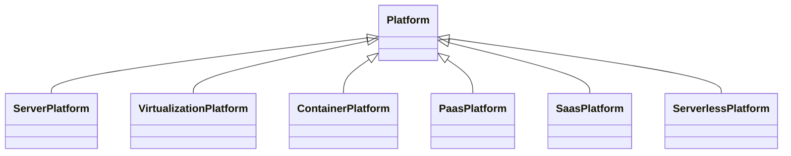
```mermaid
classDiagram
    Platform <|-- ServerPlatform
    Platform <|-- VirtualizationPlatform
    Platform <|-- ContainerPlatform
    Platform <|-- PaasPlatform
    Platform <|-- SaasPlatform
    Platform <|-- ServerlessPlatform
```

### Server Platforms

The `ServerPlatform` node type can represent the following. Note that
this list is not meant to be exhaustive:

- *Bare Metal Machine*: A device without operating system software or
  firmware pre-installed. Instead, this device exposes an interface
  that allows it to be managed remotely (e.g. an HPE server with an
  iILO interface) and that allows for remote installation of the
  operating system or hypervisor software.
- *Physical Server*: A device with operating system software or
  firmware pre-installed.
- *Virtual Machine*: A VM instantiated on a virtualization platform.

### Virtualization Platforms

The `VirtualizationPlatform` node type represents systems or services
that support the creation of virtual machine instances. This can
include the following:

- *Hypervisor Platform*: a platform that allows for the creation of
   virtual infrastructure on a server or bare metal device.
- *IaaS (Infrastructure as a Service)*: A platform that allows
  on-demand creation of networks, virtual machines and storage in the
  cloud.

### Container Platforms

The `ContainerPlatform` node type represents systems that can host
containerized software. This can include:

- *Container Runtimes*: Engines that run containers on a single host,
  such as Docker Engine or containerd. A container runtime is modeled
  as its own node, hosted on the `ServerPlatform` node that represents
  the host it is installed on.
- *Kubernetes Clusters*: To orchestrate container-based applications
  across one or more hosts.

### PaaS Platforms

The `PaaSPlatform` node type represents *Platform as a Service*
technologies. These are platforms for developing and deploying
apps. They allow developers to push code and the platform handles
builds, dependencies, deployment, scaling, etc.

Examples of PaaS include
- Heroku
- Google App Engine
- Microsoft Azure App Service
- AWS Elastic Beanstalk
- Red Hat OpenShift

### SaaS Platforms

The `SaasPlatform` node type represents *Software as a Service*
offerings. These are platforms for renting and using a finished
application.

Examples of SaaS include:
- Gmail
- Salesforce

### Serverless Platforms

The `ServerlessPlatform` node type represents platforms that provide
the ephemeral runtime support for serverless functions, such as AWS
Lambda, Azure Functions, Google Cloud Functions or OpenFaaS

## Layering of Platforms

While platform node types are primarily used to create (abstract)
representations of pre-existing platform resources, these types can
also be used for *orchestrating* new platform resources. In those
cases, newly orchestrated platform nodes must be *layered* on top of
already-existing platform nodes. This layering is expressed using a
`HostedOn` relationship, and the corresponding platform node types
must express valid target nodes in their `host` requirement.

The section describes several examples of platform layering.

### Virtual Machine on an Infrastructure-as-a-Service Platform

A common use case of platform layering involves the creation of a
virtual machine on an IaaS platform such as AWS EC2. This scenario can
be modeled using a `ServerPlatform` node that represents the virtual
machine and that has a `HostedOn` relationship to a
`VirtualizationPlatform` node representing AWS. This scenario is shown
in the following figure:

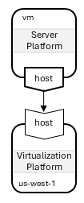

### IaaS Platform on a Server

In some scenarios, the `HostedOn` relationship can be reversed and the
Infrastructure-as-a-Service platform can be deployed on one or more
servers. For example, this is the case when a Proxmox node is deployed
on a physical or virtual server. This use case can be modeled using a
`VirtualizationPlatform` node that represents the Proxmox node and
that has a `HostedOn` relationship to a `ServerPlatform` node
representing the server on which Proxmox is installed.  The Proxmox
node can then in turn be used to *host* other (virtual) server
platforms.

The complete scenario is shown in the following figure:

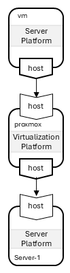

### IaaS Platform on a Kubernetes Cluster

A similar scenario involves extending Kubernetes with support for
virtualization using Kubevirt. Kubevirt allows for the use of
Kubernetes APIs to create and manage virtual machines on KVM.

This use case can be modeled using a `VirtualizationPlatform` node
that represents Kubevirt and that has a `HostedOn` relationship to a
`ContainerPlatform` node that represents the Kubernetes cluster. The Kubevirt
node can then in turn be used to *host* other virtual server
platforms.

The complete scenario is shown in the following figure:

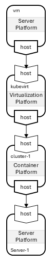

In practice however, the hosting relationships between the different
platform nodes are more complex than what is shown in this
figure. This complexity results from the fact that Kubevirt includes
two different types of components:

- Virtualization APIs, which are provided by the Kubevirt operator(s)
  and custom resource definitions. These are deployed on the
  Kubernetes cluster.
- Virtualization software, which is provided by KVM and that must be
  installed directly on the underlying server on which the Kubernetes
  cluster runs.

To support installation of these different components, a single
HostedOn relationship between the Kubevirt node and the Kubernetes
node is insufficient. Additional information is required in the
Kubevirt `VirtualizationPlatform` node to identify not just the
Kubernetes cluster on which Kubevirt is deployed, but also the
server(s) on which the Kubernetes cluster itself is deployed.

To accurately represent these dependencies, we use the following
observation:

- All platforms can be considered to have not only a *data plane*, but
  also a *control plane*.
- For most platforms layering scenarios, modeling the hosting
  relationships used for the data plane is sufficient since control is
  typically provided by the same platform that also provides the
  *hosting*.
- However, for some platforms (such as Kubevirt), it may be necessary
  to model deployment of the control plane separately from deployment
  of the data plane. This needs a second requirement on the `Platform`
  node type saying where control is hosted, alongside `host` saying
  where the data plane is.

  > **Proposed, not yet present.** `Platform` declares `host` and
    `links-to` only, so the models below cannot be written down against
    the profile as it stands. The requirement is proposed as
    **`control-host`** in [Section 2.3 of the abstract-profile
    changes](../../docs/abstract-profile-proposed-changes.md#23-communitytoscaabstractbase--one-containment-relationship-one-requirement-name), which also answers the question this section used to
    ask — whether a distinct relationship type is needed, or a distinct
    requirement name suffices. A distinct name suffices: the same
    relationship carries both senses either way, so the difference
    belongs on the requirement.
  
Using this approach, the abstract `VirtualizationPlatform` node that
represents the Kubevirt node has a `HostedOn` relationship to the
underlying `ServerPlatform` node on which Kubernetes is deployed, and
it binds `control-host` to the `ContainerPlatform`
node representing the Kubernetes cluster. The updated model is shown
in the following figure:

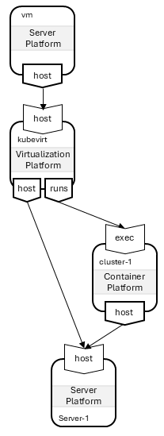

### Container Runtime on a Server

The simplest container platform layering scenario installs a container
runtime, such as Docker Engine or containerd, on a server. It is
modeled using a `ContainerPlatform` node that represents the runtime
and that has a `HostedOn` relationship to the `ServerPlatform` node
representing the server on which the runtime is installed. The
`ContainerPlatform` node in turn hosts the containerized applications
that the runtime runs.

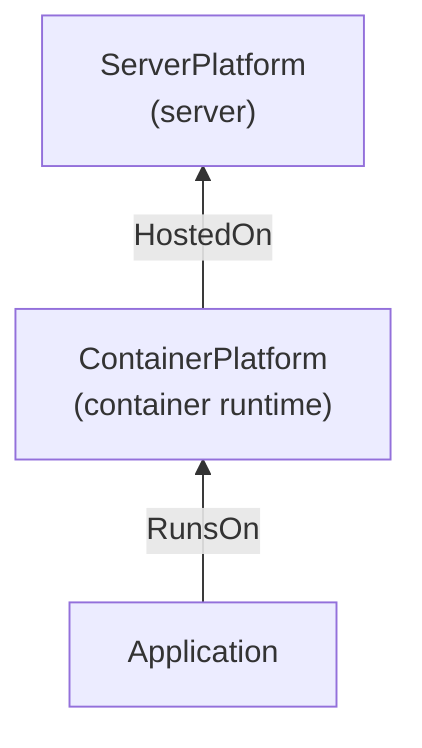
```mermaid
graph BT
    engine["ContainerPlatform<br/>(container runtime)"] -->|HostedOn| server["ServerPlatform<br/>(server)"]
    app["Application"] -->|RunsOn| engine
```

A container runtime provides its control plane on the same host that
runs its containers, so a single `HostedOn` relationship expresses
where both are deployed. This is the common case described above, in
contrast to Kubevirt, where the two are deployed on different
platforms.

### Kubernetes Cluster on one or more Servers

Another obvious layering scenario is the deployment of a Kubernetes
cluster on a (physical or virtual) server as shown in the following
figure:

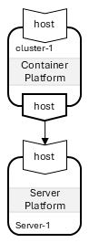

This figure shows a single-node Kubernetes cluster that is represented
by a `ContainerPlatform` node and that has a `HostedOn` relationship
to a `ServerPlatform` node that represents the server on which the
cluster is deployed.

In production, almost all Kubernetes clusters consist of multiple
nodes. Multi-node Kubernetes clusters can be modeled using multiple
`HostedOn` relationships originating from the `ContainerPlatform`
node, one to each of the `ServerPlatform` nodes that represent the
servers on which the cluster is deployed.

Furthermore, Kubernetes distinguishes between *Control* nodes and
*Worker* nodes. To indicate which server acts as the control node in
the Kubernetes cluster, the `ContainerPlatform` node binds
`control-host` to it. The complete model is shown in following
figure:

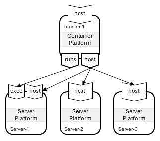

In this figure, `server-1` not only acts as the control node, but it
also acts as a worker node that can host Kubernetes workloads. To
model a control node that cannot be used to host workloads, the
`HostedOn` relationship to the control node is removed as shown in the
following figure:

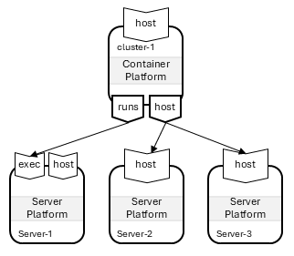

And finally, Kubernetes clusters are typically deployed in *High
Availability* mode where multiple servers act as redundant control
nodes. This scenario can be modeled using multiple `control-host`
bindings as shown in the following figure:

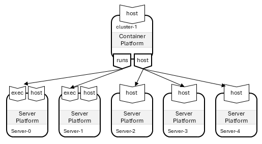

> While we can accurately model the desired configuration, we need to
  document how these models drive substitution for the
  `ContainerPlatform` nodes that represent the Kubernetes
  cluster. Specifically,

> - how is the total number of nodes communicated to the substituting template?
> - how is the number of control nodes communicated?
> - how can we communicate whether the control nodes can host workloads?

### Does a control node also host workloads?

The third question above is the one the model does not yet answer. Assume the
`ContainerPlatform` has two placement requirements — `host` for the servers that run workloads
and a second for the control plane, proposed as `control-host` in
[the abstract-profile changes](../../docs/abstract-profile-proposed-changes.md#23-communitytoscaabstractbase--one-containment-relationship-one-requirement-name).
Having both does not by itself settle how to say that the machine running the control plane is
*also* available for workloads. Two models, recorded here as the choice rather than the
answer.

*Model A — set overlap*, which is what the figures above describe. `host` lists every
server that hosts workloads, `control-host` lists the control nodes, and a control node that
also hosts workloads appears in both:

```yaml
  requirements:                      # master on server_1, which also hosts workloads
    - host: server_1
    - host: server_2
    - host: server_3
    - control-host: server_1

  requirements:                      # master on server_1, control-only
    - host: server_2
    - host: server_3
    - control-host: server_1
```

Both questions are then answered by traversal: which server runs the control plane is the
`control-host` target, and whether it hosts workloads is whether it also appears under `host`
— which `$has_entry` reads directly, so a substitution filter can select a tainting
realization from a non-tainting one.

What Model A lacks is a way to *act* on it. A realization needs a worker on every host except
the one that is also the control host, and a requirement mapping cannot select a subset of
bindings: `[host, UNBOUNDED]` takes all of them and cannot skip one.

*Model B — disjoint sets and a property.* `host` lists only servers that host workloads and
are not control nodes, and a property carries the rest:

```yaml
  properties:
    schedulable_control_nodes: true
  requirements:
    - host: server_2
    - host: server_3
    - control-host: server_1
```

Directly realizable — every `host` binding becomes a worker, `control-host` becomes the
controller, no subsetting — at the cost of a graph that no longer answers "which servers run
workloads" by traversal, since `server_1` does but does not appear under `host`.

The trade is between a model that states the topology honestly and one that can be built
today. Model A is preferable if the subsetting limitation is treated as something to fix;
Model B is the pragmatic choice if it is not.

---


### Managed Kubernetes Clusters

Cloud providers typically support a *Managed Kubernetes Cluster*
service that automates the management of the worker nodes. Such a
service can be modeled using a `ContainerPlatform` node that is hosted
directly on a `VirtualizationPlatform` node as shown in the following
diagram:

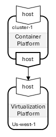

> This figure (and other figures that include `VirtualizationPlatform`
  nodes) assume there is one such node for each cloud region. Is that
  the correct approach? Alternatively, we could define one
  `VirtualizationPlatform` node and use a `region` input value for the
  relevant operation inputs.

While managed Kubernetes clusters use the same `ContainerPlatform`
node type as the Kubernetes deployments on server platforms, there are
a number of differences that impact the definition of the
`ContainerPlatform` node type:

1. Unlike the server platform Kubernetes deployment scenarios shown
   above, the intended deployment topology cannot be derived from the
   managed Kubernetes cluster model:

   - It does not provide information about the requested number of worker
     nodes.
   - It does not provide information about the requested number of
     controller nodes.

   > It appears that managed Kubernetes clusters do not support hosting
     workloads on the controller nodes.

   This information must instead be provided using property values
   defined on the `ContainerPlatform` nodes.

2. Managed Kubernetes clusters typically also include auto-scaling
   functionality where additional nodes can be spun up to handle
   increased load. To support this functionality, it may be necessary
   to introduce additional property values that specify whether
   auto-scaling is enabled and, if so, what the maximum supported
   number of worker node is.

   > Managed Kubernetes clusters typically also allow users to specify
     architecture, OS, size, etc. of the worker nodes. The assumption is
     that this information can be provided using the
     `implementation-details` property of the abstract nodes.

3. Managed Kubernetes clusters also allow users to specify one or more
   subnets that should be used for the cluster network, as well as the
   network technology to be used (Calico, Flannel, etc.). The models
   for cluster networking should reflect this.

   > This information is likely also relevant for Kubernetes clusters
     deployed on `ServerPlatform` nodes.

4. Substitution filters in substituting templates for
   `ContainerPlatform` nodes may need information about the platform
   on which the container platform is deployed. Not all of this
   information may be reflected in platform properties. It may be
   necessary to introduce a function that checks the type of the
   underlying platform (for example a `$has_type` function that takes
   a TOSCA Path argument). 
