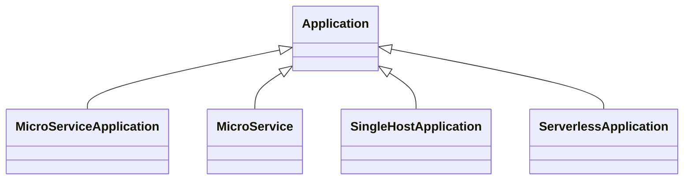

# TOSCA Community Application Profile

This profile defines TOSCA types that support the deployment of
abstract applications. These applications will frequently be deployed
on Kubernetes clusters, although other deployment platform can be
considered as well.  The profile currently defines the following node
type hierarchy:

