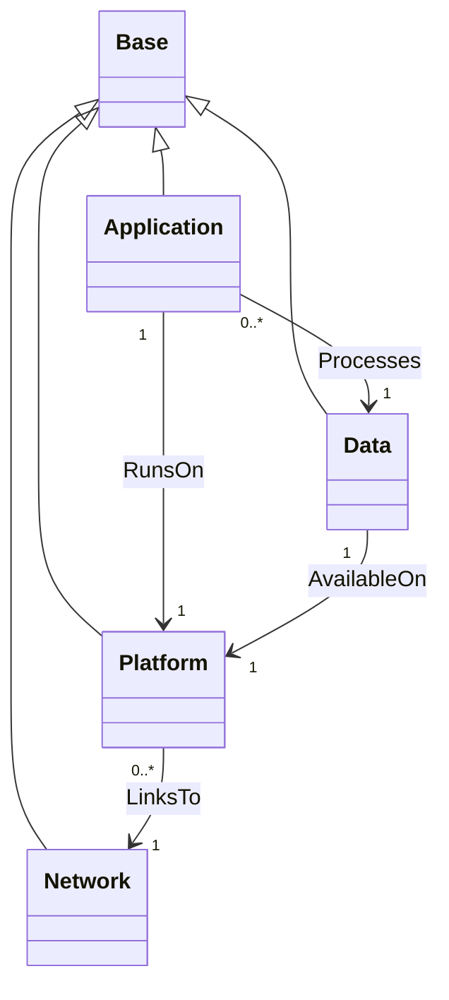

# TOSCA Community Base Profile

The Base profile defines types for modeling services and
applications at the highest level of abstraction. It also defines
types to represent the platforms on which these services and
applications are deployed. 

## Type Definitions

The `community.tosca.base` profile defines four node types as shown in
the following diagram.



The abstract nodes in the diagram above are intended to be decomposed
into concrete Service Templates using the TOSCA substitution mapping
feature. This approach can be used to orchestrate both the
infrastructure and the application. For example, a TOSCA Orchestrator
may build a service from scratch by:

- First setting up a K8s cluster, and then
- Deploying a service on the newly created K8s cluster

> Reference specific profiles that define types that derive from the
  types defined in the base profile.

These node types relate to one-another using the following
relationships:

- Application nodes define a relationship of type `RunsOn` to a
  platform node. This is a containment relationship that defines which
  platform runs the application.
- Application nodes define a relationship of type `Processes` to a
  node node. This is a dependency relationship that defines which
  entity contains the data that are processed by the application.
- Application nodes define a relationship of type `AvailableOn` to a
  platform node. This is a containment relationship that defines which
  platform stores persistent copies of the data.
- Platform nodes define a relationship of type `LinksTo` to a network
  node. This is a dependency relationship that defines the network(s)
  to which platforms connect.

## Adding Implementation Details

Since the abstract node types defined in this profile *hide* any
details required at the lower levels, a mechanism is needed to add
such lower-level details during substitution mapping without burdening
the abstract node types with unnecessary information. The approach
adopted by the base profile defines an *opaque*
`implementation-details` property on the abstract nodes that is passed
to the substituting template and that is only parsed and interpreted
in the context of that substituting template. This section describes
the mechanism for how this works.

1. All abstract nodes define a property called
   `implementation-details` that contains a structured set of
   lower-level details that can simply be ignored at the highest level
   of abstraction. The value of this property can be encoded using a
   variety of ways&mdash;include JSON, YAML, or some other
   mechanism&mdash;but the base profile uses JSON encoding and defines
   a `json` data type for this purpose.  The abstract node should
   validate that the provided string is valid JSON, but it does not
   need to know about the specific values carried in that string. This
   allows arbitrary implementation detail data to be provided in the
   abstract node.
2. In the substituting template, we define a substitution mapping that
   maps the `mplementation-details` property value to an input of the
   substituting template. For example, the following shows how the
   `implementation-details` property is mapped to a service template
   input called `json-data` which is also of type `json`:
   ```
   service_template:
     substitution_mappings:
       node_type: app:MicroService
       properties:
	 implementation-details: json_data
     inputs:
       json_data:
	 type: json
   ```
3. The substituting template then defines another service template
   input that uses a TOSCA data type to represent the implementation
   details. For example, the following shows a TOSCA data type called
   `ImplementationDetails` and an input value of that type called
   `implementation-details`. Note that ubstituting templates are free
   to chose different data type names and different input names:
   ```
   data_types:
     ImplementationDetails:
       properties:
	 service_label:
	   type: string
	 deployment_label:
	   type: string
	 security_context:
	   type: k8s:SecurityContext
   service_template:
     inputs:
       json_data:
	 type: json
       implementation-details:
	 type: ImplementationDetails
   ```
4. Finally, the key to making this work is to fix the value of the
   `implementation-details` input to the data that are returned by
   decoding the JSON string in the `json_data` input, as follows:
   ```
   service_template:
     substitution_mappings:
       node_type: app:MicroService
       properties:
	 implementation-details: json_data
     inputs:
       json_data:
	 type: json
       implementation-details:
	 type: ImplementationDetails
	 value: {$decode_json: [{$get_input: json_data}]}
   ```
   Note that this requires a custom `$decode_json` function.
5. The TOSCA processor will then validate the data returned by the
   `$decode_json` function against the `ImplementationDetails` data
   type, thereby ensuring (at deployment time) that correct
   implementation details have been provided in the abstract node.
6. In the substituting template, whenever one of the implementation
   detail values are required, they could be retrieved using
   `$get_input` function calls, for example as follows:
   ```
   $get_input: [implementation-details, label]
   ```
