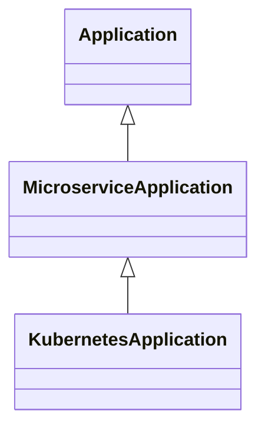

# TOSCA Community Common Profile

The Common profile defines types for modeling services and
applications at the highest level of abstraction. It also defines
types to represent the platforms on which these services and
applications are deployed. 

## Node Types
At the highest level of abstraction, a service or application can be
modeled using the service template shown in the following figure:

This service template defines three nodes:

1. An *application* node of type `Application` that represents the
   functionality provided by the service.
2. A *data* node of type `Data` that represents the persistent data
   processed by the service. This data node can model Data Sets, Data
   Lakes, Databases or similar entities.
3. A *platform* node of type `Platform` that represents the platform
   on which the service is deployed.

Each of these nodes is defined as abstract using the `substitute`
directive and is intended to be implemented using *substitution
mapping*.

## Relationship Types

The nodes in the service template above relate to one-another using
the following relationships:

- Application nodes define a relationship of type `RunsOn` to a
  platform node. This is a containment relationship that defines which
  platform runs the application.
- Application nodes define a relationship of type `Processes` to a
  node node. This is a dependency relationship that defines which
  entity contains the data that are processed by the application.
- Application nodes define a relationship of type `AvailableOn` to a
  platform node. This is a containment relationship that defines which
  platform stores persistent copies of the data.

## Substitutions

The abstract nodes in the Service Template shown above are intended to
be decomposed into concrete Service Templates using the TOSCA
substitution mapping mechanism. This approach can be used to
orchestrate both the infrastructure and the application. For example,
a TOSCA Orchestrator may build a service from scratch by:

- First setting up a K8s cluster, and then
- Deploying a service on the newly created K8s cluster

The substituting templates can use one or more levels of derivation
down to the lowest level (the Instance View in the Policy
Continuum) by defining the appropriate profiles as follows:

- Separate profiles are needed to model Applications and Platforms.
- Another Profile may be needed to represent types that are common to
  both templates.
- Additional profiles may be needed for specific technologies/devices.

### Adding Implementation Details

One area that needs more discussion is the following: since
higher-levels of abstraction *hide* the details of the lower levels,
we need to design a way to add those lower-level details during
substitution mapping without burdening the abstract node types at the
higher levels with implementation-specific details. The following two
approaches have been suggested:

#### Opaque Implementation Properties

This approach adds an optional property to the abstract node type,
which we may call `implementation-detail`. It may contain a structured
set of lower-level details (encoded using JSON, YAML, or some other
mechanism) that can be simply ignored at the highest abstraction
level. When a (more) concrete node is derived from the abstract node
type, it refines this property by making it required and giving it a
structure.

For example, given the following hhierarchy of derived node types:

the `implementation-detail` property may become mandatory and may be
assigned a structure at the `KubernetesApplication` level (where
details such as images, exposed ports, etc. become relevant). Further,
the KubernetesApplication is the element in the chain that is
substitutable (e.g. by the online boutique service template). The
implementation-detail property, which becomes an input for the
orchestrator, is mapped to the substituting template for deployment.

The TOSCA profile in this directory defines an optional
`implementation-details` property in node and relationship types, with
the aim of conveying details needed for implementation. The idea is
that the property (better, the corresponding data type,
i.e. `ImplementationDetails`) is refined by adding domain specific
parameters. As an example, consider this case:

- A `ComputeImplDetails` data type derives from the
  `ImplementationDetails` data type, adding domain specific properties
  (e.g. RAM, CPU, Storage, GPUAvailability, etc.)
- A `ComputePlatform` node type derives from the `Platform` node
  type. The `implementation-details` property is refined as follows:
  - Its type becomes `ComputeImplDetails` (instead of the base type
    `ImplementationDetails`)
  - Its `required` flag becomes `true`

#### *Under-the-Hood* Input Values

The Ubicity implementation uses the following approach:

- The substituting template defines all the necessary inputs that are
  required to deploy and configure the substituting service. These
  inputs effectively specify all the necessary *implementation
  details*.
- Some of these inputs are provided by mapping property values of the
  substituted node to inputs of the substituting template (as
  specified by the substitution mapping)
- However, there may be other required input values that are not
  mapped. Typically, those input values are used for configuration
  parameters that are *abstracted away* in the substituted node. When
  deploying the abstract service that includes the substituted node,
  the user must provide those additional input values as well as the
  input values required by the abstract service template. The Ubicity
  API expects input values to be provided as JSON. It expects the
  additional input values required by the substituting template under
  the `substitutions` keyword in the JSON structure.

Unfortunately, this approach assumes that the user knows which
substituting service template will be used at deployment time, which
undermines the *hiding away details* benefit of abstraction.
