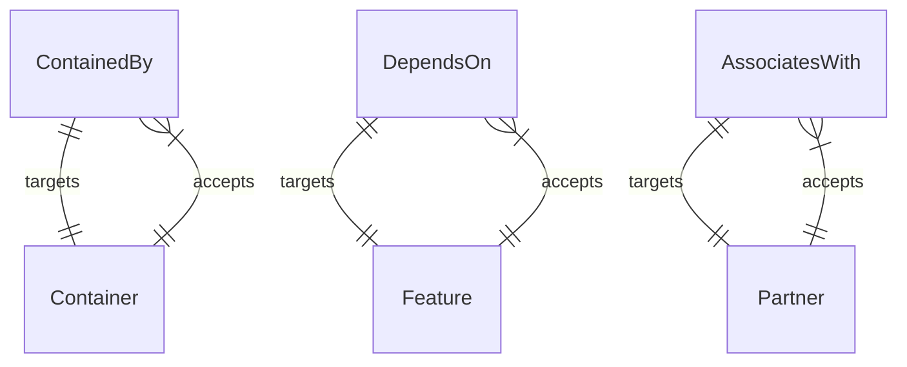

# TOSCA Core Profile

This profile defines general-purpose TOSCA types that are intended to
be shared by all other profiles.

## Relationship Types

This profile defines three different *kinds* of top-level
relationships. The *kind* of the relationship can be used by a TOSCA
processor to determine how changes in *target* nodes are propagated
across relationships to the *source* nodes of those relationships.

- A *containment* relationship kind that indicates that the lifecycle
  of the contained entity (the *source* of the relationship) is
  dictated by the lifecycle of the containing entity (the *target* of
  the relationship). This kind of relationship is provided using the
  `ContainedBy` relationship type. Relationships of type `ContainedBy`
  target capabilities of type `Container` as specified using the
  `valid_capability_types` keyword in the type definition.
- A *dependency* relationship kind that indicates that the state
  and/or configuration of a dependent node (the *source* of the
  relationship) depends on the state and/or configuration of the
  *target* node. This kind of relationship is provided using the
  `DependsOn` relationship type. Relationships of type `DependsOn`
  target capabilities of type `Feature` as specified using the
  `valid_capability_types` keyword in the type definition.
- An *association* relationship kind that records a relationship
  between two nodes that carries **no lifecycle, state, or
  configuration dependency** — the association is informational and
  neither node's deployment depends on the other. This kind of
  relationship is provided using the `AssociatesWith` relationship
  type. Relationships of type `AssociatesWith` target capabilities of
  type `Partner` as specified using the `valid_capability_types`
  keyword in the type definition.

  > **Guard against misuse.** If a relationship *does* carry a
  > deployment or configuration dependency (for example, a cloud
  > resource that must exist before another node can be associated with
  > it), it is a *dependency*, not an *association*, and should derive
  > from `DependsOn` — even when the domain colloquially calls it an
  > "association." Reserve `AssociatesWith` for genuinely
  > dependency-free links.

Other relationship types can be derived from one of the three *base* relationship types.

### Naming derived relationship types

Derived relationship type names should express the **semantics** of the
relationship — the *intent* of the source node toward the target — and
**not** the wiring mechanism used to realize it. Prefer intent-revealing
names (`Monitors`, `ManagedBy`, `RegistersWith`, `HostedOn`) over
mechanism-flavored names (`ConnectsTo`, `BindsTo`, `LinksTo`). A reader
of a service template should be able to tell *why* two nodes are related
from the relationship type name alone, without knowing how the
connection is physically established.

## Capability Types

This profile defines three *base* capability types that are matched
with the three different kinds of base relationship types. Other
capability types are derived from one of these three base types. The
following figure shows how the different base relationship types
target different capability types and how different capability types
accept different incoming relationship types:

### Organizing derived capability types

Capability types derived from `Feature` and `Container` tend to fall
into a small number of recurring **functional categories** — the
runtime environment a node offers, the core functionality it exposes,
its management and monitoring touch points, its security and trust
surface, and so on. These categories, and the common capability and
relationship types recommended for each, are described by the
Component/Port pattern in the
[design guide](../docs/design-guide.md#componentport-pattern). New derived
capability types should be slotted into one of those categories rather
than introduced ad hoc, so the type library stays a catalog rather than
a loose collection.

## Artifact Types

The core profile defines two artifact types that can serve as
implementations. An artifact type that can implement something must say
how values reach the artifact and how results come back, or an artifact
written for one orchestrator will not run on another.

### `Python`

A Python script. The same artifact type is used for two different kinds of
implementation, and the two have different calling conventions.

#### As an operation implementation

- Input values are passed as *environment variables*, one for each input
  defined in the corresponding interface operation, each named after the
  input.
- Values for *TOSCA Primitive Types* and *TOSCA Special Types* are passed
  directly, in their TOSCA spelling — a boolean arrives as `true` or
  `false`.
- Values for *TOSCA Complex Data Types* and *TOSCA Collection Types* are
  passed as JSON-encoded strings.
- An input with no value is passed as the four characters `null`, which is
  distinct from an empty string.
- Output values are printed to `stdout` as JSON or YAML, decoded by the
  orchestrator into separate output values whose names must match the
  operation's output definitions.

This is the same convention the `Bash` artifact type uses, and it is
described in full in the [technology base
profile](../technology/base/README.md).

#### As a function implementation

- Arguments are passed as an **ordered list of values**, matching the
  `arguments` of the signature the function was called through. They are
  not named, and they are not passed as environment variables.
- The artifact returns a **single value**, of the type the signature's
  `result` declares. There are no named outputs.
- The artifact must define an **entry point named after the TOSCA
  function**. `to_uppercase` is implemented by a `to_uppercase` callable in
  `functions/to_uppercase.py`.

> The difference between these two conventions is not about how an
> orchestrator invokes the artifact — in its own interpreter or as a
> subprocess — which is an implementation choice and not part of the
> contract. It is that an operation exchanges *named* values in both
> directions while a function takes *positional* arguments and returns
> *one* result. An artifact written for one cannot serve as the other.

#### Runtime environment

What an implementation may assume about its runtime *is* part of the
contract, and is currently unstated. The functions in this profile use the
Python standard library only, with one exception: `decode_yaml` imports a
YAML parser, and so depends on a package the orchestrator must make
available. An artifact type that does not say which packages an
implementation may rely on leaves that dependency to be discovered at
deployment.

> Conventions for declaring an implementation's package dependencies, and
> for the Python version an implementation may assume, are open.

### `Bash`

A shell script, using the operation calling convention described above.

> `Bash` is declared both here and in the technology base profile, where
> it additionally carries a `host` property and full documentation of its
> conventions. TOSCA typing is nominal, so these are two distinct types
> and an artifact of one cannot satisfy a definition expecting the other.
> Which of the two profiles should own it is unsettled.

## Functions

This profile defines custom functions whose implementations are Python
files under [`functions/`](functions). The entry point in each file has
the same name as the TOSCA function.

Most of these implementations use the Python **standard library only**, so
a processor can execute them without provisioning anything. The two YAML
functions are the exception: `validate_yaml` and `decode_yaml` require a
**YAML parser** (PyYAML), which a processor must make available to function
implementations. `validate_yaml` is also the validation clause on the
`YAML` data type, so that dependency applies to any profile using that
type — including the `implementation-details` property in the
[base profile](../abstract/base).
