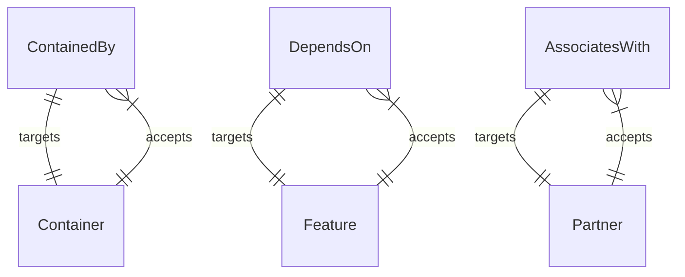

# TOSCA Core Profile

This profile defines general-purpose TOSCA types that are intended to
be shared by all other profiles.

## Data Types

Every data type here but one derives from a TOSCA primitive and adds a validation clause, so a
value is an ordinary string or integer that has been checked. `IPv4Socket` is the exception, a
complex type composed of two of the others.

**The regular expressions avoid look-around assertions**, deliberately, so that they work in regex
engines that do not support them. Two consequences are documented on the types themselves: `Fqdn`
does not enforce the 253-character DNS name limit, and `Email` accepts most common addresses without
being fully compliant with RFC 5321 and RFC 5322.

### Structured encodings

- **`JSON`**, **`YAML`** — a string carrying a document in that format, validated by the
  corresponding function below. `YAML` is the type the `implementation-details` property uses to
  carry values across a substitution boundary, so any profile using that property depends on the
  YAML parser those functions need.

### Network addressing

- **`IPv4`** — a dotted-quad IPv4 address.
- **`Port`** — an integer from 0 to 65535. Zero is admitted because it is the conventional way to
  ask for an unspecified port; a URL cannot name it, which is why `HttpUrl` accepts only 1 to 65535.
- **`IPv4Socket`** — an address and a port together, as `ip-address` and `transport-port`. The only
  complex type in this profile.

### Names and addresses

- **`Email`** — an email address.
- **`Fqdn`** — a fully qualified domain name.
- **`HttpUrl`** — an HTTP or HTTPS URL whose host is `localhost`, an FQDN or an IPv4 address,
  optionally followed by a port and by a path, query or fragment built from the characters RFC 3986
  permits. Anchored at both ends, so the whole value must be a URL rather than merely begin with
  one.

### Identifiers

- **`GenericId`** — a string identifier with no constraint of its own. It exists to be derived from,
  by a type that adds the validation its identifiers need.
- **`AlphanumericId`** — letters and digits, any length.
- **`UUID`** — an RFC 4122 UUID, versions 1 through 5.
- **`UUIDRelaxed`** — the 8-4-4-4-12 hexadecimal form without the version and variant constraints.

> **Two credential reference types are agreed and not yet declared here.** `CredentialRef` carries
> the path to where credential material is retrieved and, where one is needed, a `name`;
> `NamedCredentialRef` derives from it and makes `name` mandatory. Agreed on 2026-09-02 as decision
> D13; Section 2.1 of the [abstract-profile
> proposal](../docs/abstract-profile-proposed-changes.md) has the detail, and
> [credential-orchestration-proposal.md](../docs/credential-orchestration-proposal.md) proposes the
> capability and node types that use them.

## Relationship Types

This profile defines three different *kinds* of top-level
relationships. The *kind* of the relationship can be used by a TOSCA
processor to determine how changes in *target* nodes are propagated
across relationships to the *source* nodes of those relationships.

- A *containment* relationship kind that indicates that the lifecycle
  of the contained entity (the *source* of the relationship) is
  dictated by the lifecycle of the containing entity (the *target* of
  the relationship). This kind of relationship is provided using the
  `ContainedBy` relationship type. Relationships of type `ContainedBy`
  target capabilities of type `Container` as specified using the
  `valid_capability_types` keyword in the type definition.
- A *dependency* relationship kind that indicates that the state
  and/or configuration of a dependent node (the *source* of the
  relationship) depends on the state and/or configuration of the
  *target* node. This kind of relationship is provided using the
  `DependsOn` relationship type. Relationships of type `DependsOn`
  target capabilities of type `Feature` as specified using the
  `valid_capability_types` keyword in the type definition.
- An *association* relationship kind that records a relationship
  between two nodes that carries **no lifecycle, state, or
  configuration dependency** — the association is informational and
  neither node's deployment depends on the other. This kind of
  relationship is provided using the `AssociatesWith` relationship
  type. Relationships of type `AssociatesWith` target capabilities of
  type `Partner` as specified using the `valid_capability_types`
  keyword in the type definition.

  > **Guard against misuse.** If a relationship *does* carry a
  > deployment or configuration dependency (for example, a cloud
  > resource that must exist before another node can be associated with
  > it), it is a *dependency*, not an *association*, and should derive
  > from `DependsOn` — even when the domain colloquially calls it an
  > "association." Reserve `AssociatesWith` for genuinely
  > dependency-free links.

Other relationship types can be derived from one of the three *base* relationship types.

### Naming derived relationship types

Derived relationship type names should express the **semantics** of the
relationship — the *intent* of the source node toward the target — and
**not** the wiring mechanism used to realize it. Prefer intent-revealing
names (`Monitors`, `ManagedBy`, `RegistersWith`, `HostedOn`) over
mechanism-flavored names (`ConnectsTo`, `BindsTo`, `LinksTo`). A reader
of a service template should be able to tell *why* two nodes are related
from the relationship type name alone, without knowing how the
connection is physically established.

## Capability Types

This profile defines three *base* capability types that are matched
with the three different kinds of base relationship types. Other
capability types are derived from one of these three base types. The
following figure shows how the different base relationship types
target different capability types and how different capability types
accept different incoming relationship types:

### Organizing derived capability types

Capability types derived from `Feature` and `Container` tend to fall
into a small number of recurring **functional categories** — the
runtime environment a node offers, the core functionality it exposes,
its management and monitoring touch points, its security and trust
surface, and so on. These categories, and the common capability and
relationship types recommended for each, are described by the
Component/Port pattern in the
[design patterns](../docs/design-patterns.md#componentport-pattern). New derived
capability types should be slotted into one of those categories rather
than introduced ad hoc, so the type library stays a catalog rather than
a loose collection.

## Artifact Types

This profile declares two artifact types that can serve as implementations:

- **`Python`** — a Python script. It implements both operations and TOSCA
  functions, and the two have different calling conventions.
- **`Bash`** — a shell script, implementing operations.

How values reach an implementation and how results come back is in
[artifact-conventions.md](../docs/artifact-conventions.md), which is the single
place these are described. `Bash` is also declared in the
[technology base profile](../technology/base/README.md), which is the copy that
carries a `host` property; the duplication is addressed by Section 2.9 of the
[abstract-profile proposal](../docs/abstract-profile-proposed-changes.md).

## Functions

This profile defines custom functions whose implementations are Python
files under [`functions/`](functions). The entry point in each file has
the same name as the TOSCA function.

Most of these implementations use the Python **standard library only**, so
a processor can execute them without provisioning anything. The two YAML
functions are the exception: `validate_yaml` and `decode_yaml` require a
**YAML parser** (PyYAML), which a processor must make available to function
implementations. `validate_yaml` is also the validation clause on the
`YAML` data type, so that dependency applies to any profile using that
type — including the `implementation-details` property in the
[base profile](../abstract/base).
