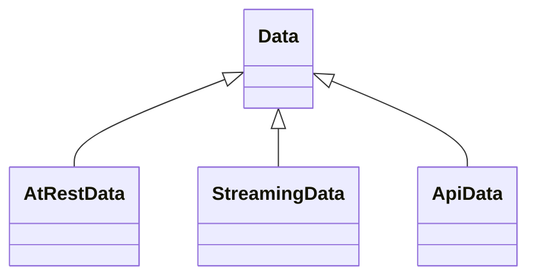

# TOSCA Community Data Profile

The Data profile defines types for representing systems that provide
persistent storage. The profile currently defines the following node
type hierarchy:

```mermaid
classDiagram
    Data <|-- AtRestData
    Data <|-- StreamingData
    Data <|-- ApiData
```
