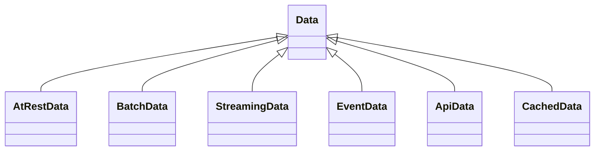

# TOSCA Community Data Profile

The Data profile defines types that specialize the abstract Data node type defined in the
[base profile](https://github.com/Engineering-Research-and-Development/tosca-community-contributions/tree/master/profiles/community/tosca/base).
They are used to represent various types of Data Sources, which are classified based on their “*delivery modality*”, i.e., how data are accessed and consumed.

The profile currently defines the following node type hierarchy:

The following sections provides further details about the proposed types.

## AtRestData
**Characteristics**: Authoritative, persistent data stored within the system’s trust boundary. It is durably persisted, accessible on demand with predictable latency, and independent of streaming or event-driven mechanisms.

**_AtRestData_** acts as a system of record and follows a “store-and-retrieve” paradigm.

**Examples**:
- File-based storage (local filesystems, network filesystems)
- Object storage systems (S3, GCS, Azure Blob)
- Relational databases (PostgreSQL, MySQL, SQL Server)
- NoSQL databases (MongoDB, Cassandra, DynamoDB)
- Graph databases (Neo4j)
- Time-series databases (InfluxDB, TimescaleDB)
- Key–value stores used as persistent storage (RocksDB, LevelDB)

## BatchData
**Characteristics**: Data produced, delivered or ingested at scheduled intervals rather than continuously or on demand. It is not event-driven and is typically generated via periodic processes (e.g., ETL pipelines, daily exports).

**_BatchData_** emphasizes timed availability rather than continuous access.

**Examples**:
- Nightly CSV/JSON exports
- Daily ETL pipeline outputs
- Batch-generated reports
- Periodic snapshots or dumps of databases
- Scheduled ingestion from external systems

## StreamingData
**Characteristics**: Data produced and transmitted as an ongoing, unbounded flow. Consumers process data in real time or near real time as it arrives.

**_StreamingData_** emphasizes continuous ingestion, low latency, and high throughput. It is typically associated with time-ordered event streams.

**Examples**:
- Kafka topics
- IoT sensor telemetry streams
- Financial market tick data
- Logs and metrics pipelines (Fluentd, Prometheus)
- Real-time analytics streams (Pub/Sub)

## EventData
**Characteristics**: Data generated or delivered as discrete, individual events, not as a continuous stream. Each event is meaningful on its own and typically represents a state change or notification.

**_EventData_** emphasizes asynchronous notification rather than continuous processing.

**Examples**:
- Webhooks
- Notification messages
- Message queues (RabbitMQ, SQS, ActiveMQ)
- Domain events published by microservices

## ApiData
**Characteristics**: Data obtained by invoking a remote service via synchronous request/response interactions. The data returned often involves application logic, validation, transformation, or aggregation.

**_ApiData_** is not necessarily persistent nor authoritative; it reflects the state exposed by a remote service at query time.

**Examples**:
- REST endpoints
- gRPC services
- GraphQL queries
- Internal microservices APIs
- Third-party HTTP APIs (weather, payments, identity providers)

## CachedData
**Characteristics**: Data retrieved from a cache layer, either local or distributed, that stores values temporarily to improve performance or reduce load on authoritative sources.

**_CachedData_** is ephemeral, non-authoritative, and governed by TTL, eviction, and invalidation rules. It acts as an optimization layer rather than a source of truth.

**Examples**:
- Redis or Memcached lookups
- In-memory application caches
- CDN edge caches (CloudFront, Akamai)
- Reverse proxy caches (Nginx caching)

## ApiData vs other Data types
It is worth to observe that from a broader perspective all data are accessed through an API, exception made for those available in the local filesystem. However, it makes definitely sense to distinguish **_ApiData_** from other types, based on the distinctive characteristics previously described.

For example, **_AtRestData_** refers to data that resides on a storage system, is durable, follows a “store-and-retrieve” semantic model, and is independent of any application logic (examples: S3, databases, filesystems). Differently, **_ApiData_** refers to data obtained from a remote service that applies its own application logic (business logic), not merely storage operations (examples: a partner’s REST API, a microservice API).
