# TOSCA Community Profile Design Guide

**Related documents:** [README](README.md) · [prior-art](prior-art.md) · [abstract-profile-proposed-changes](abstract-profile-proposed-changes.md) · [meeting-history](../../../governance/meeting-history.md) · [decision-log](../../../governance/decision-log.md) · [open-issues](../../../governance/open-issues.md)

This guide describes the modeling methodology and design patterns the
TOSCA Community uses when developing community profiles: the Model
Continuum for managing abstraction, how to translate between
abstraction levels, how abstract services are deployed, and the
Component/Port pattern for modeling how nodes interact.

---

## The Model Continuum in Support of Abstraction

To manage the complexities associated with large scale systems and
services, the TOSCA Community has adopted a modeling approach that
relies heavily on the use of *abstraction*. Abstraction allows for the
creation of *high-level* models that hide *low-level* implementation
details.  To help guide the use of abstraction in service modeling, we
leverage the [*policy
continuum*](https://www.sciencedirect.com/science/article/abs/pii/S0140366408002302)
introduced by [John
Strassner](https://www.linkedin.com/in/john-strassner-41ba98a). While
the policy continuum was originally introduced to assist with the
definition of *policies* at various levels of abstraction, it can also
be used to assist with the creation of *models* to which these
policies can be applied. Therefore, this document uses the term *model
continuum* rather than *policy continuum*.

The model continuum recommends five different levels of abstraction
as shown in the following picture:

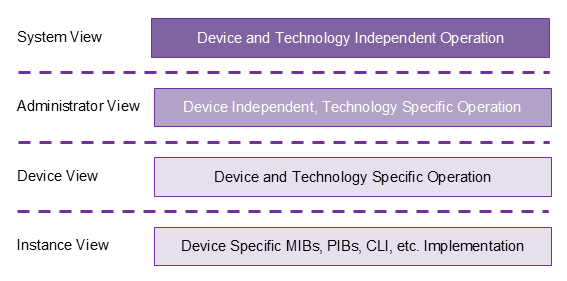

- **Business View**: describes services in terms of business goals. It
  models services as products that are available to customers.
- **System View**: describes the architectural components of the
  service in a technology-agnostic fashion. It defines the system
  architecture used to meet the business objectives specified in the
  business view.
- **Administrator View**: specifies technologies used for each of the
  architectural components in the system. It introduces
  technology-specific implementations for the architecture specified
  in the system view.
- **Device View**: lists specific devices or software
  components&mdash;as well as their associated
  configurations&mdash;for all of the components of the service. It
  introduces vendor-specific equipment for the technologies used in
  the administrator view.
- **Instance View**: captures the state of each instance and specifies
  details about the interfaces for managing these instances.

The model continuum enables a **top-down** service design approach,
where high-level designs are incrementally refined into lower levels
as follows:

1. System designers create abstract *system view* models to define the
   architecture of their systems.
2. These abstract system models are then refined using *administrator
   view* models that introduce the specific technologies chosen to
   implement the system architecture.
3. For the technologies selected in the administrator view models,
   *device view* models specify specific vendor products or software
   packages.
4. Finally, the *instance view* models add interface implementations
   based on implementation artifacts that can be used by an
   Orchestrator to manage the products specifies in the device view
   models.

> Add discussion about monitoring and telemetry data moving in the
  other direction: low-level monitoring data are summarized and
  aggregated into high-level *system health* attributes.

As a *best practice*, TOSCA profile designers should avoid mixing and
matching types defined at different levels of abstraction within the
same profile. Instead, they should define separate profiles for system
view models, for administrator view models, for device view models,
and for instance view models, and use the techniques recommended in
this document to translate between different levels of abstraction.

The TOSCA Community provides separate TOSCA profiles for each level of
abstraction and is very clear about the level of abstraction for which
each profile is designed. The remainder of this document provides an
introduction to these profiles.

## Generic Base Node Types for System View Profiles

Top-down service design starts by defining TOSCA service templates at
the highest level of abstraction, which is the System View level in
the Model Continuum. At this level of abstraction, any service or
application generally consist of the following:

- *Application* components that provide the functionality provided by
  the service.
- Storage components that provide the persistent *data* that are
  processed by the service.
- One or more underlying *platforms* that run the application
  components that make up the service or that make persistent data
  available.
- *Networks* that connect various platforms.

To assist with the development of abstract service templates, the
TOSCA Community profiles include a System View profile that defines
base node types for these four *generic* abstractions. Specifically,
it defines:

- An `Application` node type that represents the functionality
  provided by the service.
- A `Data` node type that represents the persistent data processed by
  the service. This data node type can model Data Sets, Data Lakes,
  Databases or similar entities.
- A `Platform` node type that represents the platforms on which the
  service components are deployed.
- A `Network` node type that represents connectivity between
  platforms.

These node types&mdash;as well as the supporting relationship types
and capability types&mdash;are organized in the
`community.tosca.abstract.base` profile. It can be used to guide the
development of abstract service templates as shown in the following
figure:

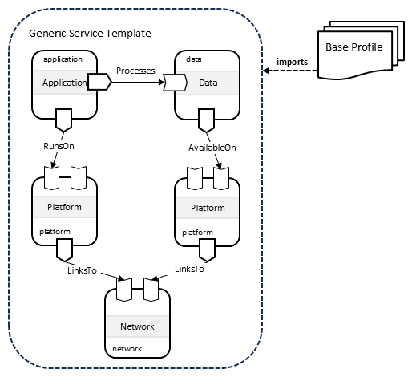

## Component-Specific System View Profiles

In practice, abstract service templates generally will not use the
*generic* base node types presented in the `community.tosca.abstract.base`
profile. Instead, they will use derived types that further refine and
extend these base types. For example, derived `Data` node types could
distinguish between databases and data lakes, or derived `Platform`
node types could specify whether applications are deployed on
Kubernetes clusters or on servers provisioned on IaaS platforms, etc.

To this end, the TOSCA Community defines four additional System View
profiles as shown in the following figure:

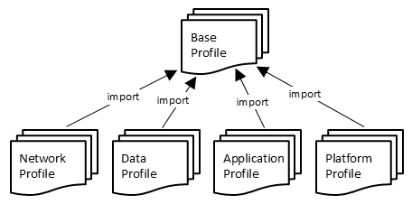

Each of these profiles defines derived node types for one of the four
base node types defined in the base profile. These profiles can then
be used to define abstract TOSCA service templates that define specific
applications or services. The following figure shown an example of
such an abstract service template:

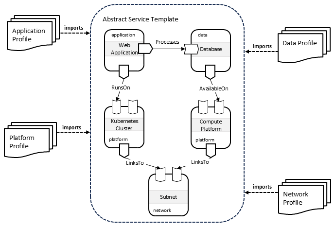

## Translating Between Levels of Abstraction

During the orchestration process, TOSCA service templates that use
types defined a higher level of abstraction must be extended with
information that is specific to the next lower level of
abstraction. The TOSCA language provides two mechanisms to accomplish
this:

### Derivation

Using the derivation approach, base node types define abstract
entities. Derived types provide concrete implementations for those
abstract definitions. This approach is shown in the following figure:

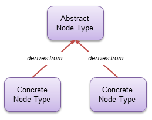

### Substitution

Using the substitution approach, base node types define an abstract
interface, a *facade* if you will. Substituting templates provide
concrete implementations for the abstract facade. This approach is
shown in the following figure:

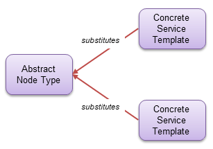

### Translation Best Practices

#### Translating System View to Administrator View

We recommend using *substitution mapping* to tranlate from the system
view level of abstraction to the administrator view level of
abstraction, as shown in the following figure:

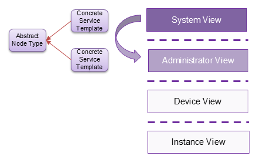

Note that this recommendation does not prohibit the use of
*inheritance* to further refine types defined in *system view*
profiles. In fact, inheritance could be useful to define base node
types that define common functionality (e.g. interfaces) that is then
shared by all node types derived from that base type. However,
inheritance should not be used to add technology-specific or
vendor-specific implementations to system view node types.

#### Translating Administrator View to Device View
We recommend using *derivation* to map from the administrator view
level of abstraction to the device view level of abstraction, as shown
in the following figure:

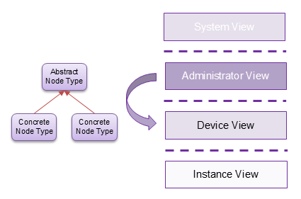

#### Translating Device View to Instance View

Derivation could be used again to translate from the device view level
of abstraction to the instance view level of abstraction, as shown in
the following figure.

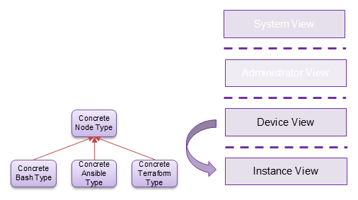

This figure suggests that different derived classes could add
different types of artifacts that can be used as interface operation
implementations. One derived node type could use Ansible playbooks, a
second derived node type could use Terraform configurations, and a
third could use simple Bash scripts.

However, this approach could result in a proliferation of profiles. A
better approach would be to *dynamically* attach implementations to
the types defined in device view profiles without having to introduce
new derived types. Unfortunately, the TOSCA language currently does
not have any constructs to support such dynamic behavior.

> This needs further discussion

### Mapping Relationship Types and Capability Types

> It is likely that the same guidelines about abstraction apply to
  relationship types as well. However, the TOSCA spec is somewhat
  vague about whether requirement mappings rules (and capability
  mapping rules for that matter) require that the relationships
  resulting from the mapping have types that are compatible with the
  relationship of the mapped requirement. If that is the case, then
  these relationship types (and capability types) must be shared
  between System View, Administrator View, and Device View profiles
  and may need to be organized in a *shared* profile.  This shared
  profile should only define top-level relationship types or
  capability types. Profile-specific types should derive from one of
  the base types defined in the base profile.

  > **Tracked as issue I15**, and related to I1 (single source of truth
  > for shared types). If the mapping rules do require type
  > compatibility, the shared top-level relationship and capability
  > types belong in `community.tosca.core` — which already owns the
  > three base relationship/capability kinds — so that System View,
  > Administrator View, and Device View profiles all derive from a
  > single source.

### Profile Organization

The approach recommended in this section has resulted in a set of
profiles as shown in the following figure:

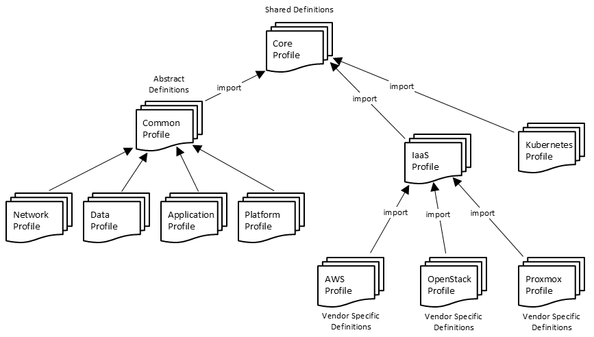

The profiles on the right are *Administrator View* and *Device View*
profiles, where *Device View* node types derive from node types
defined in *Administrator View* profiles. One such Administrator View
profile is the IaaS profile that defines node types that represent
entities managed by Infrastructure-as-a-Service platforms. These types
are then refined in profiles specific to each IaaS provider, such as
AWS, Azure, etc.

The *Core* profile defines types, repositories, functions, etc. that
are shared by profiles at different levels of abstraction.

## Deploying Abstract Services

This section describes the process that could be implemented by TOSCA
processors for deploying abstract services. This process recommends
the following steps:

1. Decouple applications and data from platforms.
2. Make placement decisions based on available platforms.
3. Placement decisions drive substitution.

### Decouple Applications and Data from Platforms

High-level service designs should be *abstract and portable*, which
means they should be independent of the target platform on which these
services will ultimately be deployed. With this goal in mind, abstract
TOSCA service templates should focus on application topology only and
must not include node templates for the platforms on which the
services are deployed. Instead, node templates for applications and
data in abstract service templates should include requirements for
capabilities in the target platform(s) on which the service can be
deployed.

The following shows a hypothetical example of such an abstract service
template that defines a simple web application that operates on data
stored in a relational database:

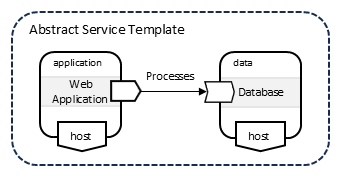

In this example, the `host` requirements of the application and data
node templates are left *dangling*. These requirements need to be
fulfilled by the TOSCA Processor at service deployment time.

To fulfill these dangling requirements, TOSCA processors should
maintain representations of the available platforms on which services
can be deployed. These representations should contain sufficient
information to allow TOSCA processors to make intelligent placement
decisions. For example, platform representations could include the
following:

  - Location: where is the platform physically located?
  - Capabilities: what type of platform is it and what types of
    workloads can the platform support?
  - Capacity: how much load can be placed on the platform?
  - Access: how to access the platform?

The following shows a representation of the platforms available for a
specific customer. 

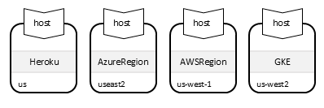

### Make Placement Decisions

When deploying an abstract service, the TOSCA Processor first makes
placement decision by *fulfilling* the dangling `host` requirements of
the nodes in the abstract service representation using capabilities of
the nodes in the abstract platform representations. Node filters can
be used to narrow down the set of candidate target platforms. The
following figure shows a node filter that drives placement for the
`application` node in the abstract service template.

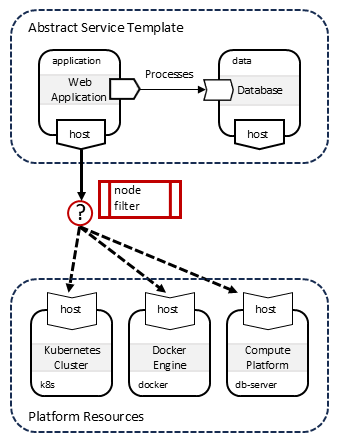

### Placement Drives Substitution

Once placement decisions have been made, the TOSCA Processor finds
substituting templates that are suitable for the allocated target
platform. This is done by using information about that target platform
into the *substitution filters* for the candidate substituting
templates.

> If substitution decisions made based on the type of the allocated
  platform, do we need to define a TOSCA function that returns a node
  type?

#### Substitute for Kubernetes

The following figure shows an example where the application node in
the abstract service is deployed on a Kubernetes cluster.

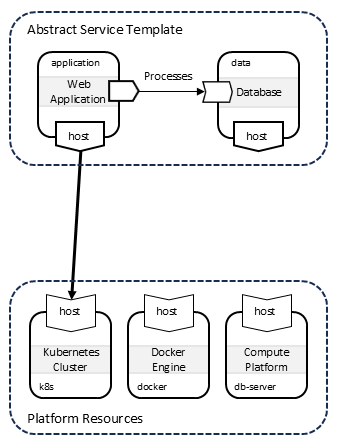

This information is then used to substitute the abstract application
node with substituting templates that implement this node by deploying
Kubernetes resources. TOSCA type definitions from the TOSCA Kubernetes
Profile are used for the templates in the substituting service:

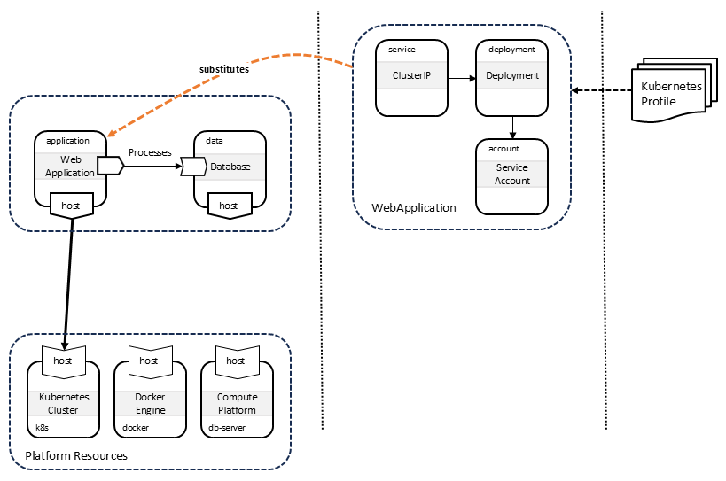

#### Substitute for Docker

The following figure shows an alternative deployment on a Docker
engine:

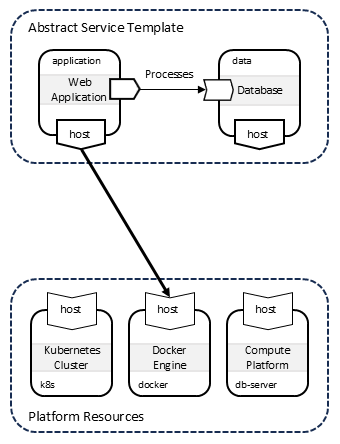

In this scenario, the abstract application node is substituted using
templates that implement this nodeq by deploying the application
directly using Docker. TOSCA type definitions from the TOSCA Docker
Profile are used for the templates in the substituting service:

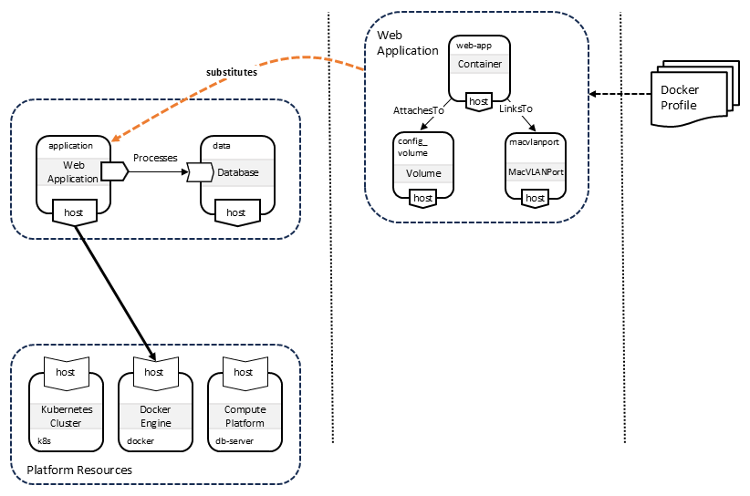

---

## Component/Port Pattern

TOSCA uses a **Component/Port** pattern where a component’s touch
points for interacting with other components are modeled separately
from that component using *port* abstractions. Using TOSCA, components
are modeled using *Node Types* and the ports of those components are
modeled using the following two different abstractions associated with
node types:
- Capabilities: for functionality exposed by a component and usable by
  other components.
- Requirements: for dependencies of one component on functionality
  exposed by other components.

**Naming principle.** Capability type names should describe the
*functionality a component exposes*; relationship type names should
describe the *semantics of the dependency* — the intent of the source
node toward the target — and not the mechanism used to realize it.
Intent-revealing names (`Monitors`, `ManagedBy`, `RegistersWith`,
`HostedOn`) are preferred over mechanism-flavored names (`ConnectsTo`,
`BindsTo`, `LinksTo`). This keeps service templates readable: the reader
should understand *why* two nodes are related from the type name alone.

The Component/Port pattern defines *common* categories of
functionality that are typically exposed by all components. It then
attempts to define *common* capability types and *common* relationship
types to represent each of these categories of functionality. Note
that this pattern is inspired by the [ONF Core Information
Model](https://opennetworking.org/software-defined-standards/models-apis/),
the [TMF Open Digital Architecture](https://www.tmforum.org/oda/), and
other modeling efforts that use a similar approach. These standard
categories of functionality are shown in the following picture:

- **Runtime environment**: most if not all TOSCA nodes are contained
  by (*hosted on*) another node and their lifecycle is determined by
  the lifecycle of the containing node. This containment dependency is
  expressed using an *execution environment requirement* that must be
  fulfilled by a corresponding *execution environment capability* of
  the containing node. Nodes that can *host* other nodes typically
  have their own *runtime environment requirement*.
- **Core functionality**: the main function of a TOSCA node is to
  provide a specific set of features or functionality to other
  nodes. This is expressed using a *core functionality capability*.
  Other nodes will define requirements for this functionality.
- **Management**: many TOSCA nodes are matched with a corresponding
  management tool. This relationship is expressed as a *management
  requirement* of the managed TOSCA node rather than as a *management
  capability* to express potential deployment dependencies: if the
  management tool is used to configure the TOSCA node, the management
  tool must be deployed before the managed node can be fully deployed.
  Note that for management tools, the management functions are exposed
  as their *core functionality capability*. Because management is
  modeled as a requirement of the managed node, a *reverse* "manages"
  capability/relationship on the management tool is **not** needed and
  should be avoided — it duplicates the same dependency in the opposite
  direction.
- **Monitoring**: many TOSCA nodes are matched with a corresponding
  monitoring tool. The monitored node exposes an *observability
  capability*; the monitoring tool declares a *monitoring requirement*
  that targets it. This is a *dependency* relationship (the monitored
  node must be deployed and observable before monitoring can attach),
  so the monitoring relationship derives from `DependsOn`. Modeling
  observability as a capability of the *monitored* node — rather than as
  a capability of the monitoring tool — keeps the direction consistent
  with management: the touch point lives on the node being acted upon.

  > **Proposed resolution for issue I17.** Formalizes the monitoring
  > pattern that was discussed in the TOSCA TC but never written down.

- **Security**: securing access to a node is not one concern but
  several, each modeled with its own capability/relationship pair:
  - *Perimeter protection* — a node exposes a capability indicating it
    can be fronted by a security control (firewall, gateway); the
    protected node declares a requirement targeting it.
  - *Credentials / authorization* — a node exposes a capability
    representing credentials it can be accessed with; consumers declare
    an authorization requirement against it.
  - *Identity / registration / trust* — a node (a registry or trust
    store) exposes a registration capability; devices and services
    declare a *registration requirement* (e.g. `RegistersWith`) so that
    their signed requests can later be verified by relying parties.

  > **Proposed resolution for issue I17.** Replaces "this pattern needs
  > further work" by splitting security into perimeter, credentials, and
  > identity/trust sub-patterns.

**The category list is open-ended.** The categories above are the
*common* ones, not an exhaustive set. Other recurring cross-cutting
categories follow the same pattern and may warrant their own common
capability and relationship types — for example *provisioning* (a node
built from an image or package source), *networking* (attachment to
hosts and networks), and *routing* (directing traffic to a target). New
categories should be introduced deliberately, documented here, and given
capability and relationship types that follow the naming principle
above.

As stated earlier, the TOSCA Community uses this pattern to define common
capability types and common relationship types for these various
categories of functionality. These types are discussed next.

### Best Practices

> **Proposed resolutions for issue I16.** The three questions below were
> previously open; the recommendations are proposed for community
> ratification. Related to I4 (abstract-vs-minimal types).

**1. Where should the capability↔relationship constraint be declared —
`valid_capability_types`, `valid_relationship_types`, or both?**

Declare it in **one** place, not both. The recommended convention:

- Put `valid_relationship_types` **only on the three base capability
  types** (`Container`, `Feature`, `Partner`), where it enforces the
  containment / dependency / association *kind* gate.
- Put `valid_capability_types` **on relationship types** to point each
  relationship at the specific capability it targets.

Restating both on every derived type is redundant, and — under TOSCA's
nominal typing — invites the two lists to drift out of sync.

**2. When should a new derived relationship or capability type be
defined, versus reusing a base type?**

Derive a new type when at least one of these holds:

1. A **semantically clearer name** improves the readability of profiles
   and templates (the name reveals intent that the base type does not).
2. **Additional properties or attributes** are needed on the
   relationship or capability.
3. **Additional inputs or operation implementations** are needed on a
   relationship interface.
4. **Additional interfaces** are needed on the relationship.

If none of these apply — the type would differ only in which nodes it
connects — do **not** derive a new type.

**3. If a specific capability and a specific relationship to it are
needed, derive new types or specialize the base types in place?**

Follow from question 2: if a case in (1)–(4) applies, derive the types.
Otherwise, reuse the base types and constrain them at the point of use
with `valid_source_node_types` / `valid_target_node_types` in the
capability and requirement definitions. This keeps the type hierarchies
shallow and avoids a proliferation of near-identical types.
