# TOSCA Community Profile Design Guide

**Related documents:** [README](../README.md) · [design-patterns](design-patterns.md) · [profile-organization](profile-organization.md) · [prior-art](prior-art.md) · [abstract-profile-proposed-changes](abstract-profile-proposed-changes.md) · [meeting-history](../../../../governance/meeting-history.md) · [decision-log](../../../../governance/decision-log.md) · [open-issues](../../../../governance/open-issues.md)

This guide describes the modeling methodology and design patterns the
TOSCA Community uses when developing community profiles: the Model
Continuum for managing abstraction, how to translate between
abstraction levels, how abstract services are deployed, and the
Component/Port pattern for modeling how nodes interact.

---

## The Model Continuum in Support of Abstraction

To manage the complexities associated with large scale systems and
services, the TOSCA Community has adopted a modeling approach that
relies heavily on the use of *abstraction*. Abstraction allows for the
creation of *high-level* models that hide *low-level* implementation
details.  To help guide the use of abstraction in service modeling, we
leverage the [*policy
continuum*](https://www.sciencedirect.com/science/article/abs/pii/S0140366408002302)
introduced by [John
Strassner](https://www.linkedin.com/in/john-strassner-41ba98a). While
the policy continuum was originally introduced to assist with the
definition of *policies* at various levels of abstraction, it can also
be used to assist with the creation of *models* to which these
policies can be applied. Therefore, this document uses the term *model
continuum* rather than *policy continuum*.

The model continuum recommends five different levels of abstraction
as shown in the following picture:

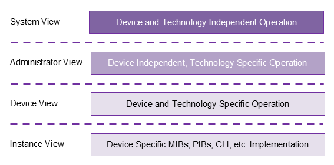

- **Business View**: describes services in terms of business goals. It
  models services as products that are available to customers.
- **System View**: describes the architectural components of the
  service in a technology-agnostic fashion. It defines the system
  architecture used to meet the business objectives specified in the
  business view.
- **Administrator View**: specifies technologies used for each of the
  architectural components in the system. It introduces
  technology-specific implementations for the architecture specified
  in the system view.
- **Device View**: lists specific devices or software
  components&mdash;as well as their associated
  configurations&mdash;for all of the components of the service. It
  introduces vendor-specific equipment for the technologies used in
  the administrator view.
- **Instance View**: captures the state of each instance and specifies
  details about the interfaces for managing these instances.

The model continuum enables a **top-down** service design approach,
where high-level designs are incrementally refined into lower levels
as follows:

1. System designers create abstract *system view* models to define the
   architecture of their systems.
2. These abstract system models are then refined using *administrator
   view* models that introduce the specific technologies chosen to
   implement the system architecture.
3. For the technologies selected in the administrator view models,
   *device view* models specify specific vendor products or software
   packages.
4. Finally, the *instance view* models add interface implementations
   based on implementation artifacts that can be used by an
   Orchestrator to manage the products specified in the device view
   models.

> **Open, not yet tracked as an issue.** Add discussion about monitoring
> and telemetry data moving in the other direction: low-level monitoring
> data are summarized and aggregated into high-level *system health*
> attributes. This is the *bottom-up* counterpart to the top-down
> refinement described above, and the mechanism already exists —
> `substitution_mappings.attributes` escalates values from a substituting
> service onto the substituted node. Needs an issue number and a written
> pattern.

As a *best practice*, TOSCA profile designers should avoid mixing and
matching types defined at different levels of abstraction within the
same profile. Instead, they should define separate profiles for system
view models, for administrator view models, for device view models,
and for instance view models, and use the techniques recommended in
this document to translate between different levels of abstraction.

The TOSCA Community provides separate TOSCA profiles for each level of
abstraction and is very clear about the level of abstraction for which
each profile is designed. The remainder of this document provides an
introduction to these profiles.

## Generic Base Node Types for System View Profiles

Top-down service design starts by defining TOSCA service templates at
the highest level of abstraction, which is the System View level in
the Model Continuum. At this level of abstraction, any service or
application generally consist of the following:

- *Application* components that provide the functionality provided by
  the service.
- Storage components that provide the persistent *data* that are
  processed by the service.
- One or more underlying *platforms* that run the application
  components that make up the service or that make persistent data
  available.
- *Networks* that connect various platforms.

To assist with the development of abstract service templates, the
TOSCA Community profiles include a System View profile that defines a
base node type for each of these four abstractions, together with the
relationship and capability types that connect them. They are organized
in the `community.tosca.abstract.base` profile, and what each one models
and how they relate to one another is documented with the profile
itself: [base profile README](../abstract/base/README.md#type-definitions).

The result guides the development of abstract service templates as shown
in the following figure:

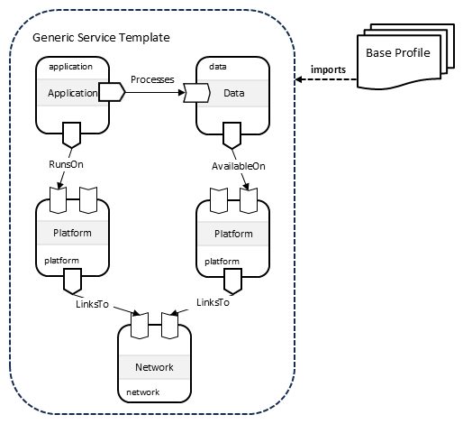

## Component-Specific System View Profiles

In practice, abstract service templates generally will not use the
*generic* base node types presented in the `community.tosca.abstract.base`
profile. Instead, they will use derived types that further refine and
extend these base types. For example, derived `Data` node types could
distinguish between databases and data lakes, or derived `Platform`
node types could specify whether applications are deployed on
Kubernetes clusters or on servers provisioned on IaaS platforms, etc.

To this end, the TOSCA Community defines one further System View profile
per base node type, each defining the derived types for its own
abstraction, as shown in the following figure:

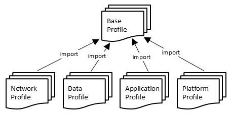

Which profiles those are, and how they sit relative to the profiles
below them, is in
[profile-organization.md](profile-organization.md#the-profile-set).
Together they are what an abstract service template is written against.
The following figure shows an example of such a template:

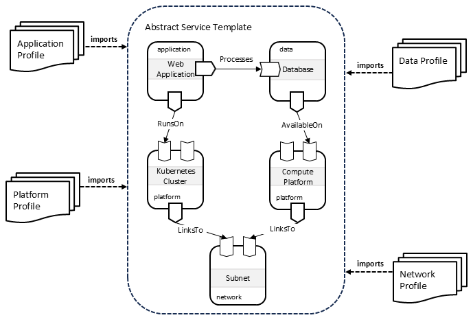

## Translating Between Levels of Abstraction

During the orchestration process, TOSCA service templates that use
types defined a higher level of abstraction must be extended with
information that is specific to the next lower level of
abstraction. The TOSCA language provides two mechanisms to accomplish
this:

### Derivation

Using the derivation approach, base node types define abstract
entities. Derived types provide concrete implementations for those
abstract definitions. This approach is shown in the following figure:

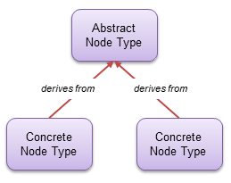

### Substitution

Using the substitution approach, base node types define an abstract
interface, a *facade* if you will. Substituting templates provide
concrete implementations for the abstract facade. This approach is
shown in the following figure:

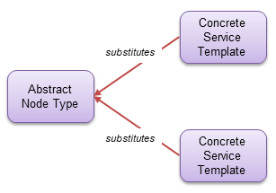

### Passing Implementation Details Across a Substitution Boundary

Abstract node types *hide* the details required at lower levels. That is what
makes them abstract, but it creates a problem during substitution: the
substituting template frequently needs some of what was hidden. A mechanism is
therefore needed to supply those lower-level details without burdening the
abstract node types with information that means nothing at their level.

**This is a recommended practice, not a requirement of the specification.**
§15.2 requires property mappings only for non-optional service template inputs
that do not define a `default` value, so a substituting template is free to
declare additional inputs that are never mapped at all, provided they are
optional or carry a default. Nothing here overrides that.

**What the recommendation is for.** An unmapped input with a default can only
carry a value fixed when the substituting template was authored, which makes it
a lowest-common-denominator value across every use of that template. It can
never carry a value that differs per substituted node. Where a value does vary
with the node being substituted, mapping is the only mechanism that crosses the
substitution boundary. The two are therefore not competing solutions to one
problem:

- **An unmapped input with a default** suits a value that is genuinely constant
  across every use of the realization.
- **A mapped property** is required as soon as the value depends on which node
  is being substituted.

The pattern below is how the community profiles carry a *set* of such
per-node values without declaring each one on the abstract type. It uses an
*opaque* `implementation-details` property, passed to the substituting template
and parsed only in that template's context.

1. All abstract nodes define a property called `implementation-details` that
   contains a structured set of lower-level details that can simply be ignored
   at the highest level of abstraction. The value of this property can be
   encoded in a variety of ways&mdash;including YAML, JSON, or some other
   mechanism&mdash;but the community profiles use YAML encoding. The [core
   profile](../core) defines a `YAML` data type for this purpose. The abstract
   node should validate that the provided string is well-formed YAML, but it
   does not need to know about the specific values carried in that string. This
   allows arbitrary implementation detail data to be provided in the abstract
   node.

   YAML is used rather than JSON because the surrounding service template is
   itself a YAML document. JSON is a subset of YAML, so nothing is given up,
   while the value can be written as a block scalar instead of a quoted
   string&mdash;which permits line breaks and comments, and avoids quoting a
   JSON document inside YAML:
   ```yaml
   node_templates:
     my_app:
       type: base:Application
       properties:
         implementation-details: |
           service_label: frontend
           # the deployment label is optional
           deployment_label: web
   ```
   When authoring a block scalar, the whole block must share a common base
   indentation: the base is taken from the first non-empty line, every line
   must be indented at least that far, and any extra indentation is preserved
   as structure. Tabs are not valid YAML indentation and must not appear in the
   encoded value.
2. In the substituting template, we define a substitution mapping that maps the
   `implementation-details` property value to an input of the substituting
   template. For example, the following shows how the `implementation-details`
   property is mapped to a service template input called `yaml_data` which is
   also of type `YAML`:
   ```yaml
   service_template:
     substitution_mappings:
       node_type: app:MicroService
       properties:
         implementation-details: yaml_data
     inputs:
       yaml_data:
         type: YAML
   ```
3. The substituting template then defines another service template input that
   uses a TOSCA data type to represent the implementation details. For example,
   the following shows a TOSCA data type called `ImplementationDetails` and an
   input value of that type called `implementation-details`. Note that
   substituting templates are free to choose different data type names and
   different input names:
   ```yaml
   data_types:
     ImplementationDetails:
       properties:
         service_label:
           type: string
         deployment_label:
           type: string
         security_context:
           type: k8s:SecurityContext
   service_template:
     inputs:
       yaml_data:
         type: YAML
       implementation-details:
         type: ImplementationDetails
   ```
4. Finally, the key to making this work is to fix the value of the
   `implementation-details` input to the data that are returned by decoding the
   YAML string in the `yaml_data` input, as follows:
   ```yaml
   service_template:
     substitution_mappings:
       node_type: app:MicroService
       properties:
         implementation-details: yaml_data
     inputs:
       yaml_data:
         type: YAML
       implementation-details:
         type: ImplementationDetails
         value: {$decode_yaml: [{$get_input: yaml_data}]}
   ```
   Note that this requires a custom `$decode_yaml` function.
5. The TOSCA processor will then validate the data returned by the
   `$decode_yaml` function against the `ImplementationDetails` data type,
   thereby ensuring (at deployment time) that correct implementation details
   have been provided in the abstract node.

   This step is what makes the opaque property safe: the value is untyped only
   while it crosses a boundary that could not have typed it, and the decode
   step is where the substituting template&mdash;which does know the
   schema&mdash;re-establishes typing.
6. In the substituting template, whenever one of the implementation detail
   values are required, they could be retrieved using `$get_input` function
   calls, for example as follows:
   ```yaml
   $get_input: [implementation-details, service_label]
   ```

### Interface Definitions Differ by Level

A node type at the System View level declares the operations a
substituting service can implement. A node type at the Administrator
View or Device View level declares the operations its implementation
artifacts carry out. These are different sets, and the community
profiles define a `Standard` interface at each level accordingly:

| profile | `Standard` operations |
|---|---|
| `community.tosca.abstract.base` | `create`, `modify`, `delete` |
| `community.tosca.technology.base` | `create`, `configure`, `start`, `modify`, `stop`, `delete` |

The reason lies in how substitution implements an operation. An
*interface mapping* maps an operation on the substituted node to a
*workflow* in the substituting service, so an operation declared on a
System View node type is answerable only where a workflow can stand for
it. Starting and stopping describe transitions an artifact performs on a
running resource; a service whose internals are themselves nodes with
lifecycles of their own has no single workflow that corresponds.

**Relationship types at the System View level declare no interfaces at
all.** Substitution applies to node types: a `substitution_mapping`
declares a `node_type`, and the language defines no relationship
counterpart. An interface declared on a relationship can therefore only
be implemented by an artifact supplied at the level where the
relationship is declared, which is precisely what a System View profile
does not supply. Relationship types at this level carry structure; a
configuration interface on a relationship belongs to the
technology-specific and vendor-specific profiles, alongside the
artifacts that implement it.

The same reasoning applies to any interface type, not only to
`Standard`. An interface belongs at the level whose node types can
implement its operations, and an interface serving one level is not
made general by being defined lower in the import chain.

### Translation Best Practices

#### Translating System View to Administrator View

We recommend using *substitution mapping* to translate from the system
view level of abstraction to the administrator view level of
abstraction, as shown in the following figure:

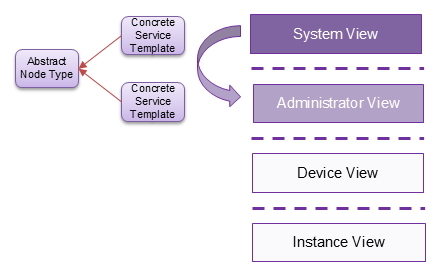

Note that this recommendation does not prohibit the use of
*inheritance* to further refine types defined in *system view*
profiles. In fact, inheritance could be useful to define base node
types that define common functionality (e.g. interfaces) that is then
shared by all node types derived from that base type. However,
inheritance should not be used to add technology-specific or
vendor-specific implementations to system view node types.

#### Translating Administrator View to Device View
We recommend using *derivation* to map from the administrator view
level of abstraction to the device view level of abstraction, as shown
in the following figure:

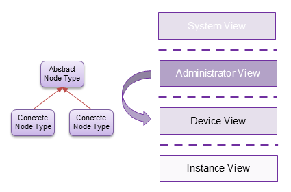

#### Translating Device View to Instance View

Derivation could be used again to translate from the device view level
of abstraction to the instance view level of abstraction, as shown in
the following figure.

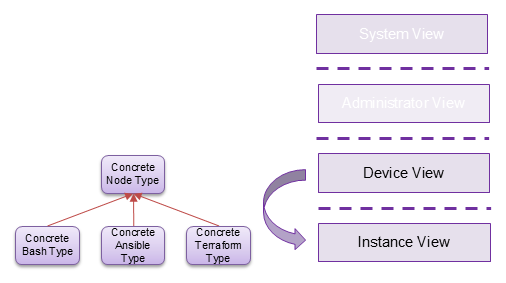

This figure suggests that different derived classes could add
different types of artifacts that can be used as interface operation
implementations. One derived node type could use Ansible playbooks, a
second derived node type could use Terraform configurations, and a
third could use simple Bash scripts.

However, this approach could result in a proliferation of profiles. A
better approach would be to *dynamically* attach implementations to
the types defined in device view profiles without having to introduce
new derived types. Unfortunately, the TOSCA language currently does
not have any constructs to support such dynamic behavior.

> **Tracked as issue I14** (dynamic attachment of implementation
> artifacts). Needs a language construct; open against a future spec
> version.

### Mapping Relationship Types and Capability Types

**Capability mappings and requirement mappings impose no type
compatibility.** Their grammar is positional — a capability mapping
names a node template and one of its capabilities, a requirement mapping
names a node template and one of its requirements — and neither carries
a rule relating the type on the substituted node to the type on the
substituting one. The specification states the reason directly:
capability and requirement mappings do not propagate property or
attribute values and are used exclusively to control service topology.
Where a value must cross the boundary, a property or attribute mapping
carries it, and those *are* type compatible.

The consequence for profile organization is that **relationship types
and capability types need not be shared across levels of
abstraction.** A System View profile and a Device View profile may each
define their own, and a substituting service may map a requirement of
one onto a requirement of the other, because the mapping stitches the
topology rather than matching the types. What does require compatibility
is *derivation*: a refined requirement must name a relationship type
derived from the one it refines, so types related by inheritance stay
related across a profile boundary.

The guidance about abstraction still applies to relationship and
capability types, then, but as a design choice rather than a constraint
the language imposes. Where the same relationship means the same thing
at every level, defining it once and deriving from it is the simpler
model. Where a relationship carries an interface at one level and pure
structure at another — see [Interface Definitions Differ by
Level](#interface-definitions-differ-by-level) above — a definition per
level is the honest one.

### Where the Resulting Profiles Live

How the profiles that result from this methodology are organized — the levels,
the two dimensions that cross them, how to decide which profile a type belongs
in, and the naming convention — is in
[profile-organization.md](profile-organization.md).

## Deploying Abstract Services

This section describes the process that could be implemented by TOSCA
processors for deploying abstract services. This process recommends
the following steps:

1. Decouple applications and data from platforms.
2. Make placement decisions based on available platforms.
3. Placement decisions drive substitution.
4. Resolve the placement edge through the substitution, recursively where
   the allocated platform is itself abstract.

### Decouple Applications and Data from Platforms

High-level service designs should be *abstract and portable*, which
means they should be independent of the target platform on which these
services will ultimately be deployed. With this goal in mind, abstract
TOSCA service templates should focus on application topology only and
must not include node templates for the platforms on which the
services are deployed. Instead, node templates for applications and
data in abstract service templates should include requirements for
capabilities in the target platform(s) on which the service can be
deployed.

The following shows a hypothetical example of such an abstract service
template that defines a simple web application that operates on data
stored in a relational database:

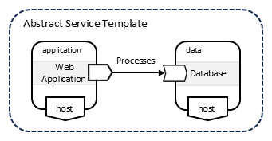

In this example, the `host` requirements of the application and data
node templates are left *dangling*. These requirements need to be
fulfilled by the TOSCA Processor at service deployment time.

To fulfill these dangling requirements, TOSCA processors should
maintain representations of the available platforms on which services
can be deployed. These representations should contain sufficient
information to allow TOSCA processors to make intelligent placement
decisions. For example, platform representations could include the
following:

  - Location: where is the platform physically located?
  - Capabilities: what type of platform is it and what types of
    workloads can the platform support?
  - Capacity: how much load can be placed on the platform?
  - Access: how to access the platform?

The following shows a representation of the platforms available for a
specific customer. 

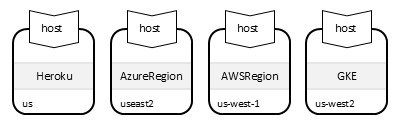

### Make Placement Decisions

When deploying an abstract service, the TOSCA Processor first makes
placement decisions by *fulfilling* the dangling `host` requirements of
the nodes in the abstract service representation using capabilities of
the nodes in the abstract platform representations. Node filters can
be used to narrow down the set of candidate target platforms. The
following figure shows a node filter that drives placement for the
`application` node in the abstract service template.

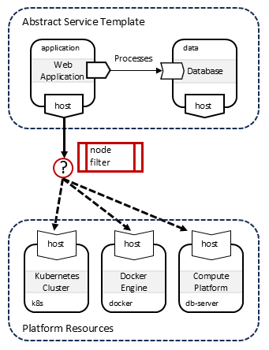

The capability named by the requirement determines which platforms are
*eligible*; the node filter then chooses among them. In practice a
placement filter usually compares **properties** of the candidate — its
location, its capacity, what it is designated to be — rather than
matching further capability types, because eligibility has already been
settled by the capability. In the abstract service template this looks
as follows:

```yaml
node_templates:
  application:
    type: <abstract application node type>
    properties:
      <where this application may run>: [...]
    requirements:
      # Left dangling: no target node is named. The processor fulfils it
      # at deployment time against the available platform representations.
      - host:
          node_filter:
            $has_entry:
              - {$get_property: [SELF, SOURCE, <where this application may run>]}
              - {$get_property: [SELF, TARGET, <where this platform is>]}
```

**A node filter may be declared in two places, and both are applied.** A
requirement *definition* in a node type may carry a `node_filter`, and a
requirement *assignment* in a template may carry another. A processor
evaluates both, so a template can narrow the placement its type permits
but can never relax it. Profile designers should treat a filter written
into a type as permanent for every consumer of that type, and prefer to
leave placement policy to the templates unless the constraint is truly
intrinsic to the type.

#### Filters and Missing Values

Platform representations are rarely populated uniformly — one platform
may publish its capacity while another does not — so filters must
tolerate absent values. TOSCA's comparison functions are *three-valued*
for this reason: an operand that has no value evaluates to null, a
comparison with a null operand returns null rather than false, and `$and`
skips null operands rather than failing on them.

The practical effect is that a filter listing several constraints
degrades gracefully: it constrains on exactly the fields both sides
populate, and the remaining constraints begin to apply, with no change to
the filter, as platform representations grow richer. This is what makes
it safe to write a thorough placement filter against representations that
are only partly filled in.

**Note the asymmetry between the two kinds of filter**, which is easy to
be caught by:

| | Filter evaluates to null |
|---|---|
| **Node filter** (placement) | the candidate **passes** — the constraint is skipped |
| **Substitution filter** (realization) | the template **does not match** |

Placement is permissive about what it does not know; realization
selection is not. A substituting template whose filter reads a property
the abstract node does not populate will simply never be selected.

### Placement Drives Substitution

Once placement decisions have been made, the TOSCA Processor finds
substituting templates that are suitable for the allocated target
platform. This is done by feeding information about that target
platform into the *substitution filters* of the candidate substituting
templates.

Because placement has already been made, the filter can reach the
allocated platform through the requirement that was just fulfilled. A
substitution filter is evaluated against the node being substituted, so
it uses a TOSCA Path that traverses that relationship to its target:

```yaml
substitution_mappings:
  node_type: <abstract application node type>
  substitution_filter:
    $equal:
      - {$get_property: [SELF, RELATIONSHIP, host, 0, TARGET, <property naming the platform>]}
      - <the value this substituting template claims>
```

This is what keeps the abstract service template free of technology. The
template says only what the application needs and where it may run, and
the *realization* asks what it was placed on. No property has to be added
to the application to record which technology should deploy it: that
choice belongs to the platform, and the application reaches it across the
`host` requirement.

**Do we need a function that returns a node type?** Filtering on a
*property* of the allocated platform is sufficient, and is preferable to
filtering on its type:

- Platforms of **different types** — a Kubernetes cluster versus a Docker
  engine, as in the examples below — can be distinguished either way,
  since a type that is distinct can also expose a property saying what it
  is.
- Platforms of the **same type** cannot be distinguished by type at all.
  This case is common: a fleet of like devices differing only in what each
  is designated to become is one node type carrying different property
  values, and a type-returning function would find them identical.

A property filter covers both cases and a type filter covers only one,
which argues against introducing the function. It does place a
requirement on the platform representation: it must carry a property that
*distinguishes* the platform, which the [platform representation
list](#decouple-applications-and-data-from-platforms) above does not yet
call out. Location, capabilities, capacity and access describe what a
platform *is and can do*; selecting a realization additionally needs to
know what it is *designated to be*.

> **Proposed resolution for issue I13** (`type-of-node` / "hash type"
> function). Recommends *not* adding the function, on the grounds that
> property-based selection is strictly more general. Consistent with the
> direction already recorded for I4 (abstract-types vs. minimal-types),
> which leans toward property-based substitution.

**Filters must be mutually exclusive.** A processor selects the *first*
candidate whose substitution filter matches, and raises an error when
none does. Neither outcome is negotiable by the template author, so the
author of a set of substituting templates for the same abstract node type
is responsible for ensuring that at most one filter can match any given
node. Selecting on the allocated platform makes this straightforward:
each realization claims a different platform designation, so exclusivity
follows from the filters rather than having to be maintained separately.

**The allocated platform may itself be abstract.** A platform
representation can be a node that is substituted in turn, in which case
the `host` requirement of the substituting service's inner node cannot be
resolved against it directly. The processor resolves this recursively: it
maps the requirement onto the substituted node's relationship, and where
that target is itself abstract, drills into *that* node's substituting
service, reads its `substitution_mappings.capabilities` for the named
capability, and recurses on the inner node the mapping names. The edge
therefore crosses both substitution boundaries and resolves against the concrete
node. Nothing extra need be declared for this beyond the two mappings each
side already provides: a capability mapping on the platform side, and a
requirement mapping on the application side.

#### Substitute for Kubernetes

The following figure shows an example where the application node in
the abstract service is deployed on a Kubernetes cluster.

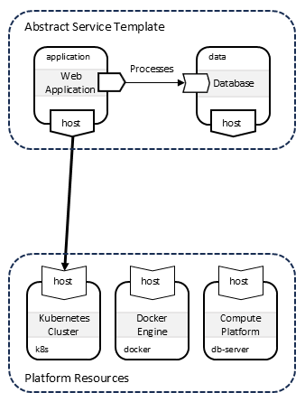

This information is then used to substitute the abstract application
node with substituting templates that implement this node by deploying
Kubernetes resources. TOSCA type definitions from the TOSCA Kubernetes
Profile are used for the templates in the substituting service:

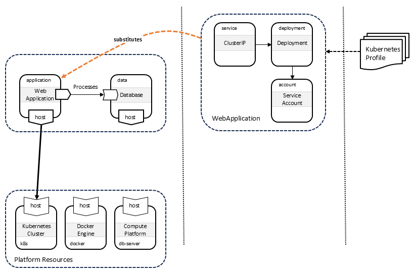

#### Substitute for Docker

The following figure shows an alternative deployment on a Docker
engine:

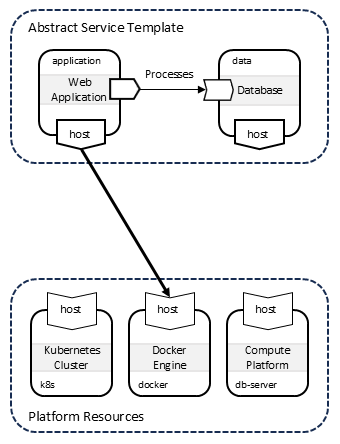

In this scenario, the abstract application node is substituted using
templates that implement this node by deploying the application
directly using Docker. TOSCA type definitions from the TOSCA Docker
Profile are used for the templates in the substituting service:

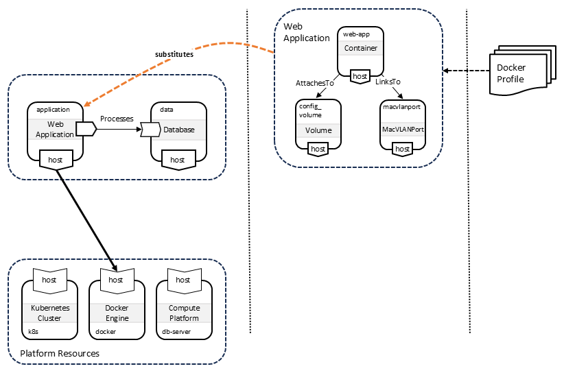


---

---

## Patterns

The recurring modeling patterns these methods are applied through — the
Component/Port pattern and the practices built on it — are in
[design-patterns.md](design-patterns.md).
