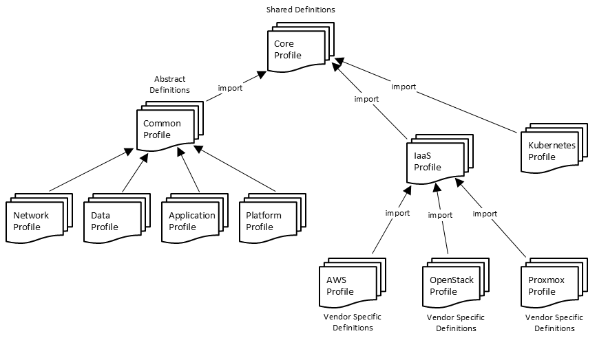

# Profile Organization

**Status:** Current practice.
**Audience:** TOSCA Community
**Purpose:** Say how the community profiles are organized and how to decide which
profile a type belongs in — the levels of abstraction, the dimensions that cross
them, and the naming convention. The modeling methodology and the design patterns
are in the [design guide](design-guide.md); this document is about where the
results of applying them are kept.

**Related documents:** [README](../README.md) · [design-guide](design-guide.md) · [prior-art](prior-art.md) · [meeting-history](../../../../governance/meeting-history.md) · [decision-log](../../../../governance/decision-log.md) · [open-issues](../../../../governance/open-issues.md)

---

## The Profile Set

The methodology in the [design guide](design-guide.md) has resulted in a set of
profiles as shown in the following figure:

The profiles on the right are *Administrator View* and *Device View*
profiles, where *Device View* node types derive from node types
defined in *Administrator View* profiles. One such Administrator View
profile is the IaaS profile that defines node types that represent
entities managed by Infrastructure-as-a-Service platforms. These types
are then refined in profiles specific to each IaaS provider, such as
AWS, Azure, etc.

The *Core* profile defines types, repositories, functions, etc. that
are shared by profiles at different levels of abstraction.

Two further profiles serve as the base of a *column* rather than of a
level. `community.tosca.abstract.base`, described in [Generic Base Node
Types for System View
Profiles](design-guide.md#generic-base-node-types-for-system-view-profiles) above,
holds the four generic node types of the System View column together
with the relationship and capability types they use.
`community.tosca.technology.base` is its counterpart for the
Administrator View and Device View columns. It defines a `Root` node
type that technology-specific and vendor-specific node types derive
from, the six-operation `Standard` interface those types implement, and
a `Bash` artifact type carrying a `host` property, so that a script can
be declared to run on a particular host rather than on the orchestrator.
Why the two `Standard` definitions differ is covered in [Interface
Definitions Differ by Level](design-guide.md#interface-definitions-differ-by-level)
above.

> The figure above shows a single base profile, and it is the System
> View one. No base profile is drawn beneath the Administrator View and
> Device View rows, although `community.tosca.technology.base` is the
> common parent of both.

> Which naming scheme each of these profiles takes is
> [below](#profile-naming).

## Two Dimensions Determine Where a Type Belongs

The level of abstraction is not the only thing that decides which
profile a node type belongs in. Profile organization is governed by two
*independent* dimensions, and a type must be located in both before a
home can be chosen for it.

Both dimensions are present in the figure above. The first is
the *model continuum*, which runs vertically: the figure labels System
View profiles *technology and vendor independent*, Administrator View
profiles *technology specific*, and Device View profiles *vendor
specific*. The second runs horizontally, and appears in the figure as
the decomposition of the System View level into separate Platform,
Application, Data, and Network profiles. The section on [decoupling
applications and data from platforms](design-guide.md#decouple-applications-and-data-from-platforms)
below applies that same separation to the design of abstract service
templates.

What the figure does not yet show is the two dimensions *crossed below
the System View level*. Its Administrator View row contains IaaS,
Kubernetes, and Docker profiles, and its Device View row contains AWS,
OpenStack, and Proxmox profiles — all of them platform profiles. The
application, data, and network columns have no Administrator View or
Device View counterparts in the figure, yet the reasoning that
justifies them at the System View level applies unchanged further down:
a certificate authority is a technology-specific concept in the same
way a Kubernetes cluster is, and a particular certificate authority
implementation is vendor-specific in the same way AWS is.

Taken together, the two dimensions therefore produce four categories
rather than one column of three:

|                        | **Platform**                                              | **Application**                        |
| ---------------------- | --------------------------------------------------------- | -------------------------------------- |
| **Administrator View** | a Kubernetes cluster; a container runtime; an OCI registry | a certificate authority; an image registry |
| **Device View**        | k3s, k0s, minikube, kubeadm; containerd, Docker Engine     | step-ca; zot; Harbor                   |

A type that appears to belong in two of these categories at once is not
a single type. A node type *named* for a technology-neutral role while
its properties describe one specific product spans the Administrator
and Device rows simultaneously, and no profile can hold it correctly.
The remedy is to rename the type for the product it actually models, or
to separate it into two types, rather than to select a compromise
profile for it.

In practice the Administrator View cell of the application column is
frequently filled by a *capability type* rather than by a node type.
Where consumers bind a port rather than a node — see the [Component/Port
Pattern](design-patterns.md#componentport-pattern) — the technology-neutral concept
is already expressed by the capability that the port advertises, and the
node type only ever needs to be the Device View realization, named for
its product.

This is what makes an intermediate abstract node type unnecessary, and
the alternative is not merely redundant but unbuildable. Suppose the
technology-neutral concept were modeled as a node type at the
Administrator View row. A Device View product type would then reach it
by *derivation*, following the recommendation in [Translating
Administrator View to Device
View](design-guide.md#translating-administrator-view-to-device-view) above. But that
same product type must also derive from the type that represents how it
is realized. That is one `derived_from` and two required parents, and
TOSCA node types are singly inherited. Expressing the neutral concept as
a capability avoids the contradiction entirely, because a port is
*bound* rather than *inherited*, and binding carries no such limit.

This is a specific instance of a more general tension already noted in
[Translating Device View to Instance
View](design-guide.md#translating-device-view-to-instance-view) above: where derivation
is the only mechanism available for crossing a boundary, every
independent axis of variation has to be expressed as another derived
type. Capabilities relieve that pressure wherever what the consumer
needs is a contract rather than an ancestor.

> The profile organization figure above depicts the horizontal dimension
> only at the System View level. Extending it to show application (and
> data, and network) profiles at the Administrator View and Device View
> levels would make the four categories described here visible in the
> figure itself.

## Profile Naming

**`community.tosca.*` names the profiles the community designs; reverse-DNS
names the rest.** The `core` and `abstract.*` layer carries the community
namespace. A profile generated from an external specification, or contributed
from a project that already has a name of its own, keeps a reverse-DNS name
drawn from the technology it models — `io.kubernetes`, `io.kubevirt`,
`sh.helm`.

**Which scheme a profile takes turns on who determined its type set**, not on how
technology-specific it is. Where the community chose the types — argued them, and
can change them — the profile carries the community namespace, even when what it
models is a single technology: `community.tosca.technology.base` is
technology-specific and community-designed, and takes `community.tosca.*` for
that reason. Where the types are determined by something outside the community —
generated from a specification, or contributed from a project that named them
already — the profile takes a reverse-DNS name drawn from that source.

**A reverse-DNS name states origin, not authority.** `io.kubernetes` says the
profile renders the Kubernetes API. It does not claim to be the Kubernetes
project's own profile, and a second rendering produced by a different method may
sit alongside it under a name of its own.

**A generated profile is versioned by the release it was generated from**, not
by a profile version number of its own. The Kubernetes resource profile is
`io.kubernetes:1.35` because it renders the Kubernetes 1.35 OpenAPI, which makes
the version self-documenting: a reader can tell which API the profile describes
without consulting anything else. A profile in the community namespace versions
on the community's own release line instead, for the same reason: its types
answer to the community rather than to an upstream release.
