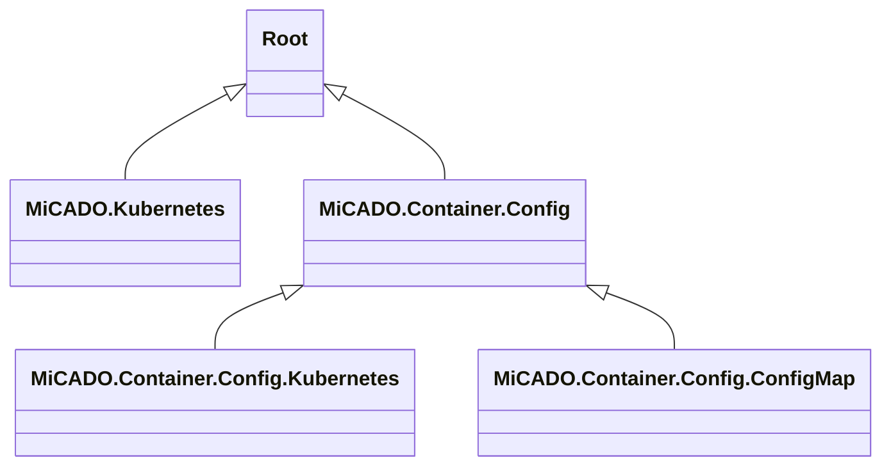
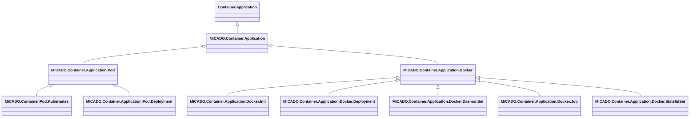
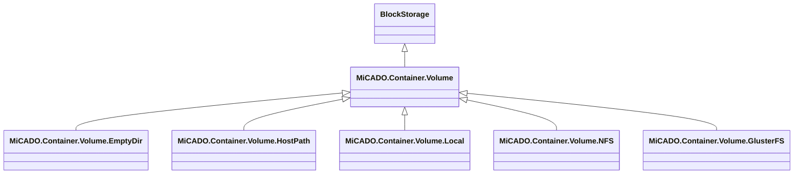
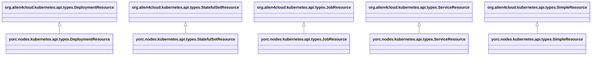
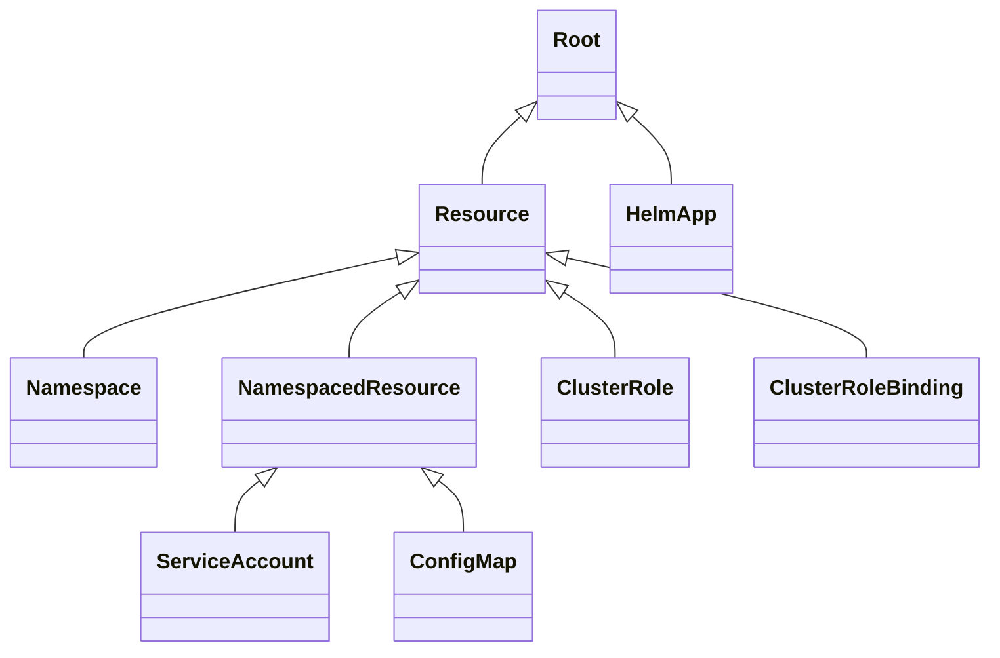
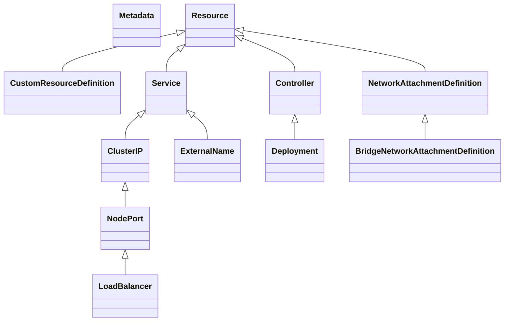

# TOSCA Community Kubernetes Profile

This profile defines TOSCA types to support integration with
Kubernetes.

## Inventory

The following projects define node types related to containers and
kubernetes:

### Micado

> In the following diagram, the `tosca.nodes` prefix in the node type
  names is not shown to improve readability.

#### Configuration-Related Types

#### Application Types

#### Storage Types

### Yorc

Yorc defines a collection of Kubernetes-related TOSCA types that are
based on Alien4Cloud type definitions.

### Ubicity 
The following shows the Ubicity profile for Kubernetes:

### Puccini

Puccini takes a different approach than most other TOSCA projects: it
models entities using *capability types* rather than node types and
then composes node types as collections of capabilities. To reflect
this approach, the following diagrams show Puccini capability type
hieararchies rather than node type hiearchies. This type hierarchy
foces on type definitions in support of Kubernetes-based services.

