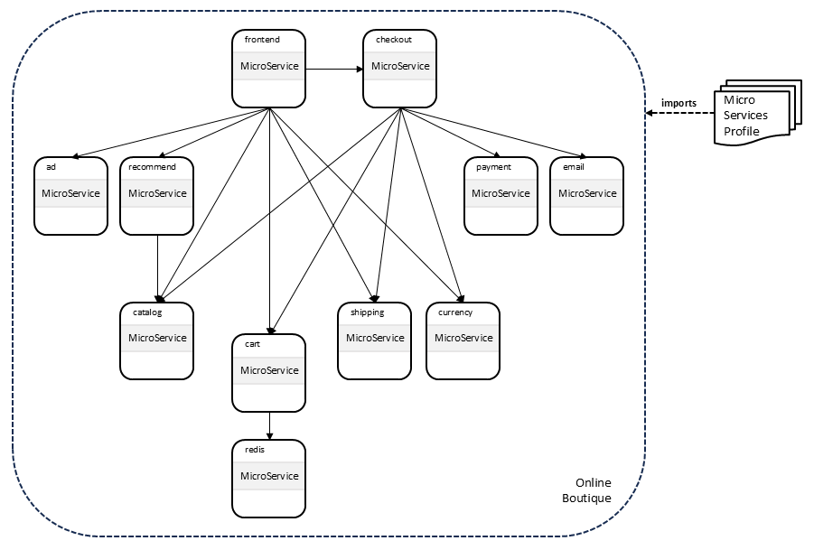
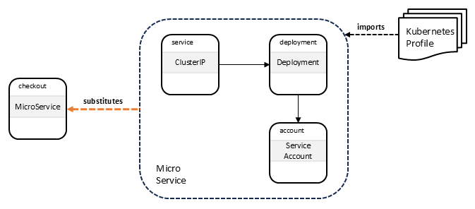
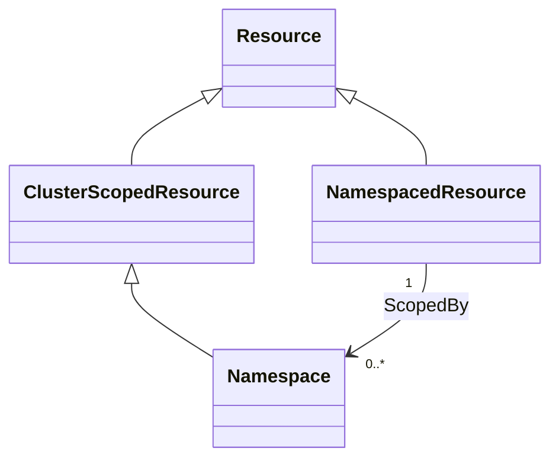
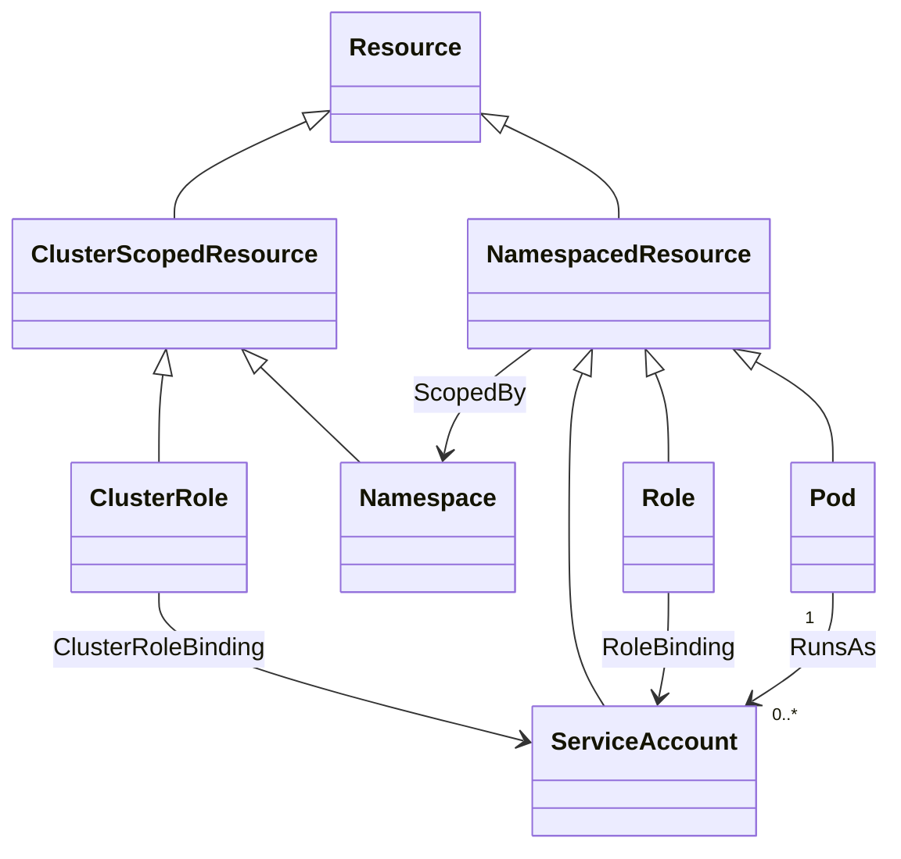
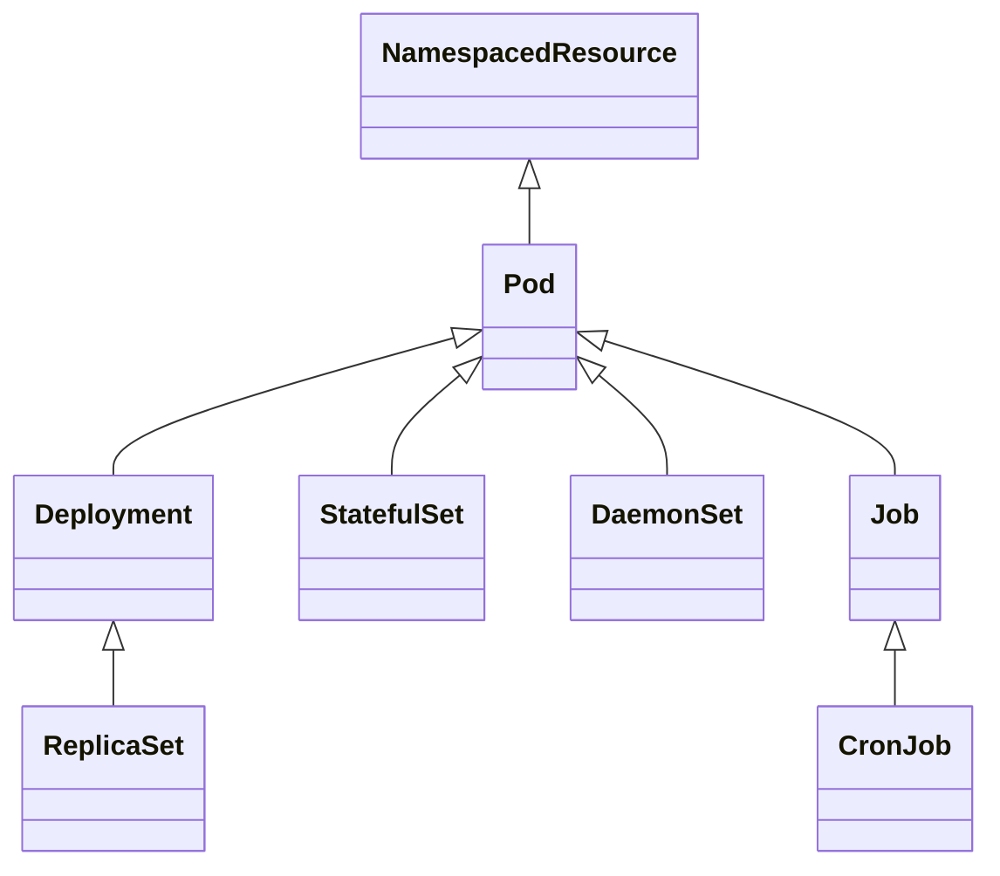
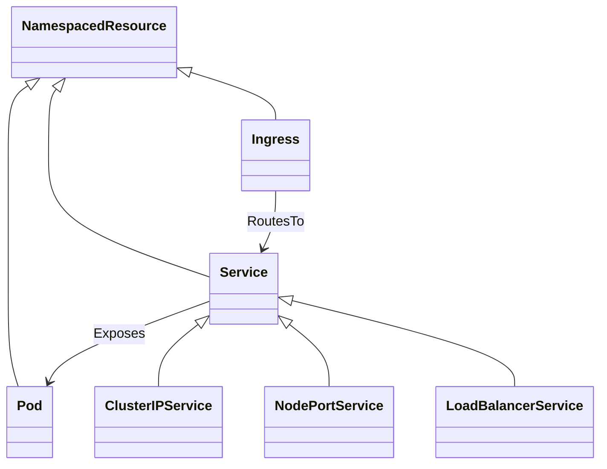

# TOSCA Community Kubernetes Profile

This profile defines TOSCA types to support integration with
Kubernetes. It tries to build on and extend existing [TOSCA type
definitions for Kubernetes](inventory.md).

## Why TOSCA for Kubernetes

because TOSCA models services as a graph, it contains **service
topology** information that represents how various microservices
interact with one another to deliver complete system
functionality. Such service relationships and dependencies are not
immediately apparent from Kubernetes manifests.

Service topology information enables a variety of automation use
cases:

1. *Service Visualization*: TOSCA provides solution architects with a
   powerful tool for designing applications by visualizing
   interactions between microservices, a critial feature for
   designing complex applications.
2. *Design-Time Validation*: Using TOSCA for modeling Kubernetes
   services provides the ability to validate topological relationships
   between microservices at design time, ensuring correct designs
   before service deployment.
3. *Runtime Validation*: TOSCA can also be used for Day 2
   validation. TOSCA templates effectively define a collection of
   schemas and policies that apply not only at deployment but also
   during ongoing operations. Orchestrators can validate at runtime
   whether a service complies with its TOSCA template and take
   corrective action if not.
4. *Microservice Configuration*: Topology information can be used to
   automatically generate microservice configurations such as resource
   labels and selectors, connectivity information (e.g., using
   environment variables), etc.
5. *Deploy Service Meshes*: Automatically *inject* service meshes
   (such as Istio, Linkerd, Consul, and others) into Kubernetes
   services and use topology information to configure these meshes.
6. *Enforce Network Policies*: By default, Kubernetes microservices
   use a single Layer 2 network that enables any-to-any communication
   between microservices and does not enforce any security
   rules. Topology information in TOSCA service templates can be used
   to only enable connectivity between those microservices that are
   expected to communicate (e.g., by deploying and configuring Cillium
   network security and packet filtering).
7. *Manage Deployment Dependencies*: Some Kubernetes resources may
   need to be created before others. For example, some resources
   require an *admin* service account before a namespace can be
   created. This type of *precedence* relationship cannot be expressed
   in Kubernetes manifests and may require separating manifests.
8. *Model Relationships between Infrastructure and Workloads*: TOSCA
   offers the potential to streamline Kubernetes deployments by using
   TOSCA as a unified language for infrastructure and workload
   management, which could simplify the deployment process and ensure
   proper interaction between infrastructure and workloads.
9. *Improved Service Assurance*: TOSCA provides the ability to create
   additional control loops for service assurance, particularly when
   dealing with unreliable software and hardware.

## Objectives

TOSCA support for Kubernetes is guided by the following two (seemingly
competing) objectives:

1. Given that TOSCA's main benefit is its ability to define service
   topologies that model the interactions between microservices, it
   must support **top-down** service designs that abstract away
   non-essential details to maintain a clear focus on microservice
   interactions.
2. On the other hand, TOSCA must also maintaining the ability to
   express low-level Kubernetes concepts and support **bottom-up**
   designs that align with Kubernetes resources, as losing this
   functionality could create obstacles for existing Kubernetes users.

TOSCA profiles for Kubernetes must balance high-level abstractions
with low-level building blocks since users might need both approaches
depending on their workflows and company requirements.

## Example Microservices

Our plan is to evaluate various design approaches using *real world*
microservices examples. Will create functional TOSCA service templates
for these examples as well as profiles that define the types for the
nodes and relationships in those service templates.

The following examples have been proposed:

### [Online Boutique](https://github.com/GoogleCloudPlatform/microservices-demo)

This example was suggested by Miles. It defines a web-based e-commerce
app where users can browse items, add them to the cart, and purchase
them. It consists of 11 microservices that communicate using gRPC, as
shown in the following figure:

There is a single [Kubernetes
Manifest](https://github.com/GoogleCloudPlatform/microservices-demo/blob/main/release/kubernetes-manifests.yaml)
that deploys the entire microservice.

This section defines a TOSCA service template that models the online
boutique and that can be used to deploy the service.

### [DeathStarBench](https://github.com/delimitrou/DeathStarBench)
These examples were suggested by Angelo.

## Design Approaches

The following two approaches are explored to balance high-level
microservice abstractions with low-level Kubernetes resource
descriptions:

### Substitution Mapping

One approach leverages the [policy
continuum](https://github.com/oasis-open/tosca-community-contributions/tree/master/profiles/com/ubicity#abstraction)
design pattern that defines different TOSCA profiles for different
levels of abstraction:

- A *System View* profile defines abstract types that focus on
  modeling the microservices that make up a service and the
  interactions between these microservices. Nodes of these types are
  used to create abstract TOSCA service templates that focus on
  service topology only and are independent of specific
  implementation details such as service meshes or monitoring
  systems.
- A separate *Administrator View* profile defines node types that
  model [Kubernetes
  resources](#kubernetes-resources)
  fairly closely. This profile could get augmented with operation
  implementations that deploy the corresponding Kubernetes resources
  on Kubernetes clusters.
- *Substitution mapping* is used to translate between these two views:
  each node in the abstract service is *decomposed* (substituted)
  using a service template that consists of nodes with types defined
  in the Administrator View profile.

This approach provides service designers with the ability to create
top-down service designs and drill down into lower-level
details. However, tooling support would be necessary to effectively
manage substitution mapping and other complex development processes.

By hiding the internals of each microservice and instead introducing
these internals through substitution, this approach allows each
microservice can be transformed not just into Kubernetes resources,
but also into any other containerized or legacy application, including
Nomad, Docker Compose, serverless, etc.

### Microservice Node Types with Kubernetes Resource Capability Types

A second approach balances the objectives outlined above by using
*node types* to represent the microservices in a Kubernetes service
and using *capability types* to represent the Kubernetes resources
that implement those microservices:

- The TOSCA profile for Kubernetes defines capability types that model
  [Kubernetes
  resources](#kubernetes-resources)
  fairly closely.
- The same profile also defines a base microservice node type.
- Node types that derive from the base microservice node type define
  capabilities that model the Kubernetes resources that are used to
  deploy nodes of this derived type.

Using this approach, all definitions required to deploy TOSCA services
on Kubernetes are in one place, simplifying design and reducing
tooling challenges.

## Substitution Mapping Approach

### Online Boutique

The substitution mapping approach introduces a *MicroServices* profile
that defines a `MicroService` node type as a basic abstraction and
focuses on how microservices interact to provide full system
functionality. The following figure shows a TOSCA service template for
the online boutique example that uses nodes of type `MicroService` to
model the topology of the service:

> This example assumes that the `MicroService` node type can be
  *parameterized* through property values to represent the
  configurations for each of the microservices in the Online Boutique
  example. If this is not the case, then microservice-specific derived
  node types may need to be created.

The corresponding [TOSCA service
template](../examples/online_boutique/main.yaml) imports the
[microservices profile](../microservices/profile.yaml).

Each of the abstract microservice nodes in the online boutique service
is *realized* by substituting it using a template that uses nodes from
a *Kubernetes* profile. These node types resemble Kubernetes resources
more closely and can be readily implemented using corresponding
Kubernetes manifests. The following figure shows how the `checkout`
node in the online boutique is substituted using a *microservice*
service template that defines a node of type `ClusterIP`, a node of
type `Deployment`, and a node of type `ServiceAccount`:

The corresponding [substituting TOSCA service
template](../substitutions/microservice/main.yaml) imports the
[kubernetes profile](../kubernetes/profile.yaml).

### Managing Cluster-Wide Resources

Some Kubernetes resources (e.g., Cluster Roles) are defined
cluster-wide and can be shared and accessed by all Kubernetes services
deployed on the cluster. This section discusses how to model cluster-wide
resources using TOSCA. 
Two potential methods are described:

1. Create-if-not-exists
2. Updates to cluster platform service

#### Create-if-not-Exists Nodes

Using the *create-if-not-exists* pattern, TOSCA services that need a
cluster-wide resource include a node template for that resources that
includes both the `select` as well as the `create` directive. TOSCA
Orchestrators process such nodes as follows:

1. The orchestrator first tries to *select* a node from inventory that
   represents the requested cluster-wide resource. This selection may
   optionally involve node filters to identify specific resources,
   e.g., based on property values. If such a node is found, it is used
   in the service.
2. If no such node is found in inventory, the orchestrator *creates*
   the node instead (using the interface operations specified in the
   node template or node type).
3. From there on, other services that request the same cluster-wide
   resource (through their own *create-if-not-exists* node template)
   will be assigned the newly created node.

#### Updates to Cluster Platform Service

Marcel suggested modeling the Kubernetes cluster itself as using a
TOSCA service template. Cluster-wide resources would be handled as follows:

- The Kubernetes service template would include one or more node
  templates that represent (shared) cluster-wide resources.

- These node templates use the `count` keyword to specify the number
  of node representations that need to be instatiated based on the
  template.

- When a Kubernetes services needs a new cluster-wide resource, it
  *updates* the Kubernetes platform services by incrementing the
  `count` value for the corresponding nodes and specifying the
  property values for the new resources (presumably by providing them
  as input values to the Kubernetes Platform service).

The user's modeling needs should influence the approach chosen, and
the TOSCA Kubernetes Profile should ideally support both approaches.

### Questions

1. Service meshes can be added to any microservices-based
   application. How do we represent in the TOSCA service template
   whether the Kubernetes service needs a service mesh or not?
   Different node types in the MicroServices profile? Different
   `MicroService` node properties?
2. Different types of service meshes can be added (e.g., Istio,
   Linkerd, etc.). How do we represent which service mesh is used?
   Different node types in the MicroServices profile? Different
   `MicroService` node properties?
3. Configuring network security and network policies requires a CNI
   like Cillium. How do we represent which CNI is used? Is this
   modeled as part of Platform node type?
4. Do we need to define a standard architecture for applications to
   avoid variability in configuring connectivity information? For
   example, in the example manifest file for the Online Boutique, we
   can figure out which services interact with which other services
   based on the values of environment variables. Environment value
   configurations are specific to the application and not understood
   by Kubernetes, requiring custom mechanisms for TOSCA templates to
   represent them. Do we need to come up with a *standard* approach
   for representing this?
5. What other common approaches are typically used for configuring
   communication between microservices?
6. Do we need to support dynamic behavior in service relationships.
7. How does Nephio capture service relationships.

## Kubernetes Resources

Kubernetes resources are the building blocks used to define, deploy,
and manage applications and their underlying infrastructure within a
Kubernetes environment.

### Namespaces
Kubernetes distinguishes between the following two types of resources:

1. *Namespaced Resources*: These exist within a namespace that models
   a *virtual cluster* within a cluster that is used for resource
   isolation.
2. *Cluster-Scoped Resources*: These exist at the cluster level and
   are not tied to any namespace.

This distinction is shown in the following class diagram:

### Authentication and Authorization Resources
The main abstractions for managing authentication and authorization
are as follows:

- ServiceAccount: Provides an identity for Pods.
- Role / ClusterRole – Define permissions (RBAC).
- RoleBinding / ClusterRoleBinding – Attach roles to users, groups, or
  service accounts.

The relationships between these abstractions are shown in the
following class diagram:

### Storage and Configuration Abstractions

The main storage abstraction in Kubernetes is the *volume*. Kubernetes
volumes provide a way for containers in a pod to access and share data
via the filesystem. There are different kinds of volume that you can
use for different purposes, for example:
- ConfigMap – Stores non-sensitive configuration data (key/value
  pairs, config files).
- Secret – Stores sensitive information (passwords, tokens,
  keys). Mounted into Pods or injected as environment variables.
- PersistentVolume (PV) – A cluster-wide storage resource managed
  independently of Pods.
- PersistentVolumeClaim (PVC) – A Pod’s request for storage, matched
  against available PVs.

Various kinds volumes are shown in the following class diagram:

### Workload Abstractions
Kubernetes uses the following abstractions for managing workloads:

- Pod: A Pod is the smallest and most basic deployable unit in
  Kubernetes.  A Pod is a wrapper around one or more containers that
  are tightly coupled and share the same network namespace and storage
  volumes.
- ReplicaSet: Extends pods with scaling and self-healing. It ensures
  that a specified number of Pod replicas are running at all
  times. ReplicaSets recreate Pods if they fail.
- Deployment: Extends ReplicaSets with full lifecycle management,
  including updates and upgrades. It is used to declare desired state
  for stateless apps (number of replicas, rolling updates, rollbacks).
- StatefulSet – Like a Deployment, but for stateful apps that need:
  - Stable identities (network names).
  - Stable storage volumes.
  - Ordered scaling and rolling updates.
- DaemonSet – Ensures a Pod runs on every (or selected) Node. Common
  for monitoring/logging/agent Pods.
- Job – Runs Pods until they complete successfully. Used for batch or
  finite tasks.
- CronJob – Runs Jobs on a schedule (like cron).

Representations of workload abstractions in TOSCA need to address the
following challengs:

- While not recommended, it is possible to instantiate Pods separately
  from ReplicaSets and to instantiate ReplicaSets separately from
  Deployments. This suggests that Pods, ReplicaSets, and Deployments
  should each be modeled using a corresponding TOSCA node type that
  includes the necessary interface operations to support
  Orchestration.
- However, when instantiating a Deployment, Kubernetes automatically
  creates the ReplicaSet for that deployment and the Pods for that
  ReplicaSet. This means that when using TOSCA to *orchestrate* a
  Deployment, the interface operations for the ReplicaSet in the
  Deployment and for the Pods in the ReplicaSet must not be used.
- All Kubernetes workloads are *exposed* to the outside world using
  Service resources (to be discussed next). Independent of the type of
  workload, Service resources always reference the Pods for the
  workload. This means that even when orchestrating a Deployment, the
  TOSCA model for the Deployment must include the Pod node so it can
  be referenced by a Service.

We propose to leverage TOSCA node type inheritance as shown in the
following figure:

### Service Abstractions
Workloads are exposed to clients using services. Kubernetes uses the
following service-related abstractions:

- Service – Provides a stable, DNS-resolvable endpoint to a set of
  Pods (via label selectors). Types:
  - ClusterIP (default, internal only).
  - NodePort (exposes on each Node’s IP at a static port).
  - LoadBalancer (uses cloud provider load balancer).
- Ingress – Exposes HTTP/HTTPS routes from outside the cluster to
  Services. Supports routing rules, TLS, etc.

The following class diagram shows a subset of these:

