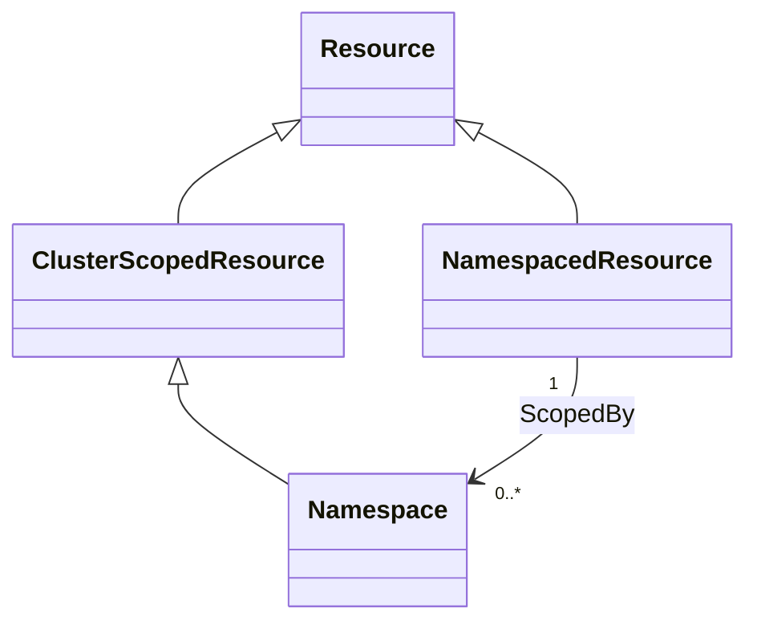
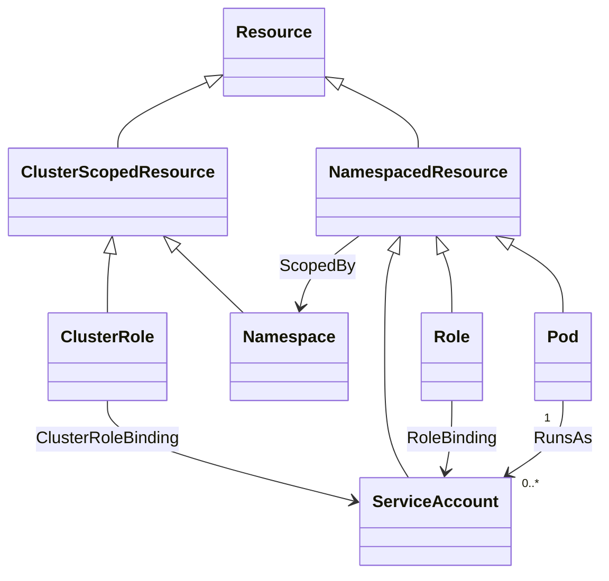
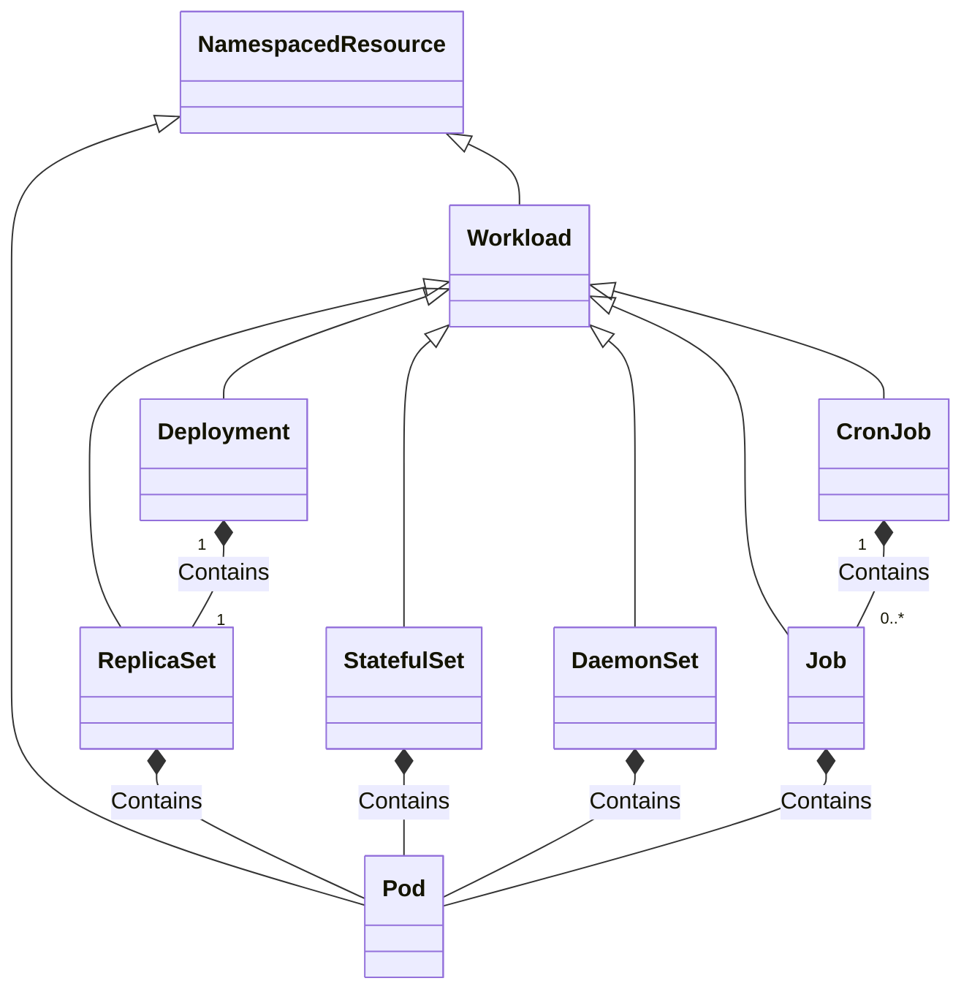
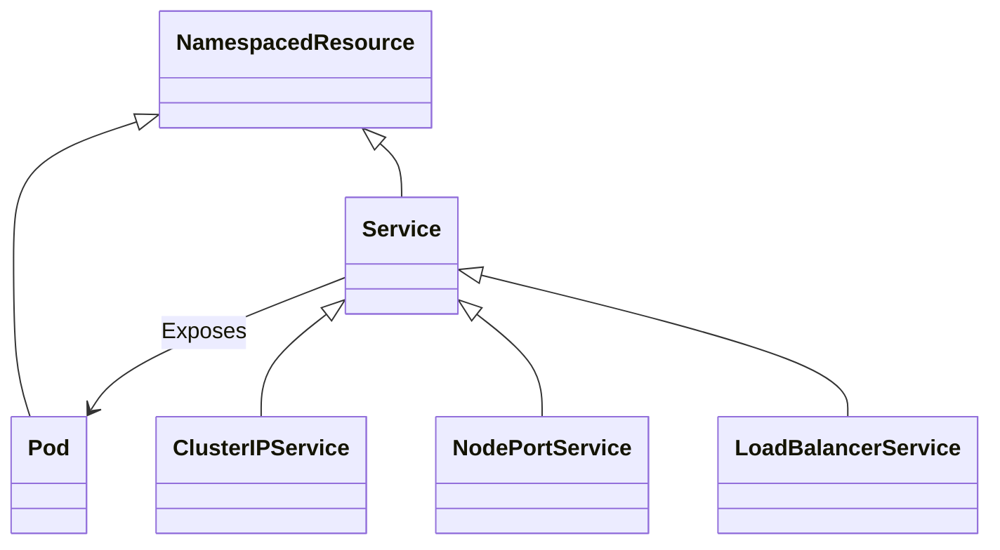

# TOSCA Community Kubernetes Profile

This profile defines TOSCA types to support integration with
Kubernetes. It tries to build on and extend existing [TOSCA type
definitions for Kubernetes](inventory.md).

## Why TOSCA for Kubernetes

because TOSCA models services as a graph, it contains **service
topology** information that represents how various microservices
interact with one another to deliver complete system
functionality. Such service relationships and dependencies are not
immediately apparent from Kubernetes manifests.

Service topology information enables a variety of automation use
cases:

1. *Service Visualization*: TOSCA provides solution architects with a
   powerful tool for designing applications by visualizing
   interactions between microservices, a critial feature for
   designing complex applications.

1. *Design-Time Validation*: Using TOSCA for modeling Kubernetes
   services provides the ability to validate topological relationships
   between microservices at design time, ensuring correct designs
   before service deployment.
2. *Microservice Configuration*: Topology information can be used to
   automatically generate microservice configurations such as resource
   labels and selectors, connectivity information (e.g., using
   environment variables), etc.
3. *Deploy Service Meshes*: Automatically *inject* service meshes
   (such as Istio, Linkerd, Consul, and others) into Kubernetes
   services and use topology information to configure these meshes.
4. *Enforce Network Policies*: By default, Kubernetes microservices
   use a single Layer 2 network that enables any-to-any communication
   between microservices and does not enforce any security
   rules. Topology information in TOSCA service templates can be used
   to only enable connectivity between those microservices that are
   expected to communicate (e.g., by deploying and configuring Cillium
   network security and packet filtering).
5. *Manage Deployment Dependencies*: Some Kubernetes resources may
   need to be created before others. For example, some resources
   require an *admin* service account before a namespace can be
   created. This type of *precedence* relationship cannot be expressed
   in Kubernetes manifests and may require separating manifests.

## Example Microservices

Our plan is to create a TOSCA Kubernetes Profile by evaluating *real
world* microservices examples and then create TOSCA service templates
for these examples. TOSCA Kubernetes types will then be created for
the nodes and relationships in those service templates.

### [Online Boutique](https://github.com/GoogleCloudPlatform/microservices-demo)

This example was suggested by Miles. It defines a web-based e-commerce
app where users can browse items, add them to the cart, and purchase
them. It consists of 11 microservices that communicate using gRPC, as
shown in the following figure:

There is a single [Kubernetes
Manifest](https://github.com/GoogleCloudPlatform/microservices-demo/blob/main/release/kubernetes-manifests.yaml)
that deploys the entire microservice.

This section defines a TOSCA service template that models the online
boutique and that can be used to deploy the service.

#### Questions

1. When modeling a service topology consisting of microservices, what
   are the *basic abstractions* that need to be represented using
   TOSCA node templates? Is this basic abstraction a microservice or
   some entities that aligns more closely with Kubernetes resources?
2. If the basic abstraction is a microservice, how is this
   *transformed* into the appropriate Kubernetes resources?
3. Service meshes can be added to any microservices-based
   application. How do we represent in the TOSCA service template
   whether the Kubernetes service needs a service mesh or not?
   Different node types? Different node properties?
4. Different types of service meshes can be added (e.g., Istio,
   Linkerd, etc.). How do we represent which service mesh is used?
   Different node types? Different node properties?
5. Configuring network security and network policies requires a CNI
   like Cillium. How do we represent which CNI is used?
6. In the example manifest file, we can figure out which services
   interact with which other services based on the values of
   environment variables. Environment value configurations are
   specific to the application and not understood by Kubernetes,
   requiring custom mechanisms for TOSCA templates to represent
   them. Can we come up with a *standard* approach for representing
   this?
7. What other approaches are typically used for configuring
   communication between microservices?
8. Do we need to define a standard architecture for applications to
   avoid variability in configuring connectivity information?
9. TOSCA establishes relationships from requirements of source nodes
   to capabilities of target nodes. Do any of the resources in the
   Kubernetes manifest correspond to requirements or capabilities?
10. On a related note, Kubernetes separates the *Service* that
    accesses pods from the *Deployment* that instantiates those
    pods. Both of them are Kubernetes resources. How to these
    *translate* to TOSCA entities:
    - Are Services and Deployments both represented as nodes?
    - Are Services and Deployments both represented as capabilities
      (where some other entity is modeled as a node that contains those
      capabilities)?
    - Is a Deployment modeled as a node whereas a Service is modeled as
      a capability through which that deployment is accessed?
11. Do we need to support dynamic behavior in service relationships.
12. How does Nephio capture service relationships.
   
### [DeathStarBench](https://github.com/delimitrou/DeathStarBench)
These examples were suggested by Angelo

## Kubernetes Resources

Kubernetes resources are the building blocks used to define, deploy,
and manage applications and their underlying infrastructure within a
Kubernetes environment.

### Namespaces
Kubernetes distinguishes between the following two types of resources:

1. *Namespaced Resources*: These exist within a namespace that models
   a *virtual cluster* within a cluster that is used for resource
   isolation.
2. *Cluster-Scoped Resources*: These exist at the cluster level and
   are not tied to any namespace.

This distinction is shown in the following class diagram:

### Authentication and Authorization Resources
The main abstractions for managing authentication and authorization
are as follows:

- ServiceAccount: Provides an identity for Pods.
- Role / ClusterRole – Define permissions (RBAC).
- RoleBinding / ClusterRoleBinding – Attach roles to users, groups, or
  service accounts.

The relationships between these abstractions are shown in the
following class diagram:

### Storage and Configuration Abstractions

The main storage abstraction in Kubernetes is the *volume*. Kubernetes
volumes provide a way for containers in a pod to access and share data
via the filesystem. There are different kinds of volume that you can
use for different purposes, for example:
- ConfigMap – Stores non-sensitive configuration data (key/value
  pairs, config files).
- Secret – Stores sensitive information (passwords, tokens,
  keys). Mounted into Pods or injected as environment variables.
- PersistentVolume (PV) – A cluster-wide storage resource managed
  independently of Pods.
- PersistentVolumeClaim (PVC) – A Pod’s request for storage, matched
  against available PVs.

Various kinds volumes are shown in the following class diagram:

### Workload Abstractions
Kubernetes uses the following abstractions for managing workloads:
- Pod – The smallest deployable unit. A Pod wraps one or more tightly
  coupled containers (usually one). Containers in a Pod share:
  - The same network namespace (IP, port space).
  - Optionally shared storage volumes.
- ReplicaSet – Ensures a specified number of Pod replicas are running
  at all times. Recreates Pods if they fail.
- Deployment – A higher-level abstraction over ReplicaSets. Used to
  declare desired state for stateless apps (number of replicas,
  rolling updates, rollbacks).
- StatefulSet – Like a Deployment, but for stateful apps that need:
  - Stable identities (network names).
  - Stable storage volumes.
  - Ordered scaling and rolling updates.
- DaemonSet – Ensures a Pod runs on every (or selected) Node. Common
  for monitoring/logging/agent Pods.
- Job – Runs Pods until they complete successfully. Used for batch or
  finite tasks.
- CronJob – Runs Jobs on a schedule (like cron).

Workload abstractions are shown in the following class diagram:

### Service Abstractions
Workloads are exposed to clients using services. Kubernetes uses the
following service-related abstractions:

- Service – Provides a stable, DNS-resolvable endpoint to a set of
  Pods (via label selectors). Types:
  - ClusterIP (default, internal only).
  - NodePort (exposes on each Node’s IP at a static port).
  - LoadBalancer (uses cloud provider load balancer).
- Ingress – Exposes HTTP/HTTPS routes from outside the cluster to
  Services. Supports routing rules, TLS, etc.

The following class diagram shows a subset of these:

