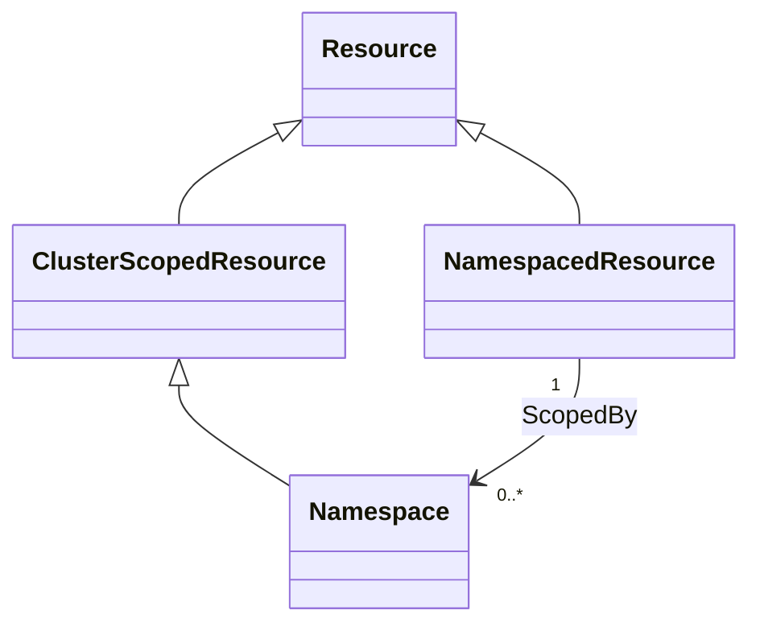
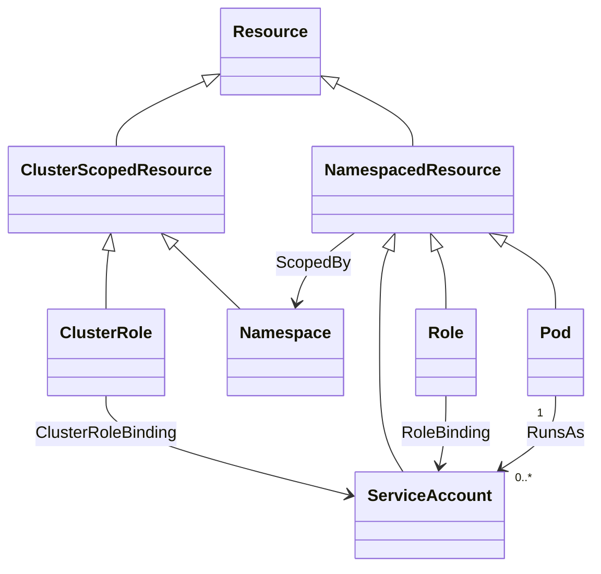
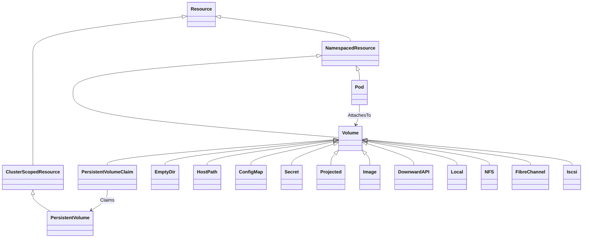
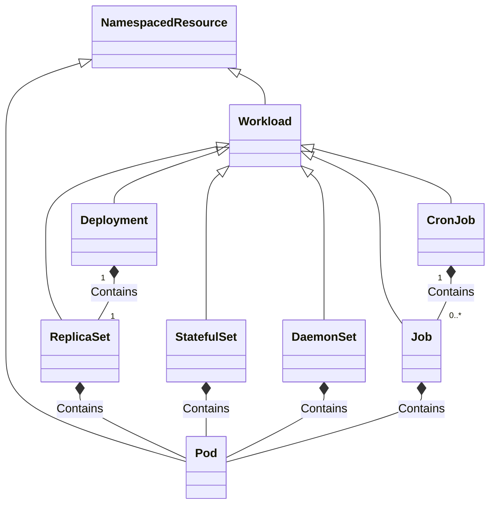
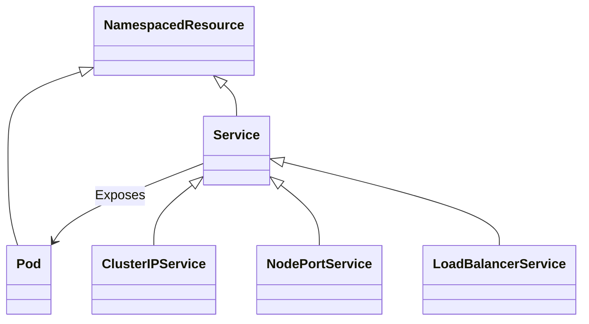

# TOSCA Community Kubernetes Profile

This profile defines TOSCA types to support integration with
Kubernetes. It tries to build on and extend existing [TOSCA type
definitions for Kubernetes](inventory.md).

We start by reviewing different kinds of *resources* defined in
Kubernetes and then suggest an approach for how these resources can be
supported by TOSCA node and capability types.

## Kubernetes Resources

Kubernetes resources are the building blocks used to define, deploy,
and manage applications and their underlying infrastructure within a
Kubernetes environment.

### Namespaces
Kubernetes distinguishes between the following two types of resources:

1. *Namespaced Resources*: These exist within a namespace that models
   a *virtual cluster* within a cluster that is used for resource
   isolation.
2. *Cluster-Scoped Resources*: These exist at the cluster level and
   are not tied to any namespace.

This distinction is shown in the following class diagram:

### Authentication and Authorization Resources
The main abstractions for managing authentication and authorization
are as follows:

- ServiceAccount: Provides an identity for Pods.
- Role / ClusterRole – Define permissions (RBAC).
- RoleBinding / ClusterRoleBinding – Attach roles to users, groups, or
  service accounts.

The relationships between these abstractions are shown in the
following class diagram:

### Storage and Configuration Abstractions

The main storage abstraction in Kubernetes is the *volume*. Kubernetes
volumes provide a way for containers in a pod to access and share data
via the filesystem. There are different kinds of volume that you can
use for different purposes, for example:
- ConfigMap – Stores non-sensitive configuration data (key/value
  pairs, config files).
- Secret – Stores sensitive information (passwords, tokens,
  keys). Mounted into Pods or injected as environment variables.
- PersistentVolume (PV) – A cluster-wide storage resource managed
  independently of Pods.
- PersistentVolumeClaim (PVC) – A Pod’s request for storage, matched
  against available PVs.

Various kinds volumes are shown in the following class diagram:

### Workload Abstractions
Kubernetes uses the following abstractions for managing workloads:
- Pod – The smallest deployable unit. A Pod wraps one or more tightly
  coupled containers (usually one). Containers in a Pod share:
  - The same network namespace (IP, port space).
  - Optionally shared storage volumes.
- ReplicaSet – Ensures a specified number of Pod replicas are running
  at all times. Recreates Pods if they fail.
- Deployment – A higher-level abstraction over ReplicaSets. Used to
  declare desired state for stateless apps (number of replicas,
  rolling updates, rollbacks).
- StatefulSet – Like a Deployment, but for stateful apps that need:
  - Stable identities (network names).
  - Stable storage volumes.
  - Ordered scaling and rolling updates.
- DaemonSet – Ensures a Pod runs on every (or selected) Node. Common
  for monitoring/logging/agent Pods.
- Job – Runs Pods until they complete successfully. Used for batch or
  finite tasks.
- CronJob – Runs Jobs on a schedule (like cron).

Workload abstractions are shown in the following class diagram:

### Service Abstractions
Workloads are exposed to clients using services. Kubernetes uses the
following service-related abstractions:

- Service – Provides a stable, DNS-resolvable endpoint to a set of
  Pods (via label selectors). Types:
  - ClusterIP (default, internal only).
  - NodePort (exposes on each Node’s IP at a static port).
  - LoadBalancer (uses cloud provider load balancer).
- Ingress – Exposes HTTP/HTTPS routes from outside the cluster to
  Services. Supports routing rules, TLS, etc.

The following class diagram shows a subset of these:

