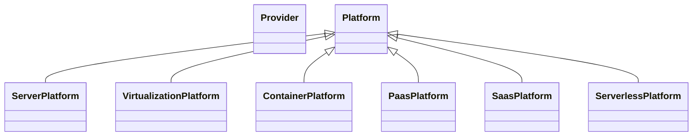
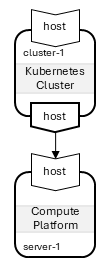
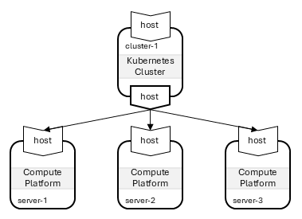
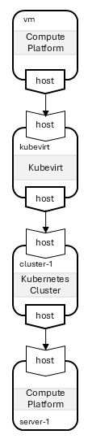
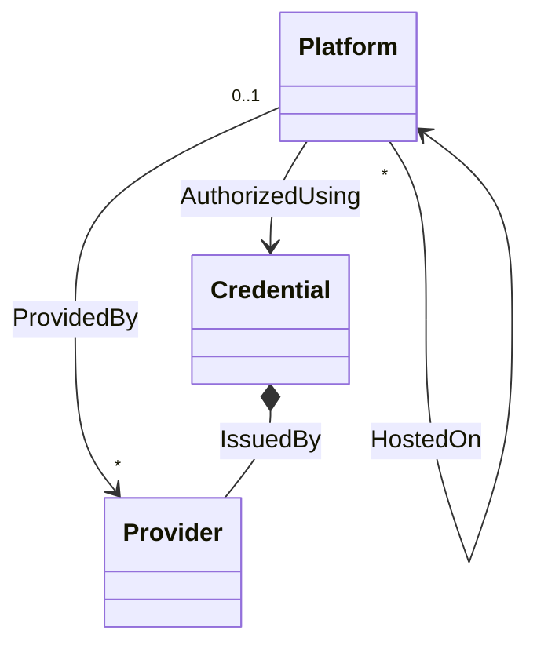

# TOSCA Community Platform Profile

This profile defines TOSCA types that support modeling of *platforms*
on which services can be *orchestrated* as well as the *providers* of
these platforms. It builds on and extends existing [TOSCA type
definitions for platforms](inventory.md).

## Platform Types

This profile consider the following types of platforms:

- *Bare Metal*: A device without operating system software or firmware
  pre-installed. Instead, this device exposes an interface that allows
  it to be managed remotely (e.g. an HPE server with an iILO
  interface) and that allows for remote installation of the operating
  system or hypervisor software.
- *Server*: A device with operating system software or firmware
  pre-installed.
- *Hypervisor Platform*: a platform that allows for the creation of
   virtual infrastructure on a server or bare metal device.
- IaaS (Infrastructure as a Service): A platform that allows on-demand
  creation of networks, virtual machines and storage in the cloud. 
- *Container  Platform*: A platform that supports containerized
  applications. This could be a container orchestration system such as
  Kubernetes or a server that uses Docker to deploy and run
  containerized applications.
- *PaaS (Platform as a Service)*: A platform for developing and
  deploying apps. It allows developers to push code and the platform
  handles builds, dependencies, deployment, scaling, etc..  Examples
  of PaaS include
  - Heroku
  - Google App Engine
  - Microsoft Azure App Service
  - AWS Elastic Beanstalk
  - Red Hat OpenShift
- *SaaS (Software as a Service)*: A platform for renting and using a
  finished application. Examples of SaaS include: - Gmail - Salesforce
- *Serverless Platform*: Represents a platform that provides the
  ephemeral runtime support for serverless functions, such as AWS
  Lambda, Azure Functions, Google Cloud Functions or OpenFaaS

Based on this classification, the following node type hierarchy is
proposed:

## Layering of Platforms

While platform node types are primarily used to create (abstract)
representations of available platform resources, these types can also
be used to *orchestrate* new platform resources. In those cases, newly
orchestrated platform nodes must be *layered* on top of
already-existing platform nodes. This layering is expressed using a
`HostedOn` relationship, and and the corresponding platform node types
must express valid target nodes in their `host` requirement.

The section describes several examples of platform layering.

### Virtual Machine on an Infrastructure-as-a-Service Platform

The following figure shows a virtual `ComputePlatform` node (a VM)
instantiated directly on AWS.

### IaaS Platform on Compute Platform

In some scenarios, the `HostedOn` relationship can be reversed and the
Infrastructure-as-a-Service platform can be deployed on a Compute
platform. This is the case when a Proxmox node is deployed on a
physical or virtual server as shown in the following figure:

In this scenario, the Proxmox node can in turn be used to *host* other
(virtual) Compute platforms.

### Kubernetes Cluster on Compute Platform

Another obvious layering scnenario is the deployment of a Kubernetes
cluster on a Compute platform as shown in the following figure:

### Kubernetes Cluster on Multiple Compute Platforms

Kubernetes clusters typically consist of multiple worker nodes, each
of which is deployed on a different server. We can model this scenario
using multiple `HostedOn` relationships, one to each of the Compute
platforms that hosts a worker node. This scenario is shown in the
following figure:

### IaaS Platform on Kubernetes Clusters

Kubernetes clusters can be extended with support for Kubevirt which
allows for the creation and management of virtual machines. This
effectively turns Kubernetes into an IaaS platform. This can be
modeled by layering Kubevirt on top of a Kubernetes cluster as shown
in the following figure:

Kubevirt can then in turn be used to *host* virtual machines as also
shown in the figure.

#### Kubernetes-Kubevirt Layering Modeling Challenges

There are severals challenges with this layering of platform node
types, particularly regarding the relationship between Kubernetes
clusters and Kubevirt virtualization platforms:

- The abstract model above shows Kubevirt running on top of a
  Kubernetes cluster.
- In practice however, the relationships are more complex, since
  Kubevirt requires installation of at least two very different
  types of components:
  - KVM virtualization, which is installed directly on the underlying
    ComputePlatform. If the Kubernetes cluster uses multiple worker
    nodes, then each of those nodes must have KVM.
  - The Kubevirt operator(s) and custom resource definitions, which
    are installed on the Kubernetes cluster.
- To support these different installations, a single HostedOn
  relationship between the Kubevirt node and the Kubernetes node is
  insufficient. Additional information is required to identify not
  just the Kubernetes cluster, but also the ComputePlatform(s) on
  which the Kubernetes cluster is deployed.

The layering approach proposed above needs refinement to accurately
represent these complex dependencies.

The following three apporaches have been proposed:

1. Introduce additional relationships: using this approach, the
   abstract Kubevirt node is HostedOn on a ComputePlatform node
   directly, but an additional `ControlledBy` or `ManagedBy`
   relationship is introduced between the KubeVirt node and the
   corresponding Kubernetes node.

   Another option is that each platform can be considered to have a
   *control plane* as well as a *data plane*. For most platforms,
   modeling the hosting relationships used by the data plane is
   sufficient. However, for some platforms, it may also be necessary
   to model where the control plane is deployed. Control plane
   deployment is not modeled using a hosting relationship, but rather
   using a `RunsOn` relationship.

   > How do we make sure that the Kubevirt nodes are HostedOn the same
     ComputePlatform nodes as the Kubernetes nodes?

2. Use properties on the Kubernetes node to indicate whether Kubevirt
   is supported. With this approach, Kubevirt is no longer modeled as
   a separate Platform node. Instead, it becomes part of the
   Kubernetes platform node, and substitution filters are used to
   select a substituting template that installs Kubevirt if necessary.

   > With this approach, how do we indicated whether the Kubernetes
     platform can host ComputePlatform nodes or now (since this
     capability can not be turned on or off dynamically based on a
     property value).

3. Introduce Aggregate platform node types: with this approach, a new
   derived platform node type is introduced that is composed of both a
   Kubernetes platform as well as a Kubevirt platform. This aggregate
   node type is HostedOn the same ComputePlatform node(s)

## Providers and Credentials

This profile also defines node types for modeling the *providers* that
own various platform. The provider is modeled separately from the
platform itself to allow for the fact that different types of
platforms may be offered by the same provider.

> It is a topic of discussion whether *credentials* to access
  platforms should be modeled at this level as well, and if so how
  these credentials should be represented. The discussion below
  assumes there is a separate node type to represent credentials. The
  use of a node type (as opposed to a data type or an artifact) is
  motivated by the fact that credentials may need to be created
  automatically through *orchestration*.

The following figure shows how the various platform-related entities
might interact:

