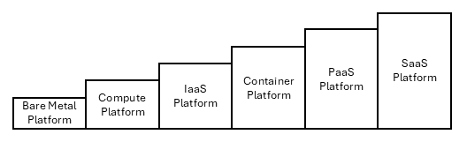
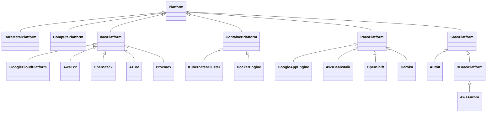
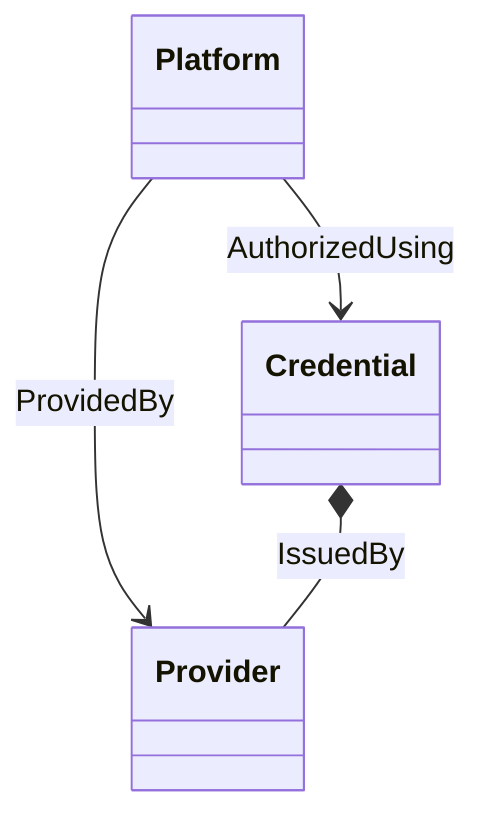

# TOSCA Community Platform Profile

This profile defines TOSCA types that support modeling of *platforms*
on which services can be *orchestrated* as well as the *providers* of
these platforms. It builds on and extends existing [TOSCA type
definitions for platforms](inventory.md).

## Platforms

The following figure shows different types of platforms under
consideration: 

This figure represents the following:
- Bare Metal: A device without operating system software or firmware
  installed. 
- Compute: A device with operating system software or firmware
  installed.
- IaaS (Infrastructure as a Service): A platform that allows on-demand
  creation of networks, virtual machines and storage
- Container Platform: A container orchestration system such as
  Kubernetes that handles scheduling, scaling, load balancing,
  networking, and self-healing of applications. A Container platform
  sits somewhere between IaaS and PaaS
  - It’s more than IaaS (because it abstracts servers into a unified
    cluster).
  - It’s less than PaaS (because it doesn’t abstract away deployment
    complexity for developers by default).
- PaaS (Platform as a Service): A platform for developing and
  deploying apps. It allows developers to push code and the platform
  handles builds, dependencies, deployment, scaling, etc..  Examples
  of PaaS include
  - Heroku
  - Google App Engine
  - Microsoft Azure App Service
  - AWS Elastic Beanstalk
  - Red Hat OpenShift
- SaaS (Software as a Service): A platform for renting and using a
  finished application. Examples of SaaS include:
  - Gmail
  - Salesforce

> Do we need to call out Serverless/Functions-as-a-Service separately
  or is FaaS just a special type of PaaS?

Based on the [inventory](inventory.md) of node type definitions above,
the following node type hierarchy is proposed:

## Providers and Credentials

This profile also defines node types for modeling the *providers* that
own various platform. The provider is modeled separately from the
platform itself to allow for the fact that different types of
platforms may be offered by the same provider.

> It is a topic of discussion whether *credentials* to access
  platforms should be modeled at this level as well, and if so how
  these credentials should be represented. The discussion below
  assumes there is a separate node type to represent credentials. The
  use of a node type (as opposed to a data type or an artifact) is
  motivated by the fact that credentials may need to be created
  automatically through *orchestration*.

The following figure shows how the various platform-related entities
might interact:

## Layering of Platforms

> This section is intended to discuss layering relationships between
  platforms. For example, a Kubernetes cluster might be hosted on an
  IaaS platform. A PaaS platform may use Kubernetes underneath.

Some PaaS existed long before Kubernetes was created.  These platforms
provided developer workflows, build pipelines, and runtime
environments without Kubernetes. For example:

- Heroku (2007) → classic PaaS, lets you git push code and deploy. No
  Kubernetes.
- Google App Engine (2008) → serverless-style PaaS, predates
  Kubernetes.
- Cloud Foundry (2011) → a PaaS with its own container/runtime system,
  not Kubernetes-based.

Many newer PaaS offerings do use Kubernetes under the hood, because
Kubernetes has become a de facto standard for container
orchestration. Examples:

- OpenShift (Red Hat)
- Google Cloud Run / Knative
- VMware Tanzu Application Service (K8s edition)

In these cases, Kubernetes provides a solid infrastructure layer,
while the PaaS adds developer-focused abstractions.

Some modern PaaS options still don’t depend on Kubernetes, especially
serverless PaaS:

- AWS Elastic Beanstalk (abstracts EC2, no Kubernetes required).
- AWS Lambda / Azure Functions (FaaS, sometimes called a “serverless
  PaaS”).
- Netlify, Vercel (serverless platforms for web apps, not
  Kubernetes-based).

