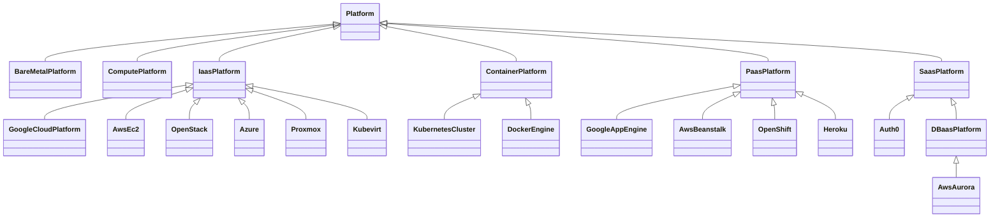

# TOSCA Community Platform Profile

This profile defines TOSCA types that support modeling of *platforms*
on which services can be *orchestrated* as well as the *providers* of
these platforms. It builds on and extends existing [TOSCA type
definitions for platforms](inventory.md).

## Platforms

The following figure shows different types of platforms under
consideration:

This figure represents the following:
- Bare Metal: A device without operating system software or firmware
  installed. 
- Compute: A device with operating system software or firmware
  installed.
- IaaS (Infrastructure as a Service): A platform that allows on-demand
  creation of networks, virtual machines and storage
- Container Platform: A container orchestration system such as
  Kubernetes that handles scheduling, scaling, load balancing,
  networking, and self-healing of applications. A Container platform
  sits somewhere between IaaS and PaaS
  - It’s more than IaaS (because it abstracts servers into a unified
    cluster).
  - It’s less than PaaS (because it doesn’t abstract away deployment
    complexity for developers by default).
- PaaS (Platform as a Service): A platform for developing and
  deploying apps. It allows developers to push code and the platform
  handles builds, dependencies, deployment, scaling, etc..  Examples
  of PaaS include
  - Heroku
  - Google App Engine
  - Microsoft Azure App Service
  - AWS Elastic Beanstalk
  - Red Hat OpenShift
- SaaS (Software as a Service): A platform for renting and using a
  finished application. Examples of SaaS include:
  - Gmail
  - Salesforce

> Do we need to call out Serverless/Functions-as-a-Service separately
  or is FaaS just a special type of PaaS?

Based on the [inventory](inventory.md) of node type definitions above,
the following node type hierarchy is proposed:

## Layering of Platforms

While platform node types are primarily used to create (abstract)
representations of available platform resources, these types can also
be used to *orchestrate* new platform resources. In those cases, newly
orchestrated platform nodes must be *layered* on top of
already-existing platform nodes. This layering is expressed using a
`HostedOn` relationship, and and the corresponding platform node types
must express valid target nodes in their `host` requirement.

The section describes several examples of platform layering.

### Virtual Machine on an Infrastructure-as-a-Service Platform

The following figure shows a virtual `ComputePlatform` node (a VM)
instantiated directly on AWS.

### IaaS Platform on Compute Platform

In some scenarios, the `HostedOn` relationship can be reversed and the
Infrastructure-as-a-Service platform can be deployed on a Compute
platform. This is the case when a Proxmox node is deployed on a
physical or virtual server as shown in the following figure:

In this scenario, the Proxmox node can in turn be used to *host* other
(virtual) Compute platforms.

### Kubernetes Cluster on Compute Platform

Another obvious layering scnenario is the deployment of a Kubernetes
cluster on a Compute platform as shown in the following figure:

### Kubernetes Cluster on Multiple Compute Platforms

Kubernetes clusters typically consist of multiple worker nodes, each
of which is deployed on a different server. We can model this scenario
using multiple `HostedOn` relationships, one to each of the Compute
platforms that hosts a worker node. This scenario is shown in the
following figure:

### IaaS Platform on Kubernetes Clusters

Kubernetes clusters can be extended with support for Kubevirt which
allows for the creation and management of virtual machines. This
effectively turns Kubernetes into an IaaS platform. This can be
modeled by layering Kubevirt on top of a Kubernetes cluster as shown
in the following figure:

Kubevirt can then in turn be used to *host* virtual machines as also
shown in the figure.

## Providers and Credentials

This profile also defines node types for modeling the *providers* that
own various platform. The provider is modeled separately from the
platform itself to allow for the fact that different types of
platforms may be offered by the same provider.

> It is a topic of discussion whether *credentials* to access
  platforms should be modeled at this level as well, and if so how
  these credentials should be represented. The discussion below
  assumes there is a separate node type to represent credentials. The
  use of a node type (as opposed to a data type or an artifact) is
  motivated by the fact that credentials may need to be created
  automatically through *orchestration*.

The following figure shows how the various platform-related entities
might interact:

