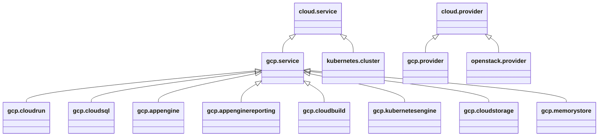

# Platforms and Providers

The first set of node type definitions to be harmonized relates to
*platforms* and *providers* and the associated *credentials*:

## Inventory
The following projects define node types related to platforms:

### EDMM
EDMM introduces a `Platform` node type which is then specialized for
different types of platforms, including IaaS and PaaS, as shown in
the following figure:

### Ystia

Ystia uses a `LocationConfig` node type to track information about
available cloud platforms. Rather than acting as a representations for
these platforms, this type is used as a data structure to store
information for accessing those platforms, including the necessary
credentials. Ystia introduces a number of cloud-specific
configurations as shown in the following figure:

In addition to defining derived types for different types of clouds,
it also includes a `HostsPool` type to represent a collection of
physical hosts, likely in support of the Ansible *hosts* concept.

### Vintner
The EDMM *platform* concept is also present in Vintner.  However,
Vintner also introduces a *provider* node type to represent the
owner of these platforms. Since some platforms may be owned by the
same provider, they support sharing of credentials or other
information. Separating provider information from platform
information allows for such sharing.

The relevant Vintner node types are shown in the following figure:

### DeMAF
DeMAF also uses separate *platforms* and *providers*, but with an
increased focus on container orchestraton.  The following figure
shows DeMAF types:

### Ubicity
Ubicity represents platforms using a `VirtualInfrastructureTarget`
node type that is then specialized to represent AWS and OpenStack
regions as well as Proxmox servers. Ubicity allows for sharing of
credentials, not by separating out a *provider* node type, but by
modeling those credentials explicitly using an `Account` node type.

Account node types are split off from platform types to allow for
sharing, similar to how provider node types support sharing. In
addition, defining credential node types creates the possibility of
creating them automatically using Orchestration.

## Harmonize

From the various platforms that define platform-related types, the
following concepts emerge:

- *Platforms*: represent *resources* on which systems and services can
  be deployed.
- *Providers*: represent the *owners* of these resources. Providers
  make their resources available *as-a-service*.
- *Credentials*: are managed by providers and represent *access* to
   platforms given by providers to their users.

### Platforms

The following figure shows different platforms under consideration:

> Do we need to call out Serverless/Functions-as-a-Service separately
  or is FaaS just a special type of PaaS?

- Bare Metal: A device without operating system software or firmware
  installed. 
- Compute: A device with operating system software or firmware
  installed.
- IaaS (Infrastructure as a Service): A platform that allows on-demand
  creation of networks, virtual machines and storage
- Container Platform: A container orchestration system such as
  Kubernetes that handles scheduling, scaling, load balancing,
  networking, and self-healing of applications. A Container platform
  sits somewhere between IaaS and PaaS
  - It’s more than IaaS (because it abstracts servers into a unified
    cluster).
  - It’s less than PaaS (because it doesn’t abstract away deployment
    complexity for developers by default).
- PaaS (Platform as a Service): A platform for developing and
  deploying apps. It allows developers to push code and the platform
  handles builds, dependencies, deployment, scaling, etc..  Examples
  of PaaS include
  - Heroku
  - Google App Engine
  - Microsoft Azure App Service
  - AWS Elastic Beanstalk
  - Red Hat OpenShift
- SaaS (Software as a Service): A platform for renting and using a
  finished application. Examples of SaaS include:
  - Gmail
  - Salesforce

Based on the inventory of node type definitions above, the following
node type hierarchy is proposed:

### Providers

### Credentials

## Interactions between Entities

The following figure shows how the various platform-related entities
might interact:

## Layering of Platforms

> This section is intended to discuss layering relationships between
  platforms. For example, a Kubernetes cluster might be hosted on an
  IaaS platform. A PaaS platform may use Kubernetes underneath.

Some PaaS existed long before Kubernetes was created.  These platforms
provided developer workflows, build pipelines, and runtime
environments without Kubernetes. For example:

- Heroku (2007) → classic PaaS, lets you git push code and deploy. No
  Kubernetes.
- Google App Engine (2008) → serverless-style PaaS, predates
  Kubernetes.
- Cloud Foundry (2011) → a PaaS with its own container/runtime system,
  not Kubernetes-based.

Many newer PaaS offerings do use Kubernetes under the hood, because
Kubernetes has become a de facto standard for container
orchestration. Examples:

- OpenShift (Red Hat)
- Google Cloud Run / Knative
- VMware Tanzu Application Service (K8s edition)

In these cases, Kubernetes provides a solid infrastructure layer,
while the PaaS adds developer-focused abstractions.

Some modern PaaS options still don’t depend on Kubernetes, especially
serverless PaaS:

- AWS Elastic Beanstalk (abstracts EC2, no Kubernetes required).
- AWS Lambda / Azure Functions (FaaS, sometimes called a “serverless
  PaaS”).
- Netlify, Vercel (serverless platforms for web apps, not
  Kubernetes-based).

