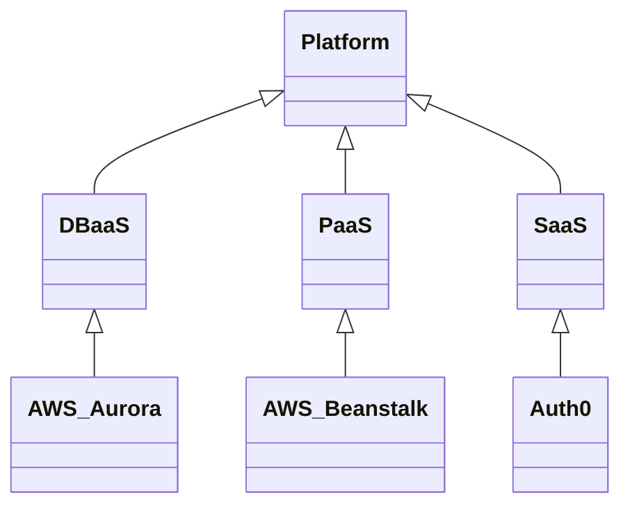
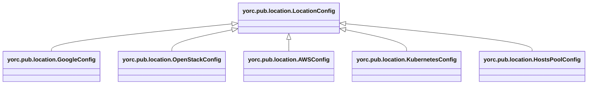
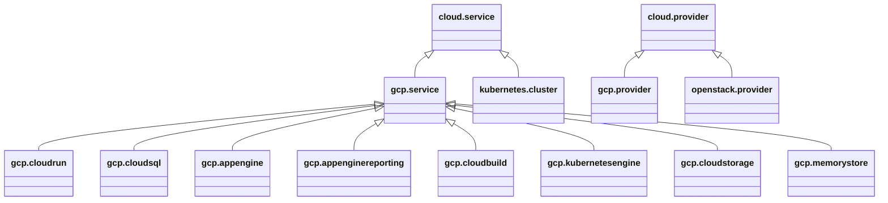
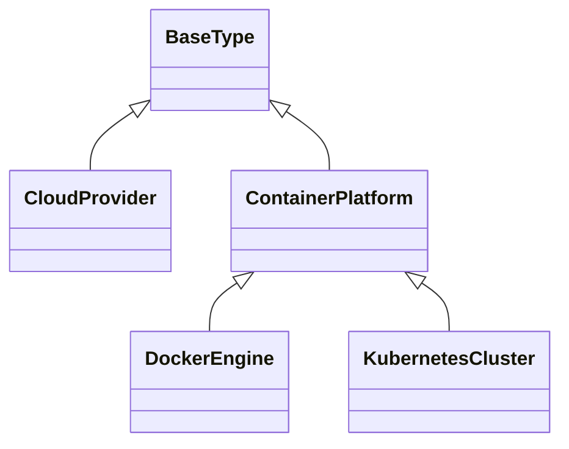
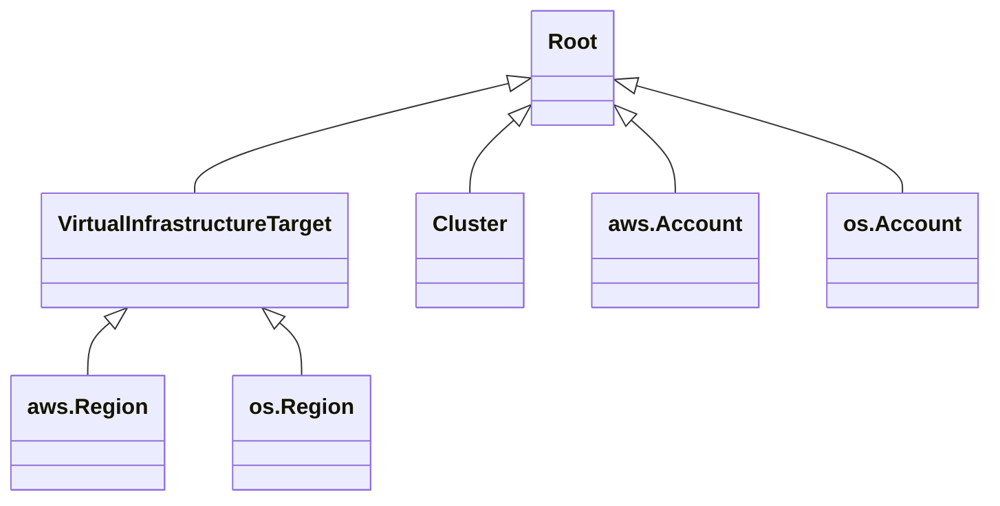

# Inventory of TOSCA Types for Platforms

The following projects define node types related to platforms and
providers:

## EDMM
EDMM introduces a `Platform` node type which is then specialized for
different types of platforms, including IaaS and PaaS, as shown in
the following figure:

## Ystia

Ystia uses a `LocationConfig` node type to track information about
available cloud platforms. Rather than acting as a representations for
these platforms, this type is used as a data structure to store
information for accessing those platforms, including the necessary
credentials. Ystia introduces a number of cloud-specific
configurations as shown in the following figure:

In addition to defining derived types for different types of clouds,
it also includes a `HostsPool` type to represent a collection of
physical hosts, likely in support of the Ansible *hosts* concept.

## Vintner
The EDMM *platform* concept is also present in Vintner.  However,
Vintner also introduces a *provider* node type to represent the
owner of these platforms. Since some platforms may be owned by the
same provider, they support sharing of credentials or other
information. Separating provider information from platform
information allows for such sharing.

The relevant Vintner node types are shown in the following figure:

## DeMAF
DeMAF also uses separate *platforms* and *providers*, but with an
increased focus on container orchestraton.  The following figure
shows DeMAF types:

## Ubicity
Ubicity represents platforms using a `VirtualInfrastructureTarget`
node type that is then specialized to represent AWS and OpenStack
regions as well as Proxmox servers. Ubicity allows for sharing of
credentials, not by separating out a *provider* node type, but by
modeling those credentials explicitly using an `Account` node type.

Account node types are split off from platform types to allow for
sharing, similar to how provider node types support sharing. In
addition, defining credential node types creates the possibility of
creating them automatically using Orchestration.

