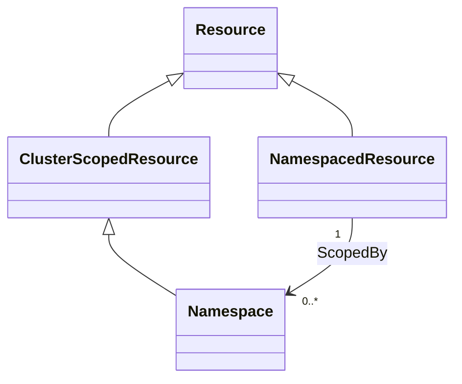
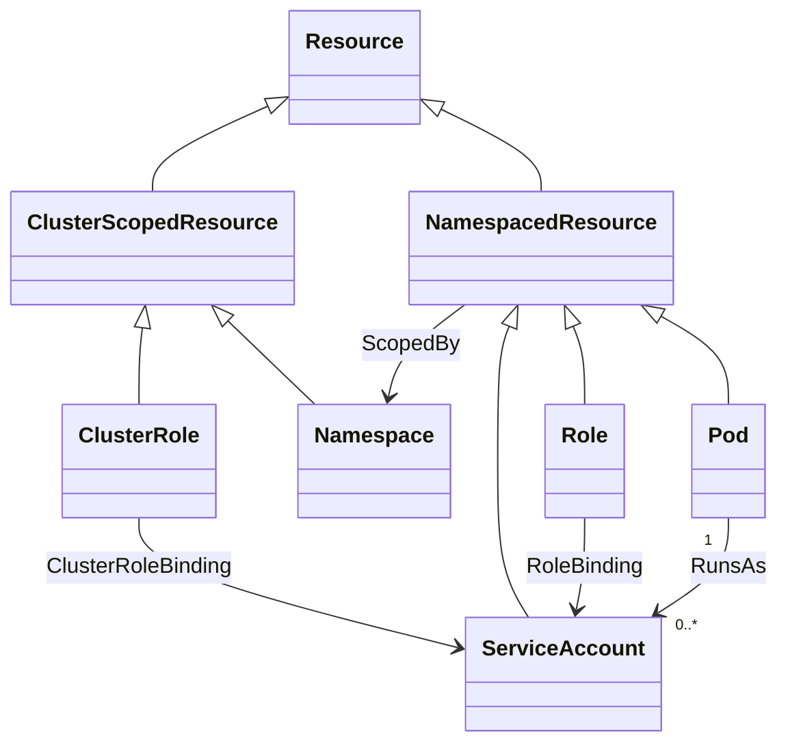
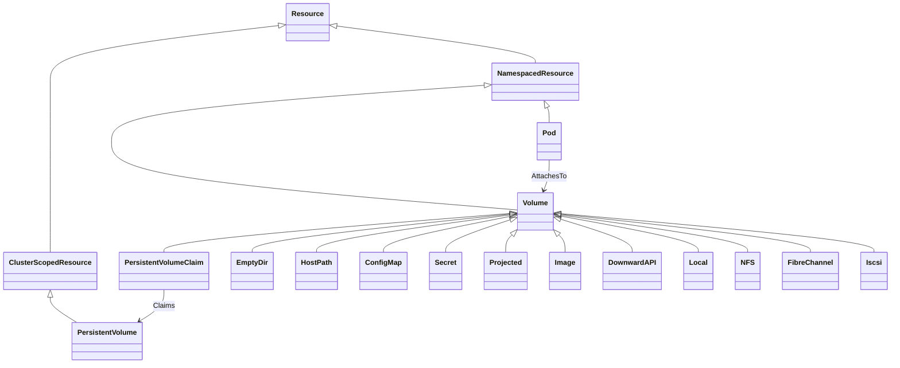
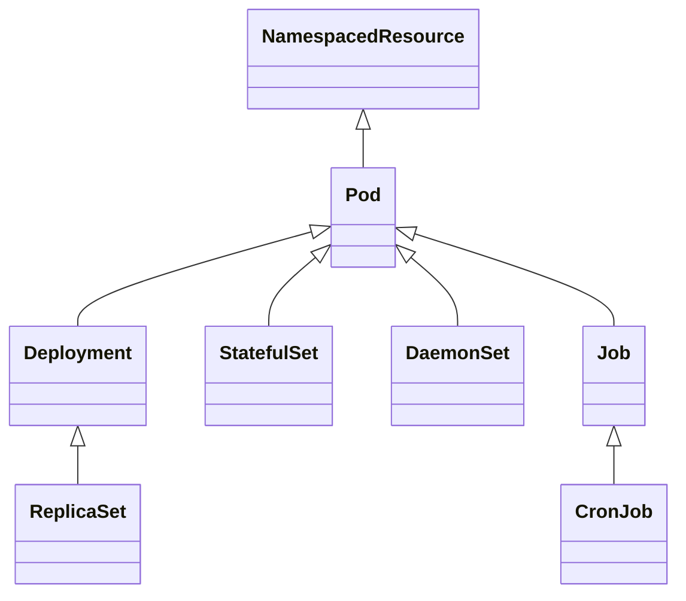
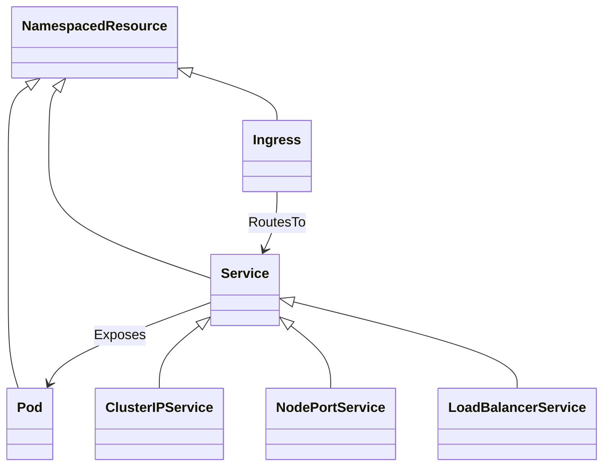

# Kubernetes Profile — Resource Type Hierarchy (hand-authored)

> **Note (2026-07-21):** This documents the hand-authored
> `community.tosca.technology.kubernetes` resource types. That profile is slated
> for consolidation in favor of the auto-generated
> `community.tosca.technology.k8s` (governance issues K6 / I21), so this
> type-hierarchy reference will be retired along with it. The durable design
> rationale for modeling Kubernetes with TOSCA — the "why", objectives, design
> approaches, open questions, and cluster-wide-resource patterns — has moved to
> [docs/kubernetes-modeling.md](../../docs/kubernetes-modeling.md).

## TOSCA Community Kubernetes Profile for Substitution Mapping

The TOSCA Community Kubernetes Profile for substitution mapping
defines node types for Kubernetes resources. Kubernetes resources are
the building blocks used to define, deploy, and manage applications
and their underlying infrastructure within a Kubernetes environment.

### Namespaces
Kubernetes distinguishes between the following two types of resources:

1. *Namespaced Resources*: These exist within a namespace that models
   a *virtual cluster* within a cluster that is used for resource
   isolation.
2. *Cluster-Scoped Resources*: These exist at the cluster level and
   are not tied to any namespace.

This distinction is shown in the following class diagram:

### Authentication and Authorization Resources
The main abstractions for managing authentication and authorization
are as follows:

- ServiceAccount: Provides an identity for Pods.
- Role / ClusterRole – Define permissions (RBAC).
- RoleBinding / ClusterRoleBinding – Attach roles to users, groups, or
  service accounts.

The relationships between these abstractions are shown in the
following class diagram:

### Storage and Configuration Abstractions

The main storage abstraction in Kubernetes is the *volume*. Kubernetes
volumes provide a way for containers in a pod to access and share data
via the filesystem. There are different kinds of volume that you can
use for different purposes, for example:
- ConfigMap – Stores non-sensitive configuration data (key/value
  pairs, config files).
- Secret – Stores sensitive information (passwords, tokens,
  keys). Mounted into Pods or injected as environment variables.
- PersistentVolume (PV) – A cluster-wide storage resource managed
  independently of Pods.
- PersistentVolumeClaim (PVC) – A Pod’s request for storage, matched
  against available PVs.

Various kinds volumes are shown in the following class diagram:

### Workload Abstractions
Kubernetes uses the following abstractions for managing workloads:

- Pod: A Pod is the smallest and most basic deployable unit in
  Kubernetes.  A Pod is a wrapper around one or more containers that
  are tightly coupled and share the same network namespace and storage
  volumes.
- ReplicaSet: Extends pods with scaling and self-healing. It ensures
  that a specified number of Pod replicas are running at all
  times. ReplicaSets recreate Pods if they fail.
- Deployment: Extends ReplicaSets with full lifecycle management,
  including updates and upgrades. It is used to declare desired state
  for stateless apps (number of replicas, rolling updates, rollbacks).
- StatefulSet – Like a Deployment, but for stateful apps that need:
  - Stable identities (network names).
  - Stable storage volumes.
  - Ordered scaling and rolling updates.
- DaemonSet – Ensures a Pod runs on every (or selected) Node. Common
  for monitoring/logging/agent Pods.
- Job – Runs Pods until they complete successfully. Used for batch or
  finite tasks.
- CronJob – Runs Jobs on a schedule (like cron).

Representations of workload abstractions in TOSCA need to address the
following challengs:

- While not recommended, it is possible to instantiate Pods separately
  from ReplicaSets and to instantiate ReplicaSets separately from
  Deployments. This suggests that Pods, ReplicaSets, and Deployments
  should each be modeled using a corresponding TOSCA node type that
  includes the necessary interface operations to support
  Orchestration.
- However, when instantiating a Deployment, Kubernetes automatically
  creates the ReplicaSet for that deployment and the Pods for that
  ReplicaSet. This means that when using TOSCA to *orchestrate* a
  Deployment, the interface operations for the ReplicaSet in the
  Deployment and for the Pods in the ReplicaSet must not be used.
- All Kubernetes workloads are *exposed* to the outside world using
  Service resources (to be discussed next). Independent of the type of
  workload, Service resources always reference the Pods for the
  workload. This means that even when orchestrating a Deployment, the
  TOSCA model for the Deployment must include the Pod node so it can
  be referenced by a Service.

We propose to leverage TOSCA node type inheritance as shown in the
following figure:

### Service Abstractions
Workloads are exposed to clients using services. Kubernetes uses the
following service-related abstractions:

- Service – Provides a stable, DNS-resolvable endpoint to a set of
  Pods (via label selectors). Types:
  - ClusterIP (default, internal only).
  - NodePort (exposes on each Node’s IP at a static port).
  - LoadBalancer (uses cloud provider load balancer).
- Ingress – Exposes HTTP/HTTPS routes from outside the cluster to
  Services. Supports routing rules, TLS, etc.

The following class diagram shows a subset of these:

