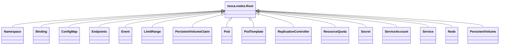
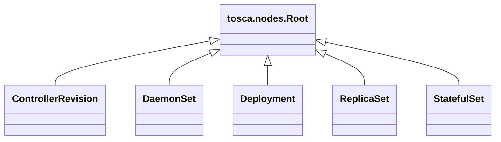
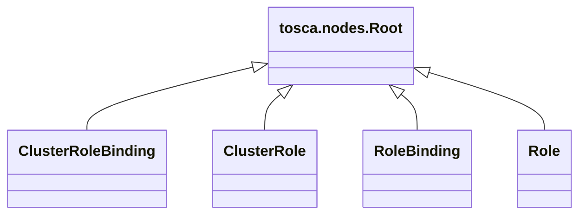
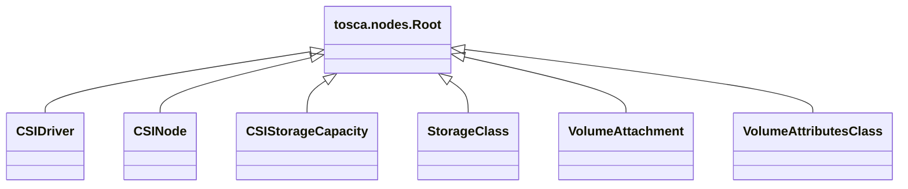
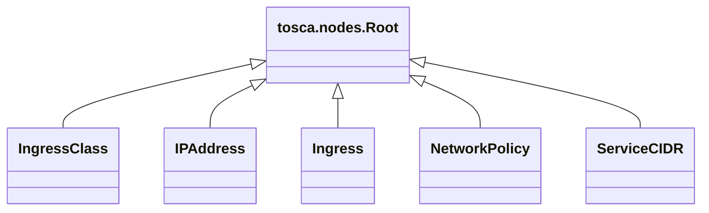

# Kubernetes Profile

## Design Approach

### Node Type Structure
TOSCA node types mimic the structure of Kubernetes manifests. The
following shows the typical structure of such a manifest:
```yaml
apiVersion: <api-group/version>
kind: <ResourceKind>
metadata:
  name: <resource-name>
  namespace: <optional-namespace>
  labels:
    key: value
  annotations:
    key: value
spec:
  # resource-specific configuration
```
To reflect this structure, all TOSCA Kubernetes node types
- define a `metadata` property.
- define a resource-specific `spec` property. The type of this
  property is specific to each kind of resource.

### Start with Automatically Converted Profiles

- By converting the OpenAPI file.
- And manually converting to TOSCA v2.0

By automatically creating data types for the various values in a
Kubernetes manifest, we allow for design time validation.

### Post-Conversion Enhancements
The following (manual) enhancements are performed post-conversion:

1. Introduce node type inheritance to promote the DRY principle
   (**D**on't **R**epeat **Y**ourself).
2. Introduce capabilities and requirements to formalize the required
   and allowed interactions between Kubernetes resources.
3. Set `spec` property values in the TOSCA node types where possible
   by using `$get_property` and `$get_attribute` functions across
   TOSCA relationships.

### Minimal Functionality in Implementation Artifacts

1. Create manifest using `apiVersion` and `kind` specific to the
   resource. Add `metadata` and `spec` as well as other
   resource-specific values.
2. Use JSON to avoid YAML formatting glitches.
3. Apply the created manifest. 

### Download Open API file

```bash
curl -o k8s-openapi-v2.json https://raw.githubusercontent.com/kubernetes/kubernetes/release-1.35/api/openapi-spec/swagger.json
```

### Convert to TOSCA

TOSCA profiles are automatically generated by converting the
downloaded `k8s-openapi-v2.json` file using
[oas2tosca](https://github.com/ubicity-corp/oas2tosca):
```bash
oas2tosca -i k8s-openapi-v2.json -o k8s-profiles
```
This creates a set of TOSCA profiles where the profile names are based
on Kubernetes API groups. Note that:

- For the time being, the conversion tool only generates TOSCA v1.3
- The conversion tool uses heuristics to decide when to generate TOSCA
  data types and when to generate TOSCA node types
- Since TOSCA doesn't support the `any` data type, the conversion tool
  emits strings for those data types.

These automatically-generated profiles are then used as a starting
point for *working* TOSCA Kubernetes profiles.

### Aggregate Generated Files into Kubernetes Profile

```bash
cp io/k8s/apimachinery/pkg/apis/meta/profile.yaml io/kubernetes/3.0/meta.yaml
cp io/k8s/apimachinery/pkg/api/resource/profile.yaml io/kubernetes/3.0/resource.yaml
cp io/k8s/apimachinery/pkg/runtime/profile.yaml io/kubernetes/3.0/runtime.yaml
cp io/k8s/apimachinery/pkg/util/intstr/profile.yaml io/kubernetes/3.0/intstr.yaml
cp io/k8s/api/core/profile.yaml io/kubernetes/3.0/core.yaml
cp io/k8s/api/apps/profile.yaml io/kubernetes/3.0/apps.yaml
cp io/k8s/api/storage/profile.yaml io/kubernetes/3.0/storage.yaml
cp io/k8s/api/networking/profile.yaml io/kubernetes/3.0/networking.yaml
cp io/k8s/api/rbac/profile.yaml io/kubernetes/3.0/rbac.yaml
```

#### Core Node Types


#### Apps Node Types


#### Rbac Node Types


#### Storage Node Types

#### Networking Node Types

### Introduce Top-Level Resource Node Type

- Keep `meta`property. This is inherited by all node types.
- Remove `apiVersion` and `kind` properties. These will be hard-coded
  in the implementation artifacts.
- Turn `status` into attribute rather than property and remove the `required` keyword

### Derive Cluster-Scoped Resources

The following resources are Cluster-Scoped (NOT namespaced). They
derive from the base `Resource` node type.

#### Core Types
```
Namespace
Node
PersistentVolume
```

#### Rbac Types
```
ClusterRole
ClusterRoleBinding
```

#### Storage Types
```
CSIDriver
CSINode
CSIStorageCapacity
StorageClass
VolumeAttachment
VolumeAttributesClass
```

#### Networking types
```
IngressClass
IPAddress
ServiceCIDR
```

### Introduce NamespacedResource Node Type

- Derives from `Resource`
- Has an optional requirement for a `Namespace`
- Sets the `namespace` property in the `metadata` to the name of the target namespace. 
- All remaining node types derive from `NamespacedResource`

## Create Pod node types

- Base Pod
- Pod:
  - advertizes a workload capability
  - makes `labels` mandatory
- Standalone pod


## Introduce WorkloadController

Introduce `WorkloadController` node type from which all workload
controllers derive.

- It defines a `pod` requirement to specify the pod workload it
  controls

- Derived classes set their pod template using the properties of the
  target of the `pod` relationship

> There is a bug in the `oas2tosca` conversion tool: rather than
  creating a `PodTemplate` data type, it creates a `PodTemplate` node
  type that defines a `template` property of type
  `PodTemplateSpec`. Changed this manually to a `PodTemplate` data
  type.


# Conversion Issues

- IntOrString type