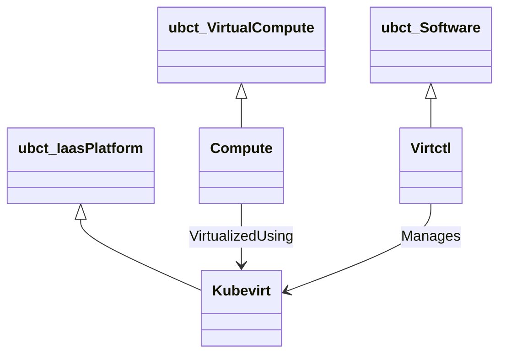

# io.kubevirt:2.5

TOSCA profile for [KubeVirt](https://kubevirt.io), a virtualization
platform that runs on top of Kubernetes.

## Type hierarchy

## Node types

- **Kubevirt** — an installation of KubeVirt on a Kubernetes cluster.
  Derived from `ubct:IaasPlatform`; plays the same role as `Aws`,
  `Azure`, `Proxmox`, etc. in its respective profile.
- **Virtctl** — installation of the `virtctl` CLI tool.
- **Compute** — a virtual machine hosted on KubeVirt, modeled as a
  Kubernetes custom resource.
