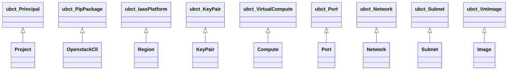
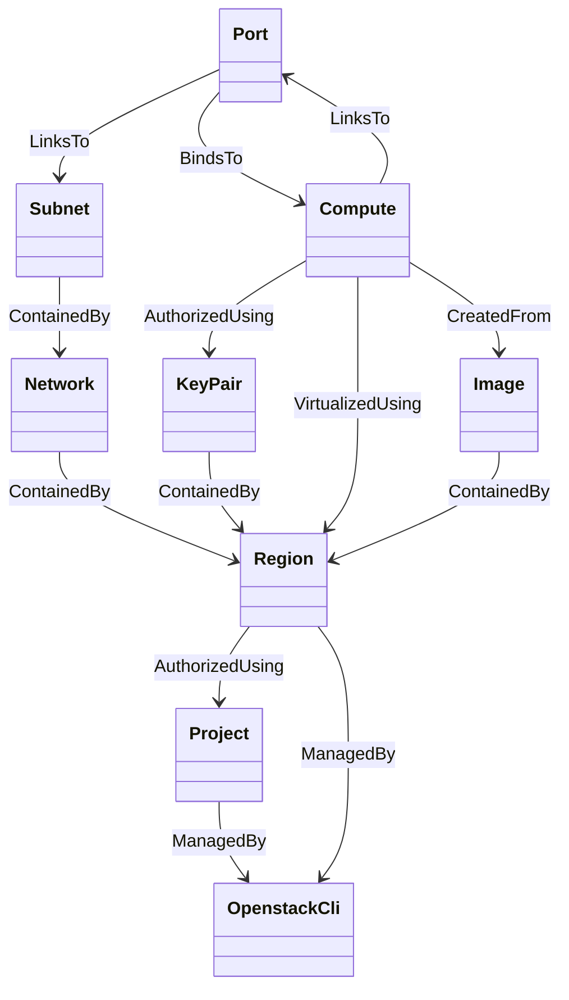

# OpenStack Profile Node Types

TOSCA type definitions for OpenStack resources.

## Node Type Hierarchy

Note: types prefixed with `ubct_` are base types from the `com.ubicity:2.5` profile.

## Resource Relationships

