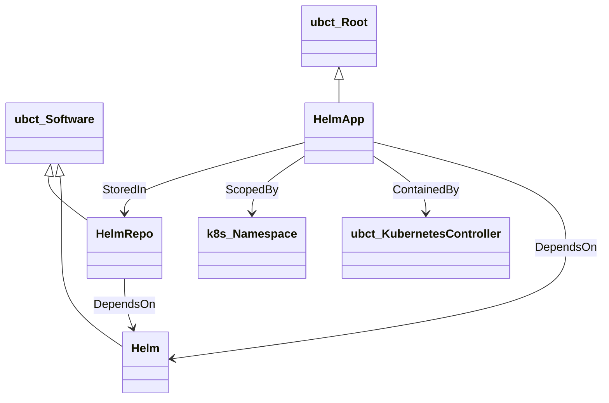

# sh.helm:3.0

TOSCA profile for [Helm](https://helm.sh), the package manager for
Kubernetes.

## Type hierarchy

## Node types

- **Helm** — an installation of the `helm` CLI tool.
- **HelmRepo** — a Helm chart repository registered with a local Helm
  installation.
- **HelmApp** — a Helm release deployed to a Kubernetes cluster.

## Artifact types

- **HelmChart** — a packaged Helm chart.
